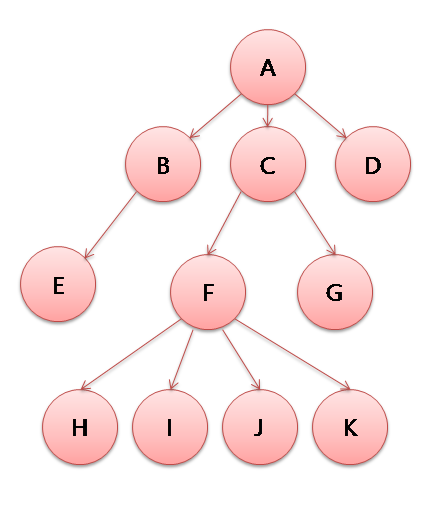

## Tree



트리는 나무와 비슷하다고 생각하면 된다. 나무는 하나의 뿌리가 있고 거기에 가지를 쳐나간다. 그 가지에는 또다른 잔가지가 나고 그 잔가지에는 또다란 잔가지가 난다. 이러한 자료구조를 트리라고 한다.
트리는 이때까지와의 자료구조 즉 스택과 큐와 덱과 같은 자료구조라는 그 존재 목적부터 궤를 달리한다.
연결리스트와 배열과 같은 자료구조는 다른 자료구조를 만드는데 모티브가되는 자료구조이며
스택과 큐와 덱은 시스템 내부적인 구현에서 사용하기에 내부를 공개할 필요가 없고 성능에 충실한 자료구죠다.
트리는 드디어 사람이 사용하기에 편리하게, 즉 사람이 쓰기 좋기 위해 만들어진 자료구조다.

**정리**
여기서 A라는 최상위 노드, 즉 모든노드를 들어가는 입구인 시작노드를 Root노드 혹은 뿌리노드라고 부른다.
그리고 A를 기준으로 B C D는 A의 직속으로 연결되어있는 노드다. 이러한 노드를 자식노드 라고 부른다.
반대로 B C D 기준으로 A노드는 부모노드로 불린다.
또한 B를 기준으로 C D는 같은 대열에 있다. 이러한 노드를 형제노드라고 한다.
그리고 D노드 처럼 자식이 단 한나도 존재하지 않는 노드를 리프노드라고 한다.
반대로 루트를 제외하고 자식을 하나라도 가지는 노드를 가지노드라고 한다.

- Root(뿌리) 노드 - 최상위 노드
- Child(자식) 노드 - 어떤 노드의 하위 노드
- Parent(부모) 노드 - 어떤 노드의 상위 노드
- Brother,Sibling(형제) 노드 - 어떤 노드의 같은 등급의 노드
- Leaf(잎) 노드 - 자식 노드가 존재하지 않는 노드
- Branch(가지) 노드 - 자식 노드가 하나라도 존재하는 노드중에 Root가 아닌 노드

A라는 루트노드를 기준으로 I까지의 최단경로는 4개의 노드르 거치게 된다 그리고 루트를 기준으로 E노드의 경우는 3개의 노드를 거친다. 이렇게 루트에서 어떠한 노드까지의 경로의 갯수를 깊이(Depth)라고 부른다.
또한 이 깊이를 레벨(Level)이라 부르기도 하는데 약간 느낌이 다른게 E노드는 깊이가 3이고 레벨역시 3인데 이렇게 생각하면 된다. 누군가 E노드의 깊이는 얼마야? 이런식으로 물어보는 경우는 있지만 누군가 깊이가 3인 노드가 뭐가 있어? 라고 표현은 안쓰고 레벨이 3인 노드는 뭐가 있어? 이런 형식으로 쓴다고 보면된다. 거의 비슷한 뜻임
그리고 H I J K 노드가 이 트리에서 가장 깊이가 깊은데 이렇게 가장 숫자가 큰 깊이를 이 노드의 높이(Height)라고 부른다.
그리고 어떠한 노드의 자식의 갯수를 차수(Degree)라고 부른다. 예를 들어 A노드의 차수는 3이다.

- 깊이(Depth) - 루트에서 어떤 노드까지의 경로의 갯수
- 레벨(Level) - 같은 깊이의 집합
- 높이(Height) - 이 트리에서 가장 높은 깊이
- 차수(Degree) - 어떠한 노드의 자식의 갯수

### 특징

루트 정점을 제외한 모든 정점을 반드시 하나의 부모 정점을 가진다.
정점이 N개인 트리는 반드시 N-1개의 간선을 가진다.
루트에서 특정 정점으로 가는 경로는 유일하다.

### 종류

- 이진트리
  각 정점이 최대 2개의 자식을 가지는 트리를 의미한다.
- 완전 이진 트리
  마지막 레벨을 제외하고 모든 정점이 채워져 있는 트리
- 포화 이진 트리
  마지막 레벨까지 모든 정점이 채워져 있는 트리
- 편향 트리
  한 방향으로만 정점이 이어지는 트리

### 이진트리의 특징

- 정점이 N개인 이진 트리는 최악의 경우 높이가 N이 될 수 있다.
- 정점이 N개인 포화 또는 와전 이진 트리의 높이는 logN이다.
- 높이가 i인 포화 이진 트리는 2ⁱ - 1개의 정점을 가진다.
- 일반적인 이진 트리를 사용하는 경우는 많지 않다. 다음 자료구조에 응용된다.
  - 이진 탐색트리
  - 힙
  - AVL 트리
  - 레드 블랙 트리

### 트리의 구현 방법

그래프와 마찬가지로 인접 행렬, 인접 리스트 두 가지 방식으로 트리를 표현할 수 있다.

### 이진 트리의 구현 방법

배열 혹은 요소에 링크가 2개 존재하는 연결 리스트로 구현할 수 있다.

- 배열로 구현

```jsx
// 0번 인덱스는 편의를 위해 비워둔다.
// Left = Index * 2
// Right = Index * 2 + 1
// Parent = floor(Index / 2)
const tree = [
  undefined,
  // 1
  9,
  // 1*2, 1*2+1
  3,
  8,
  // 2*2, 2*2+1, 3*2, 3*2+1
  2,
  5,
  undefined,
  7,
  // 4*2, 4*2+1, 5*2, 5*2+1
  undefined,
  undefined,
  undefined,
  4,
];
```

- 연결 리스트

```jsx
class Node {
  constructor(value) {
    this.value = value;
    this.left = null;
    this.right = null;
  }
}

class Tree {
  constructor(node) {
    this.root = node;
  }

  display() {
    //Level Order
    const queue = new Queue();
    queue.enqueue(this.root);
    while (queue.size) {
      const currentNode = queue.dequeue();
      console.log(currentNode.value);
      if (currentNode.left) queue.enqueue(currentNode.left);
      if (currentNode.right) queue.enqueue(currentNode.right);
    }
  }
}

const tree = new Tree(new Node(9));
tree.root.left = new Node(3);
tree.root.right = new Node(8);
tree.root.left.left = new Node(2);
tree.root.left.right = new Node(5);
tree.root right.right = new Node(7);
tree.root.left.right.right = new Node(4);
```
