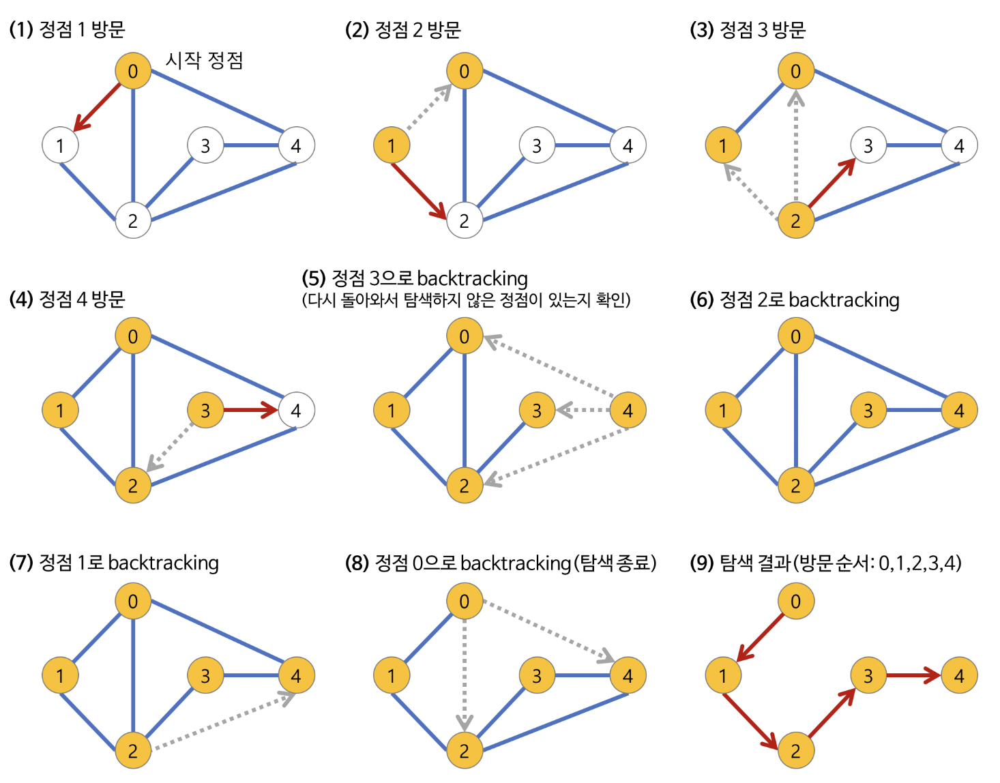

## BFS (너비 우선 탐색)


BFS(Breath First Search)는 너비 우선 탐색이라고 하며 시작 노드로부터 가까운 노드를 먼저 방문하고 멀리 떨어져 있는 노드를 나중에 방문하는 탐색 방법이다. DFS는 최대한 멀리 있는 노드를 우선으로 탐색하는데, BFS는 그 반대다. BFS는 선입선출 방식인 큐 자료구조를 이용하는 것이 일반적이다. 다른 언어의 경우는 보통 내장 라이브러리에 큐를 제공하고 있다. 하지만 자바스크립트는 큐와 관련된 객체가 내장되어 있지 않다. 따라서 큐를 이용하기 위해서는 직접 자료구조를 구현할 필요가 있다.

### 특징

- Queue를 이용하여 구현할 수 있다.
- 시작 지점에서 가까운 정점부터 탐색한다.
- V가 정점의 수, E가 간선의 수일 때 BFS의 시간복잡도는 O(V + E)다.

```jsx
function BFS(graph, start, visited) {
  const queue = [];
  queue.push(start);
  visited[start] = true;

  while (queue.size()) {
    const v = queue.shift();
    console.log(v);

    for (const node of graph[v]) {
      if (!visited[node]) {
        queue.push(node);
        visited[node] = true;
      }
    }
  }
}

const graph = [[1, 2, 4], [0, 5], [0, 5], [4], [0, 3], [1, 2]];
const visited = Array(6).fill(false);
BFS(graph, 0, visited); // 0 1 2 4 5 3
```

## DFS (깊이 우선 탐색)



DFS(Depth-First-Search)는 깊이 우선 탐색이라고 하며 그래프에서 깊은 부분을 우선으로 탐색하는 알고리즘이다. DFS는 트리에서 생각하면 이해하기 쉽다(트리도 그래프의 일종이다). 트리를 탐색할 때 시작 노드에서 한 방향으로 계속 탐색하다가 더 이상 갈 수 없을 때 다시 가장 가까운 노드로 되돌아와 다시 탐색을 진행하는 방법과 유사하다.

DFS를 구현하는 데는 2가지의 방법이 있다. 첫 번째는 재귀를 이용하는 것이고 두 번째는 스택(반복문)을 이용하는 것이다.

### 특징

- Stack을 이용하여 구현할 수 있다.
- 시작 정점에서 깊은 것부터 찾는다.
- V가 정점의 수, E가 간선의 수일 때 BFS의 시간복잡도는 O(V + E)다.

```jsx
function dfs(graph, v, visited) {
  // 현재 노드를 방문 처리
  visited[v] = true;
  console.log(v);

  // 현재 노드와 연결된 다른 노드를 재귀적으로 방문
  for (let node of graph[v]) {
    if (!visited[node]) {
      dfs(graph, node, visited);
    }
  }
}

const graph = [[1, 2, 4], [0, 5], [0, 5], [4], [0, 3], [1, 2]];
const visited = Array(7).fill(false);

dfs(graph, 0, visited);
// 0 1 5 2 4 3
```
