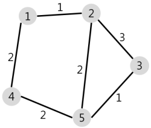
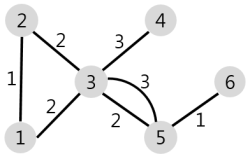

## 배달

- 문제 설명

  N개의 마을로 이루어진 나라가 있습니다. 이 나라의 각 마을에는 1부터 N까지의 번호가 각각 하나씩 부여되어 있습니다. 각 마을은 양방향으로 통행할 수 있는 도로로 연결되어 있는데, 서로 다른 마을 간에 이동할 때는 이 도로를 지나야 합니다. 도로를 지날 때 걸리는 시간은 도로별로 다릅니다. 현재 1번 마을에 있는 음식점에서 각 마을로 음식 배달을 하려고 합니다. 각 마을로부터 음식 주문을 받으려고 하는데, N개의 마을 중에서 K 시간 이하로 배달이 가능한 마을에서만 주문을 받으려고 합니다. 다음은 N = 5, K = 3인 경우의 예시입니다.

  

  위 그림에서 1번 마을에 있는 음식점은 [1, 2, 4, 5] 번 마을까지는 3 이하의 시간에 배달할 수 있습니다. 그러나 3번 마을까지는 3시간 이내로 배달할 수 있는 경로가 없으므로 3번 마을에서는 주문을 받지 않습니다. 따라서 1번 마을에 있는 음식점이 배달 주문을 받을 수 있는 마을은 4개가 됩니다.
  마을의 개수 N, 각 마을을 연결하는 도로의 정보 road, 음식 배달이 가능한 시간 K가 매개변수로 주어질 때, 음식 주문을 받을 수 있는 마을의 개수를 return 하도록 solution 함수를 완성해주세요.

- 제한사항

  마을의 개수 N은 1 이상 50 이하의 자연수입니다.
  road의 길이(도로 정보의 개수)는 1 이상 2,000 이하입니다.
  road의 각 원소는 마을을 연결하고 있는 각 도로의 정보를 나타냅니다.
  road는 길이가 3인 배열이며, 순서대로 (a, b, c)를 나타냅니다.
  a, b(1 ≤ a, b ≤ N, a != b)는 도로가 연결하는 두 마을의 번호이며, c(1 ≤ c ≤ 10,000, c는 자연수)는 도로를 지나는데 걸리는 시간입니다.
  두 마을 a, b를 연결하는 도로는 여러 개가 있을 수 있습니다.
  한 도로의 정보가 여러 번 중복해서 주어지지 않습니다.
  K는 음식 배달이 가능한 시간을 나타내며, 1 이상 500,000 이하입니다.
  임의의 두 마을간에 항상 이동 가능한 경로가 존재합니다.
  1번 마을에 있는 음식점이 K 이하의 시간에 배달이 가능한 마을의 개수를 return 하면 됩니다.

- 입출력 예

  |  N  |                           road                            |  K  | result |
  | :-: | :-------------------------------------------------------: | :-: | :----: |
  |  5  |     [[1,2,1],[2,3,3],[5,2,2],[1,4,2],[5,3,1],[5,4,2]]     |  3  |   4    |
  |  6  | [[1,2,1],[1,3,2],[2,3,2],[3,4,3],[3,5,2],[3,5,3],[5,6,1]] |  4  |   4    |

- 입출력 예 설명

  - 입출력 예 #1

    문제의 예시와 같습니다.

  - 입출력 예 #2

    주어진 마을과 도로의 모양은 아래 그림과 같습니다.

  

  1번 마을에서 배달에 4시간 이하가 걸리는 마을은 [1, 2, 3, 5] 4개이므로 4를 return 합니다.

## 배달 문제 풀이

배달 문제풀이
https://programmers.co.kr/learn/courses/30/lessons/12978?language=javascript

배달 문제는 최단 경로를 찾아야 하는 프로그래머스의 대표적인 문제입니다. 먼저 문제 설명부터 보겠습니다.

N개의 마을로 이루어진 나라가 있습니다. 이 나라의 각 마을에는 1부터 N까지의 번호가 각각 하나씩 부여되어 있습니다. 각 마을은 양방향으로 통행할 수 있는 도로로 연결되어 있는데, 서로 다른 마을 간에 이동할 때는 이 도로를 지나야 합니다. 도로를 지날 때 걸리는 시간은 도로별로 다릅니다. 현재 1번 마을에 있는 음식점에서 각 마을로 음식 배달을 하려고 합니다. 각 마을로부터 음식 주문을 받으려고 하는데, N개의 마을 중에서 K 시간 이하로 배달이 가능한 마을에서만 주문을 받으려고 합니다. 다음은 N = 5, K = 3인 경우의 예시입니다.


위 그림에서 1번 마을에 있는 음식점은 [1, 2, 4, 5] 번 마을까지는 3 이하의 시간에 배달할 수 있습니다. 그러나 3번 마을까지는 3시간 이내로 배달할 수 있는 경로가 없으므로 3번 마을에서는 주문을 받지 않습니다. 따라서 1번 마을에 있는 음식점이 배달 주문을 받을 수 있는 마을은 4개가 됩니다.
마을의 개수 N, 각 마을을 연결하는 도로의 정보 road, 음식 배달이 가능한 시간 K가 매개변수로 주어질 때, 음식 주문을 받을 수 있는 마을의 개수를 return 하도록 solution 함수를 완성해주세요.

### 문제 유형 파악하기

문제 설명에서 핵심적인 부분을 살펴보면 1번 마을에 있는 음식점에서 각 마을로 음식 배달을 하려고 합니다, N개의 마을 중에서 K 시간 이하로 배달이 가능한 마을 두 가지라 할 수 있습니다. 그리고 이미지를 살펴보면 그래프의 간선에 가중치가 있는 것을 확인할 수 있습니다.

그렇다면 문제 유형이 어떻게 될까요? 먼저 K 시간 이하인 마을을 알아내기 위해 1번 마을에서 특정 마을까지의 최단 거리를 알아야 합니다. 그러기 위해서 최단 경로 알고리즘 중 하나를 선택할 수 있습니다. 이때 BFS나 DFS를 이용할 수도 있지만 간선에 가중치가 있기 때문에 다익스트라 알고리즘을 이용하는 것이 더 효율적입니다.

이제 문제 유형을 파악했으니 한 번 풀어보겠습니다.

#### 최소 힙 구현

먼저 다익스트라 알고리즘을 구현하기 위해 힙을 구현해야 합니다. 정점을 낮은 순서로 찾아야 하기 때문에 최소 힙을 구현해야 합니다. 최소 힙은 이전 힙 영상에서 구현한 최대 힙의 조건들을 반대로 구성하면 됩니다.

```jsx
class MinHeap {
  constructor() {
    this.heap = [null];
  }

  push(value) {
    this.heap.push(value);
    let currentIndex = this.heap.length - 1;
    let parentIndex = Math.floor(currentIndex / 2);

    while (parentIndex !== 0 && this.heap[parentIndex] > value) {
      const temp = this.heap[parentIndex];
      this.heap[parentIndex] = value;
      this.heap[currentIndex] = temp;

      currentIndex = parentIndex;
      parentIndex = Math.floor(currentIndex / 2);
    }
  }

  pop() {
    const returnValue = this.heap[1];
    this.heap[1] = this.heap.pop();

    let currentIndex = 1;
    let leftIndex = 2;
    let rightIndex = 3;
    while (
      this.heap[currentIndex] > this.heap[leftIndex] ||
      this.heap[currentIndex] > this.heap[rightIndex]
    ) {
      if (this.heap[leftIndex] > this.heap[rightIndex]) {
        const temp = this.heap[currentIndex];
        this.heap[currentIndex] = value;
        this.heap[rightIndex] = temp;
        currentIndex = rightIndex;
      } else {
        const temp = this.heap[currentIndex];
        this.heap[currentIndex] = value;
        this.heap[leftIndex] = temp;
        currentIndex = leftIndex;
      }
      leftIndex = currentIndex * 2;
      rightIndex = currentIndex * 2 + 1;
    }

    return returnValue;
  }
}
```

기본적인 최소힙 코드입니다. 여기서 최소 힙이 정점과 간선의 값을 담을 수 있도록 받는 자료형을 객체로 변경 해보겠습니다. 객체는 다음과 같은 필드를 담을 수 있습니다.

```jsx
{
node: "number", // 정점 번호
cost: "number" // 간선의 값
}
먼저 push 함수를 다음과 같이 변경합니다.

push(value) {
this.heap.push(value);
let currentIndex = this.heap.length - 1;
let parentIndex = Math.floor(currentIndex / 2);

    // `this.heap[parentIndex].cost`, `value.cost`를 통해
    // 간선의 값으로 비교하도록 수정한다.
    while (parentIndex !== 0 && this.heap[parentIndex].cost > value.cost) {
        this._swap(parentIndex, currentIndex) // 편의를 위해 별도로 _swap 함수를 구현했다.

        currentIndex = parentIndex;
        parentIndex = Math.floor(currentIndex / 2);
    }

}

\_swap(a, b) { // 배열의 요소를 swap하는 함수 작성
[this.heap[a], this.heap[b]] = [this.heap[b], this.heap[a]];
}
```

이어서 편의를 위해 isEmpty 함수를 작성합니다.

```jsx
isEmpty() {
return this.heap.length === 1;
}
```

그리고 pop 함수를 다음과 같이 변경합니다.

```jsx
pop() {
if (this.isEmpty()) return; // 예외 로직
if (this.heap.length === 2) return this.heap.pop(); // 루트 정점만 남은 경우

    const returnValue = this.heap[1];
    this.heap[1] = this.heap.pop();

    let currentIndex  = 1;
    let leftIndex = 2;
    let rightIndex = 3;

    // 비교하는 부분에 전부 `.cost`를 붙여줍니다.
    // 그리고 실제로 왼쪽, 오른쪽에 값이 있는지 체크하는 조건을 추가합니다.
    while ((this.heap[leftIndex] && this.heap[currentIndex].cost > this.heap[leftIndex].cost) ||
            (this.heap[rightIndex] && this.heap[currentIndex].cost > this.heap[rightIndex].cost)) {
        if (this.heap[leftIndex] === undefined) { // 왼쪽 정점이 없을 경우
            this._swap(rightIndex, currentIndex)
        } else if (this.heap[rightIndex] === undefined) { // 오른쪽 정점이 없을 경우
            this._swap(leftIndex, currentIndex)
        } else if (this.heap[leftIndex].cost > this.heap[rightIndex].cost) {
            this._swap(rightIndex, currentIndex)
        } else if (this.heap[leftIndex].cost <= this.heap[rightIndex].cost) {
            this._swap(leftIndex, currentIndex)
        }
        leftIndex = currentIndex * 2;
        rightIndex = currentIndex * 2 + 1;
    }

    return returnValue;

}
```

이렇게 작성하면 힙이 여러 데이터를 가질 수 있습니다. 그리고 이 부분은 객체가 아닌 배열을 사용하셔도 괜찮습니다. 손에 익는 방법을 사용해보세요.

자바스크립트에서 힙이 내장 기능으로 없는 점이 아쉽지만 몇 번 만들다보면 금세 손에 익을 것이라 생각합니다.

#### 다익스트라 알고리즘 구현

힙까지 구현했다면 다익스트라 알고리즘 자체는 크게 어렵지 않습니다.

- 먼저 힙을 생성합니다.
- 각 정점에 대한 최단 거리를 저장할 배열을 무한대로 초기화합니다.
- 힙에 시작점을 추가합니다.
- 힙이 비어있지 않을 때 까지 루프를 돕니다.
- 선택된 정점에서 갈 수 있는 정점을 찾습니다.
- 더 짧은 경로라면 값을 갱신합니다.
- 루프가 종료되면 최단 거리 배열을 반환합니다.
- 위와 같은 흐름으로 알고리즘을 작성한 코드는 다음과 같습니다.

```jsx
function dijkstra(road, N) {
  const heap = new MinHeap(); // 우선순위 큐(힙)
  heap.push({ node: 1, cost: 0 }); // 1번 마을부터 시작

  const dist = [...Array(N + 1)].map(() => Infinity); // 계산하기 편하도록 N+1 길이만큼 리스트 생성
  dist[1] = 0; // 1번 마을은 무조건 거리가 0

  while (!heap.isEmpty()) {
    // heap이 비어있지 않다면
    // cost가 가장 낮은 정점을 뽑는다.
    const { node: current, cost: currentCost } = heap.pop();

    for (const [src, dest, cost] of road) {
      // 루프를 돌며 시작점, 도착점, 비용을 꺼낸다
      const nextCost = cost + currentCost; // 비용

      // 양방향을 고려하여 작성
      if (src === current && nextCost < dist[dest]) {
        // src가 현재 선택된 정점이면서 목적지까지 더 저렴할 경우
        dist[dest] = nextCost; // 거리를 갱신한다.
        heap.push({ node: dest, cost: nextCost }); // push
      } else if (dest == current && nextCost < dist[src]) {
        // dest가 현재 선택된 정점이면서 목적지까지 더 저렴할 경우
        dist[src] = nextCost; // 거리를 갱신한다.
        heap.push({ node: src, cost: nextCost }); // push
      }
    }
  }

  return dist; // 1번 마을부터 각 마을까지의 최단 거리
}
```

#### 답 찾기

다익스트라 알고리즘 함수까지 구현했다면 이후엔 간단합니다.

```jsx
function solution(N, road, K) {
  const dist = dijkstra(road, N);
  return dist.filter((x) => x <= K).length;
}
```

최종적으로 dist 배열에서 K 이하인 값만 찾고 그 길이를 반환하면 됩니다.

#### 전체 코드

```jsx
class MinHeap {
  constructor() {
    this.heap = [null];
  }

  push(value) {
    this.heap.push(value);
    let currentIndex = this.heap.length - 1;
    let parentIndex = Math.floor(currentIndex / 2);

    while (parentIndex !== 0 && this.heap[parentIndex].cost > value.cost) {
      this._swap(parentIndex, currentIndex);

      currentIndex = parentIndex;
      parentIndex = Math.floor(currentIndex / 2);
    }
  }

  pop() {
    if (this.isEmpty()) return;
    if (this.heap.length === 2) return this.heap.pop();

    const returnValue = this.heap[1];
    this.heap[1] = this.heap.pop();

    let currentIndex = 1;
    let leftIndex = 2;
    let rightIndex = 3;
    while (
      (this.heap[leftIndex] &&
        this.heap[currentIndex].cost > this.heap[leftIndex].cost) ||
      (this.heap[rightIndex] &&
        this.heap[currentIndex].cost > this.heap[rightIndex].cost)
    ) {
      if (this.heap[leftIndex] === undefined) {
        // 왼쪽 정점이 없을 경우
        this._swap(rightIndex, currentIndex);
      } else if (this.heap[rightIndex] === undefined) {
        // 오른쪽 정점이 없을 경우
        this._swap(leftIndex, currentIndex);
      } else if (this.heap[leftIndex].cost > this.heap[rightIndex].cost) {
        this._swap(rightIndex, currentIndex);
      } else if (this.heap[leftIndex].cost <= this.heap[rightIndex].cost) {
        this._swap(leftIndex, currentIndex);
      }
      leftIndex = currentIndex * 2;
      rightIndex = currentIndex * 2 + 1;
    }

    return returnValue;
  }

  isEmpty() {
    return this.heap.length === 1;
  }

  _swap(a, b) {
    // 편의를 위해 배열의 요소를 swap하는 함수 작성
    [this.heap[a], this.heap[b]] = [this.heap[b], this.heap[a]];
  }
}

function dijkstra(road, N) {
  const heap = new MinHeap(); // 우선순위 큐(힙)
  heap.push({ node: 1, cost: 0 }); // 1번 마을부터 시작

  const dist = [...Array(N + 1)].map(() => Infinity); // 계산하기 편하도록 N+1 길이만큼 리스트 생성
  dist[1] = 0; // 1번 마을은 무조건 거리가 0

  while (!heap.isEmpty()) {
    // heap이 비어있지 않다면
    // cost가 가장 낮은 정점을 뽑는다.
    const { node: current, cost: currentCost } = heap.pop();

    for (const [src, dest, cost] of road) {
      // 루프를 돌며 시작점, 도착점, 비용을 꺼낸다
      const nextCost = cost + currentCost; // 비용

      // 양방향을 고려하여 작성
      if (src === current && nextCost < dist[dest]) {
        // src가 현재 선택된 정점이면서 목적지까지 더 저렴할 경우
        dist[dest] = nextCost; // 거리를 갱신한다.
        heap.push({ node: dest, cost: nextCost }); // push
      } else if (dest == current && nextCost < dist[src]) {
        // dest가 현재 선택된 정점이면서 목적지까지 더 저렴할 경우
        dist[src] = nextCost; // 거리를 갱신한다.
        heap.push({ node: src, cost: nextCost }); // push
      }
    }
  }

  return dist; // 1번 마을부터 각 마을까지의 최단 거리
}

function solution(N, road, K) {
  const dist = dijkstra(road, N);
  return dist.filter((x) => x <= K).length;
}
```
