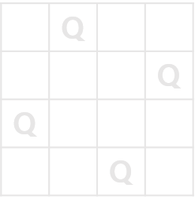
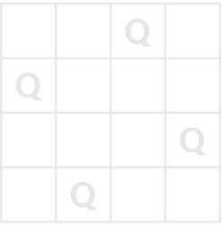

## N-Queen

- 문제 설명

  가로, 세로 길이가 n인 정사각형으로된 체스판이 있습니다. 체스판 위의 n개의 퀸이 서로를 공격할 수 없도록 배치하고 싶습니다.

예를 들어서 n이 4인경우 다음과 같이 퀸을 배치하면 n개의 퀸은 서로를 한번에 공격 할 수 없습니다.




체스판의 가로 세로의 세로의 길이 n이 매개변수로 주어질 때, n개의 퀸이 조건에 만족 하도록 배치할 수 있는 방법의 수를 return하는 solution함수를 완성해주세요.

- 제한사항

  퀸(Queen)은 가로, 세로, 대각선으로 이동할 수 있습니다.
  n은 12이하의 자연수 입니다.

- 입출력 예

  |  n  | result |
  | :-: | :----: |
  |  4  |   2    |

- 입출력 예 설명

  - 입출력 예 #1

    문제의 예시와 같습니다.

## 백트래킹 N-Queen 문제풀이

N-Queen 문제풀이
https://programmers.co.kr/learn/courses/30/lessons/12952?language=javascript

N-Queen 문제는 백트래킹을 설명할 때 자주 사용되는 유명한 문제입니다. 먼저 문제 설명부터 보겠습니다.

가로, 세로 길이가 n인 정사각형으로된 체스판이 있습니다. 체스판 위의 n개의 퀸이 서로를 공격할 수 없도록 배치하고 싶습니다.
예를 들어서 n이 4인경우 다음과 같이 퀸을 배치하면 n개의 퀸은 서로를 한번에 공격 할 수 없습니다.

체스판의 가로 세로의 세로의 길이 n이 매개변수로 주어질 때, n개의 퀸이 조건에 만족 하도록 배치할 수 있는 방법의 수를 return하는 solution함수를 완성해주세요.

문제 설명은 매우 간단합니다. 하지만 이를 코딩으로 구현하려하면 직관적으로 떠올리기 힘든 문제라고 할 수 있습니다. 이런 경우에 백트래킹을 이용할 수 있습니다.

- 전략

  우선 모든 경우의 수를 찾는 것은 괜찮습니다. 그런데 어떻게 해야 가지치기를 잘했다고 소문이 날까요? 가지치기 할 수 있는 경우는 다음과 같습니다.

  퀸을 둔 행은 가지치기 한다.
  퀸을 둔 열은 가지치기 한다.
  퀸을 둔 대각선 왼쪽, 오른쪽은 가지치기 한다.
  가지치기 조건을 찾은 것은 좋지만 가지치기를 위해 행과 열, 대각선을 루프를 통해 검사하게 되면 성능을 크게 낭비하게 됩니다. 그래서 최대한 적은 비용으로 가지치기를 하기 위해 1차원 배열을 사용해봅시다. 1차원 배열은 다음과 같이 데이터가 들어갑니다.

  배열의 index는 행의 위치, 해당 index의 value는 열의 위치
  예를 들어, queen[2] = 1은 체스판 위에서 두 번째 줄, 첫 번째 칸에 해당한다. (1부터 시작한다고 가정할 때)
  위와 같이 데이터 형태를 잡는다면 조건을 다음과 같이 잡을 수 있습니다.

  한 index에 여러 value를 둘 수 없기에 행은 자연스럽게 가지치기 된다.
  index가 같다면 둘 수 없다. 같다면 가지치기 한다.
  행, 열에 대한 차가 같다면 대각선에 있다는 뜻이므로 가지치기 한다.
  예를 들어, 1부터 시작한다고 가정할 때 queen[3] = 2, queen[1] = 4일 때 행에 대한 차 3 - 1과 열에 대한 차 4 - 2는 같기 때문에 대각선에 있다는 뜻이다. (절대값으로 계산하면 왼쪽, 오른쪽 둘다 체크 가능하다)
  이런 방식으로 검사 비용을 아낄 수 있습니다.

- 코드

  결과적으로 재귀로 구현한 코드는 다음과 같습니다. 이전에 재귀 파트를 떠올리시면서 보시면 더 이해가 쉬울 것이라 생각합니다.

```jsx
function check(queen, row) {
  // 이전까지 두었던 퀸의 위치를 확인한다.
  for (let i = 0; i < row; i += 1) {
    // 행의 위치와 대각선의 위치를 체크한다.
    if (
      queen[i] === queen[row] ||
      Math.abs(queen[i] - queen[row]) === row - i
    ) {
      return false; // 둘 수 없다면 false
    }
  }

  return true; // 모두 통과되면 true
}

function search(queen, row) {
  const n = queen.length;
  let count = 0;

  if (n === row) {
    // 체스판 끝에 도달했다면.. 재귀의 탈출 조건
    return 1;
  }

  for (let col = 0; col < n; col += 1) {
    // 0부터 n까지 열을 돌면 둘 수 있게 만든다.
    queen[row] = col; // 우선 퀸을 둔다
    if (check(queen, row)) {
      // 퀸을 둘 수 있다면..
      count += search(queen, row + 1); // 다음 행으로 이동!
    }
  }

  return count;
}

function solution(n) {
  // 미리 n개 만큼의 배열을 초기화한다. 0번 행부터 시작한다.
  return search(
    Array.from({ length: n }, () => 0),
    0
  );
}
```
