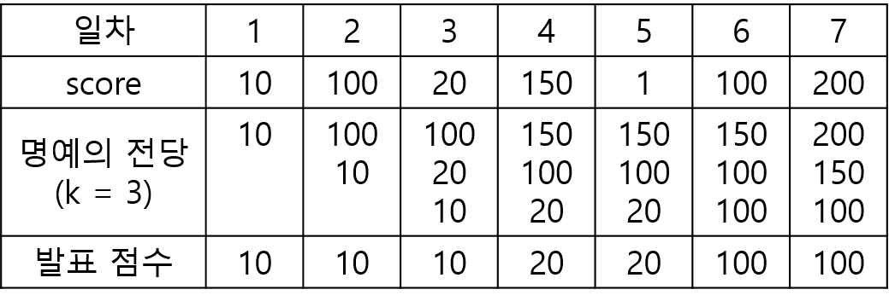
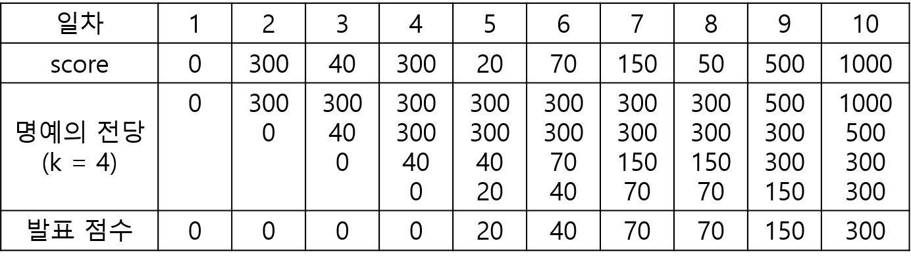

## 명예의 전당 (1)

- 문제 설명

  "명예의 전당"이라는 TV 프로그램에서는 매일 1명의 가수가 노래를 부르고, 시청자들의 문자 투표수로 가수에게 점수를 부여합니다. 매일 출연한 가수의 점수가 지금까지 출연 가수들의 점수 중 상위 k번째 이내이면 해당 가수의 점수를 명예의 전당이라는 목록에 올려 기념합니다. 즉 프로그램 시작 이후 초기에 k일까지는 모든 출연 가수의 점수가 명예의 전당에 오르게 됩니다. k일 다음부터는 출연 가수의 점수가 기존의 명예의 전당 목록의 k번째 순위의 가수 점수보다 더 높으면, 출연 가수의 점수가 명예의 전당에 오르게 되고 기존의 k번째 순위의 점수는 명예의 전당에서 내려오게 됩니다.

  이 프로그램에서는 매일 "명예의 전당"의 최하위 점수를 발표합니다. 예를 들어, k = 3이고, 7일 동안 진행된 가수의 점수가 [10, 100, 20, 150, 1, 100, 200]이라면, 명예의 전당에서 발표된 점수는 아래의 그림과 같이 [10, 10, 10, 20, 20, 100, 100]입니다.

  

  명예의 전당 목록의 점수의 개수 k, 1일부터 마지막 날까지 출연한 가수들의 점수인 score가 주어졌을 때, 매일 발표된 명예의 전당의 최하위 점수를 return하는 solution 함수를 완성해주세요.

- 제한사항

  3 ≤ k ≤ 100
  7 ≤ score의 길이 ≤ 1,000
  0 ≤ score[i] ≤ 2,000

- 입출력 예

  |  k  |                     score                     |                 result                 |
  | :-: | :-------------------------------------------: | :------------------------------------: |
  |  3  |        [10, 100, 20, 150, 1, 100, 200]        |     [10, 10, 10, 20, 20, 100, 100]     |
  |  4  | [0, 300, 40, 300, 20, 70, 150, 50, 500, 1000] | [0, 0, 0, 0, 20, 40, 70, 70, 150, 300] |

- 입출력 예 #1

  문제의 예시와 같습니다.

- 입출력 예 #2

  아래와 같이, [0, 0, 0, 0, 20, 40, 70, 70, 150, 300]을 return합니다.
  

### 문제풀이

```jsx
class MinHeap {
  constructor() {
    this.heap = [null];
  }

  size() {
    return this.heap.length - 1;
  }

  getMin() {
    return this.heap[1] ? this.heap[1] : 0;
  }

  swap(a, b) {
    [this.heap[a], this.heap[b]] = [this.heap[b], this.heap[a]];
  }

  heappush(value) {
    this.heap.push(value);
    let curIdx = this.heap.length - 1;
    let parIdx = (curIdx / 2) >> 0;
    while (curIdx > 1 && this.heap[parIdx] > this.heap[curIdx]) {
      this.swap(parIdx, curIdx);
      curIdx = parIdx;
      parIdx = (curIdx / 2) >> 0;
    }
  }

  heappop() {
    const min = this.heap[1];
    if (this.heap.length <= 2) this.heap = [null];
    else this.heap[1] = this.heap.pop();

    let curIdx = 1;
    let leftIdx = curIdx * 2;
    let rightIdx = curIdx * 2 + 1;

    if (!this.heap[leftIdx]) return min;
    if (!this.heap[rightIdx]) {
      if (this.heap[leftIdx] < this.heap[curIdx]) {
        this.swap(leftIdx, curIdx);
      }
      return min;
    }

    while (
      this.heap[leftIdx] < this.heap[curIdx] ||
      this.heap[rightIdx] < this.heap[curIdx]
    ) {
      const minIdx =
        this.heap[leftIdx] > this.heap[rightIdx] ? rightIdx : leftIdx;
      this.swap(minIdx, curIdx);
      curIdx = minIdx;
      leftIdx = curIdx * 2;
      rightIdx = curIdx * 2 + 1;
    }
    return min;
  }
}

function solution(k, score) {
  // 매일 테스트
  // 매일 k위 까지
  // 최하위 점수 표시
  // 중복점수 가능
  const heap = new MinHeap();

  const resultList = [];
  for (let i = 0; i < score.length; i++) {
    if (heap.size() < k) {
      heap.heappush(score[i]);
    } else if (heap.size() === k) {
      if (heap.getMin() < score[i]) {
        heap.heappop();
        heap.heappush(score[i]);
      }
    }
    resultList.push(heap.getMin());
  }
  return resultList;
}
```

```jsx
function solution(k, score) {
    const stack = []
    return score.reduce((a,c) => {
        if(stack.length < k) {
            stack.push(c)
            stack.sort((a,b) => a - b)
        }
        else {
            stack.push(c)
            stack.sort((a,b) => a - b)
            stack.shift()
        }
        a.push(stack[0])
        return a
    },
```
