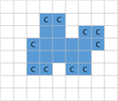
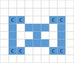
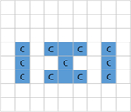

## 동계 테스트 시점 예측

북위 65도. 스웨덴의 소도시 아르예플로그(Arjeplog)에 자리한 동계 테스트 센터. 겨울 내내 얼음 두께가 1M 내외로 유지되는 광할한 얼음 호수와 그냥 걷기조차 힘든 눈길을 무대로 현대자동차그룹 연구원들은 극한 환경 속에서 더 나은 차량 성능을 확보하기 위해 제동안정성, 주행안정성, ADAS 기능 등에 대한 다양한 평가를 숨가쁘게 이어가고 있다.

이 곳은 기온이 너무 추워서 아침에 출근해보면 테스트 차량들 위에 큰 눈얼음이 생겨 있다. 정상적인 테스트를 위해서는 커다란 얼음이 어느정도 녹고 난 뒤에 가능한데, 차량 마다 당일의 테스트 가능 시점을 알기 위한 예측 프로그램을 제작 중에 있다.



예측 프로그램은 N×M (5 ≤ N, M ≤ 100)의 격자 화면 위에 눈 얼음의 모양을 작은 정사각형들이 집합되어 있는 모양으로 변환하여 위 그림과 같이 표시해 준다. 단, N 은 세로 격자의 수이고, M 은 가로 격자의 수이다. 이 얼음은 아침이 되면 기온이 상승하여 천천히 녹는다.

그런데 화면에서 나타난 얼음의 모양은 작은 정사각형 모양의 4변 중에서 적어도 2변 이상이 외부의 공기와 접촉했을 때 정확히 한 시간 만에 녹아 없어져 버린다. 따라서 위 그림의 모양과 같은 얼음(파란으로 표시된 부분)라면 C로 표시된 모든 얼음 격자는 한 시간 후에 사라진다.



위와 같이 얼음 내부에 있는 공간은 얼음 외부 공기와 접촉하지 않는 것으로 가정한다. 그러므로 이 공간에 접촉한 얼음 격자는 녹지 않고 C로 표시된 얼음 격자만 사라진다. 그러나 한 시간 후, 이 공간으로 외부공기가 유입되면, 아래 그림에서와 같이 C로 표시된 얼음 격자들이 사라지게 된다.



격자 화면의 맨 가장자리에는 얼음이 놓이지 않는 것으로 가정한다. 입력으로 주어진 얼음이 모두 녹아 없어지는데 걸리는 정확한 시간을 구하는 프로그램을 작성해보자.

- 제약조건

  5 ≤ N, M ≤ 100

- 입력형식

  첫째 줄에는 격자 화면의 크기를 나타내는 두 개의 정수 N, M이 주어진다. 그 다음 N개의 줄에는 격자 화면 위에 얼음이 있는 부분은 1로 표시되고, 얼음이 없는 부분은 0으로 표시된다. 또한, 각 0과 1은 하나의 공백으로 분리되어 있다.

- 출력형식

  출력으로는 주어진 얼음이 모두 녹아 없어지는데 걸리는 정확한 시간을 정수로 첫 줄에 출력한다.

- 입력예제1

  8 9
  0 0 0 0 0 0 0 0 0
  0 0 0 1 1 0 0 0 0
  0 0 0 1 1 0 1 1 0
  0 0 1 1 1 1 1 1 0
  0 0 1 1 1 1 1 0 0
  0 0 1 1 0 1 1 0 0
  0 0 0 0 0 0 0 0 0
  0 0 0 0 0 0 0 0 0

- 출력예제1

  4

### 문제풀이

```jsx
const readline = require("readline");

const rl = readline.createInterface({
  input: process.stdin,
  output: process.stdout,
});

const lines = [];

rl.on("line", (line) => {
  lines.push(line.split(" "));
}).on("close", () => {
  console.log(lines);
});
```
