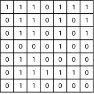
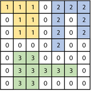

## 장애물 인식 프로그램

자율주행팀 SW 엔지니어인 당신에게 장애물과 도로를 인식할 수 있는 프로그램을 만들라는 업무가 주어졌다.


[그림 1] 지도 예시

우선 [그림 1]과 같이 정사각형 모양의 지도가 있다. 1은 장애물이 있는 곳을, 0은 도로가 있는 곳을 나타낸다.

당신은 이 지도를 가지고 연결된 장애물들의 모임인 블록을 정의하고, 불록에 번호를 붙이려 한다. 여기서 연결되었다는 것은 어떤 장애물이 좌우, 혹은 아래위로 붙어 있는 경우를 말한다. 대각선 상에 장애물이 있는 경우는 연결된 것이 아니다.


[그림 2] 블록 별 번호 부여

[그림 2]는 [그림 1]을 블록 별로 번호를 붙인 것이다.

지도를 입력하여 장애물 블록수를 출력하고, 각 블록에 속하는 장애물의 수를 오름차순으로 정렬하여 출력하는 프로그램을 작성하시오.

- 제약조건

  N은 정사각형임으로 가로와 세로의 크기는 같으며 5 ≤ N ≤ 25

- 입력형식

  입력 값의 첫 번째 줄에는 지도의 크기 N이 입력되고, 그 다음 N줄에는 각각 N개의 자료(0혹은 1)가 입력된다.

- 출력형식

  첫 번째 줄에는 총 블록 수를 출력 하시오.

그리고 각 블록 내 장애물의 수를 오름차순으로 정렬하여 한 줄에 하나씩 출력하시오.

- 입력예제1

  7
  1110111
  0110101
  0110101
  0000100
  0110000
  0111110
  0110000

- 출력예제1

  3
  7
  8
  9

### 문제풀이

```jsx
const readline = require("readline");

const rl = readline.createInterface({
  input: process.stdin,
  output: process.stdout,
});

const lines = [];

rl.on("line", (line) => {
  lines.push(line.split(""));
}).on("close", () => {
  function dfs(x, y) {
    if (x <= -1 || x >= len || y <= -1 || y >= len) {
      return false;
    }

    if (graph[x][y] === "1") {
      cnt.push(1);
      graph[x][y] = "0";
      dfs(x - 1, y);
      dfs(x, y - 1);
      dfs(x + 1, y);
      dfs(x, y + 1);

      return true;
    }
    return false;
  }

  const len = parseInt(lines[0]);
  let cnt = [];
  let graph = [];

  for (let i = 1; i <= len; i++) {
    graph.push(lines[i]);
  }

  let result = 0;
  let result_list = [];
  for (let i = 0; i < len; i++) {
    for (let j = 0; j < len; j++) {
      if (dfs(i, j)) {
        result += 1;
        result_list.push(cnt.length);
        cnt = [];
      }
    }
  }

  console.log(result);

  result_list.sort((a, b) => a - b);

  for (let i of result_list) {
    console.log(i);
  }
});
```
