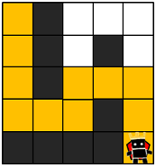
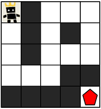
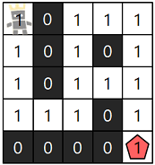

## 게임 맵 최단거리

- 문제 설명

  ROR 게임은 두 팀으로 나누어서 진행하며, 상대 팀 진영을 먼저 파괴하면 이기는 게임입니다. 따라서, 각 팀은 상대 팀 진영에 최대한 빨리 도착하는 것이 유리합니다.

  지금부터 당신은 한 팀의 팀원이 되어 게임을 진행하려고 합니다. 다음은 5 x 5 크기의 맵에, 당신의 캐릭터가 (행: 1, 열: 1) 위치에 있고, 상대 팀 진영은 (행: 5, 열: 5) 위치에 있는 경우의 예시입니다.

  

  위 그림에서 검은색 부분은 벽으로 막혀있어 갈 수 없는 길이며, 흰색 부분은 갈 수 있는 길입니다. 캐릭터가 움직일 때는 동, 서, 남, 북 방향으로 한 칸씩 이동하며, 게임 맵을 벗어난 길은 갈 수 없습니다.
  아래 예시는 캐릭터가 상대 팀 진영으로 가는 두 가지 방법을 나타내고 있습니다.

  - 첫 번째 방법은 11개의 칸을 지나서 상대 팀 진영에 도착했습니다.

  

  - 두 번째 방법은 15개의 칸을 지나서 상대팀 진영에 도착했습니다.

  

  위 예시에서는 첫 번째 방법보다 더 빠르게 상대팀 진영에 도착하는 방법은 없으므로, 이 방법이 상대 팀 진영으로 가는 가장 빠른 방법입니다.

  만약, 상대 팀이 자신의 팀 진영 주위에 벽을 세워두었다면 상대 팀 진영에 도착하지 못할 수도 있습니다. 예를 들어, 다음과 같은 경우에 당신의 캐릭터는 상대 팀 진영에 도착할 수 없습니다.

  

  게임 맵의 상태 maps가 매개변수로 주어질 때, 캐릭터가 상대 팀 진영에 도착하기 위해서 지나가야 하는 칸의 개수의 최솟값을 return 하도록 solution 함수를 완성해주세요. 단, 상대 팀 진영에 도착할 수 없을 때는 -1을 return 해주세요.

- 제한사항

  - maps는 n x m 크기의 게임 맵의 상태가 들어있는 2차원 배열로, n과 m은 각각 1 이상 100 이하의 자연수입니다.
    - n과 m은 서로 같을 수도, 다를 수도 있지만, n과 m이 모두 1인 경우는 입력으로 주어지지 않습니다.
  - maps는 0과 1로만 이루어져 있으며, 0은 벽이 있는 자리, 1은 벽이 없는 자리를 나타냅니다.
  - 처음에 캐릭터는 게임 맵의 좌측 상단인 (1, 1) 위치에 있으며, 상대방 진영은 게임 맵의 우측 하단인 (n, m) 위치에 있습니다.

- 입출력 예

  |                             maps                              | answer |
  | :-----------------------------------------------------------: | :----: |
  | [[1,0,1,1,1],[1,0,1,0,1],[1,0,1,1,1],[1,1,1,0,1],[0,0,0,0,1]] |   11   |
  | [[1,0,1,1,1],[1,0,1,0,1],[1,0,1,1,1],[1,1,1,0,0],[0,0,0,0,1]] |   -1   |

- 입출력 예 #1

  주어진 데이터는 다음과 같습니다.

  
  캐릭터가 적 팀의 진영까지 이동하는 가장 빠른 길은 다음 그림과 같습니다.

  
  따라서 총 11칸을 캐릭터가 지나갔으므로 11을 return 하면 됩니다.

- 입출력 예 #2

  문제의 예시와 같으며, 상대 팀 진영에 도달할 방법이 없습니다. 따라서 -1을 return 합니다.

### 문제풀이

```jsx
// 효율성 테스트 통과 못함
function solution(maps) {
  const rows = maps.length;
  const cols = maps[0].length;

  const calculate = (i, j, k) => {
    if (i < 0 || i >= rows || j < 0 || j >= cols || maps[i][j] === 0) {
      return Infinity;
    }

    if (i === rows - 1 && j === cols - 1) {
      return k;
    }

    maps[i][j] = 0;

    const result = Math.min(
      calculate(i - 1, j, k + 1),
      calculate(i + 1, j, k + 1),
      calculate(i, j - 1, k + 1),
      calculate(i, j + 1, k + 1)
    );

    maps[i][j] = 1;

    return result;
  };

  const resultList = calculate(0, 0, 1);

  return resultList === Infinity ? -1 : resultList;
}
```

```jsx
function solution(maps) {
  // 가로 수, 세로 수
  const rows = maps.length;
  const cols = maps[0].length;
  // 방향
  const directions = [
    [-1, 0],
    [1, 0],
    [0, -1],
    [0, 1],
  ];

  const queue = [];
  queue.push({ x: 0, y: 0, length: 1 });

  while (queue.length > 0) {
    const { x, y, length } = queue.shift();

    for (const [dx, dy] of directions) {
      const nx = x + dx;
      const ny = y + dy;

      if (nx >= 0 && nx < rows && ny >= 0 && ny < cols && maps[nx][ny] === 1) {
        // 해당 좌표 시 return
        if (nx === rows - 1 && ny === cols - 1) {
          return length + 1;
        }

        maps[nx][ny] = 0;
        queue.push({ x: nx, y: ny, length: length + 1 });
      }
    }
  }
  // 실패 시 return
  return -1;
}
```
