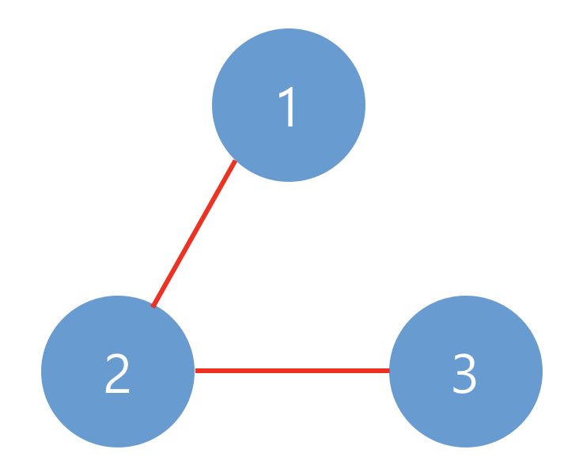

## 네트워크

- 문제 설명

  네트워크란 컴퓨터 상호 간에 정보를 교환할 수 있도록 연결된 형태를 의미합니다. 예를 들어, 컴퓨터 A와 컴퓨터 B가 직접적으로 연결되어있고, 컴퓨터 B와 컴퓨터 C가 직접적으로 연결되어 있을 때 컴퓨터 A와 컴퓨터 C도 간접적으로 연결되어 정보를 교환할 수 있습니다. 따라서 컴퓨터 A, B, C는 모두 같은 네트워크 상에 있다고 할 수 있습니다.

  컴퓨터의 개수 n, 연결에 대한 정보가 담긴 2차원 배열 computers가 매개변수로 주어질 때, 네트워크의 개수를 return 하도록 solution 함수를 작성하시오.

- 제한사항

  컴퓨터의 개수 n은 1 이상 200 이하인 자연수입니다.
  각 컴퓨터는 0부터 n-1인 정수로 표현합니다.
  i번 컴퓨터와 j번 컴퓨터가 연결되어 있으면 computers[i][j]를 1로 표현합니다.
  computer[i][i]는 항상 1입니다.

- 입출력 예

  |  n  |             computers             | return |
  | :-: | :-------------------------------: | :----: |
  |  3  | [[1, 1, 0], [1, 1, 0], [0, 0, 1]] |   2    |
  |  3  | [[1, 1, 0], [1, 1, 1], [0, 1, 1]] |   1    |

- 예제 #1

  아래와 같이 2개의 네트워크가 있습니다.
  

- 예제 #2

  아래와 같이 1개의 네트워크가 있습니다.
  

### 문제풀이

```jsx
function solution(n, computers) {
  const visited = Array(n).fill(false);

  function dfs(graph, v) {
    console.log("v", v);
    // 현재 노드를 방문 처리
    visited[v] = true;
    console.log(v);

    // 현재 노드와 연결된 다른 노드를 재귀적으로 방문
    for (let node of graph[v]) {
      if (node && !visited[node]) {
        dfs(graph, node, visited);
      }
    }
  }

  computers = computers.map((e, i) => {
    return e.map((k, j) => {
      if (k === 1) return j;
    });
  });

  let count = 0;
  while (visited.includes(false)) {
    dfs(computers, visited.indexOf(false));
    count += 1;
  }

  return count;
}
```

```jsx
let arr;
let visitArr;

function solution(n, computers) {
  let ctr = 0;
  arr = computers;
  visitArr = new Array(n).fill(false);

  for (let i in arr) {
    ctr += dfs(i);
  }

  return ctr;
}

function dfs(i) {
  if (visitArr[i] == true) return 0;
  else visitArr[i] = true;

  for (let j in arr[i]) {
    if (arr[i][j] == 1) dfs(j);
  }

  return 1;
}
```
