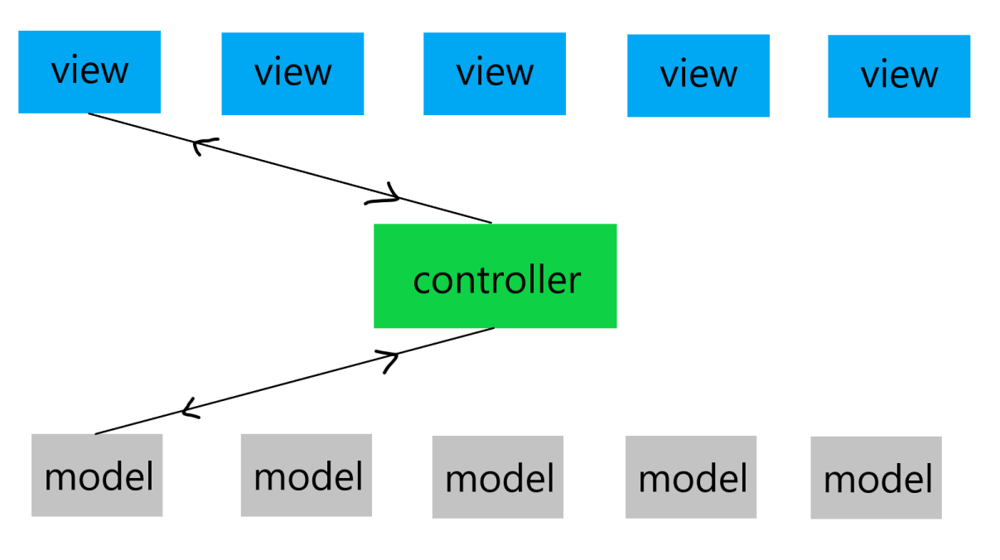

## MVC (Model-View-Controller) 

MVC 패턴을 찾아보면 1979년에 Trygve Mikkjel Heyerdahl Reenskaug라는 컴퓨터 과학자가 처음 소개했다고 합니다.
복잡한 응용프로그램을 관리하기 좋게 더 작은 구성 요소로 나누는 방법을 고민하다가 MVC 패턴을 만들었다고 합니다.
MVC 패턴은 Small Talk라는 언어에서 처음 사용되었고, 요즘 날에 유명한 루비, ASP.NET, Angular, Laravel에서 많이 사용하는 패턴이라고 합니다.

MVC 패턴의 목적은 비즈니스 로직과 뷰를 분리하는 것입니다.

### MVC 패턴의 비즈니스 로직과 뷰를 분리

그림을 보시면 여러 개의 VIEW가 있고 가운데 CONTROLLER가 있습니다.
마지막으로 맨 아래에 MODEL이 있습니다.

- View

  사용자 인터페이스를 담당합니다. 모델의 데이터를 보여주고, 사용자 입력을 받아 Model에 전달합니다.

- Controller

  모델과 뷰를 연결하고, 애플리케이션의 흐름을 제어합니다. 뷰에서 입력을 받아 모델에 전달하거나, 모델에서 변경된 데이터를 가져와 뷰에 반영합니다.

- Model

  애플리케이션의 데이터와 비즈니스 로직을 담당합니다. 데이터를 가져오고 변경하는 메서드를 가지고 있으며, 데이터 변경 시에는 이를 관리하는 컴포넌트로 알립니다.

- UserModel 클래스가 데이터를 캡슐화
- UserView 클래스가 사용자 인터페이스를 구현
- UserController 클래스는 이 둘을 중재하는 컨트롤러 역할

위의 코드에는 문제점이 있습니다. 바로 컨트롤러가 뷰와 모델을 모두 알고 있어야 한다는 것입니다.

UserController가 뷰와 모델을 직접 참조하고 있으므로, 뷰나 모델이 변경될 경우 UserController의 코드도 함께 변경되어야 합니다. 또 다른 문제는 UserView가 직접 UserModel을 참조하고 있다는 것입니다. 
예시 코드에서 UserController 클래스에  UserModel과 UserView 클래스의 인스턴스가 생성되고, displayUserInfo() 함수의 userView 인스턴스에 UserView 클래스 내부에서 UserModel의 내부 데이터인 userModel.name, userModel.email을 직접적으로 참조하는 부분이 있습니다. 이 부분에서 UserView 클래스와 UserModel 클래스가 강하게 결합되어 있어서 만약 UserModel의 속성 이름이 변경된 경우 UserView도 함께 변경되어야 합니다.

이러한 문제점들은 MVC 패턴은 대규모 애플리케이션에서는 복잡성을 증가시키고 유지보수를 어렵게 만드는 경우가 많습니다.

위의 그림은 위와 같은 이유에서 저렇게 그린게 아닐까 추측해 봅니다. 뷰와 모델의 참조로 인해 강한 결합도를 야기하고 한 클래스의 변경이 다른 클래스에도 영향을 미칠 수 있다는 걸 의미하여 그림에는 Model의 update가 view에 영향을 주게 됩니다.

또한 왜 대규모에서 문제가 발생하는지 그림을 통해 보겠습니다.

각각의 VIEW에서 필요한 MODEL의 연결이 화살표 색깔별로 나눠져 있습니다. 뷰가 확장되고 모델이 많아질수록 각 VIEW가 필요로 하는 MODEL이 서로 복잡하게 얽히게 됩니다. 이렇게 될 경우 당연히 복잡도가 늘어나고 결합도 또한 계속 증가할 것입니다.

### 다 수의 Controller

컨트롤러를 여러 개 두면 일부 문제점을 해결할 수 있지만 또 다른 문제점이 발생할 수 있습니다.

예를 들어 하나의 모델이 여러 컨트롤러에서 사용되면, 각 컨트롤러에서 모델의 상태를 일관되게 유지하기 어렵고 복잡해질 수 있습니다. 또한 컨트롤러 간의 데이터 공유가 어려워지며, 모든 컨트롤러가 불필요한 중복 코드를 가질 가능성이 있습니다. 이는 유지보수성을 저하시키고 코드의 재사용성을 낮출 수 있습니다.

따라서, 여러 개의 컨트롤러를 사용하는 경우, 각 컨트롤러가 독립적이고 책임이 명확하게 구분되도록 설계하는 것이 중요합니다. 또한 모델의 상태를 일관되게 유지하기 위해 컨트롤러 간의 공유 및 협력 방식을 고려하며, 중복 코드를 최소화하도록 해야 합니다. 또한 나누더라고 Controller에서 VIew와 Model의 강한 결합도는 똑같기 때문에 단순히 Controller의 개수가 늘어남으로 문제가 해결되진 않습니다.

그래서 이러한 MVC 패턴의 문제점을 해결하기 위해 MVP와 MVVM 패턴과 같은 다른 아키텍처 패턴이 등장하게 되었습니다.

### 참고자료

- [한 번의 글로 이해하는 소프트웨어 아키텍처 패턴 ( MVC, MVP, MVVM )](https://dev-musa.tistory.com/entry/%ED%95%9C-%EB%B2%88%EC%9D%98-%EA%B8%80%EB%A1%9C-%EC%9D%B4%ED%95%B4%ED%95%98%EB%8A%94-%EC%86%8C%ED%94%84%ED%8A%B8%EC%9B%A8%EC%96%B4-%EC%95%84%ED%82%A4%ED%85%8D%EC%B2%98-%ED%8C%A8%ED%84%B4-MVC-MVP-MVVM)
