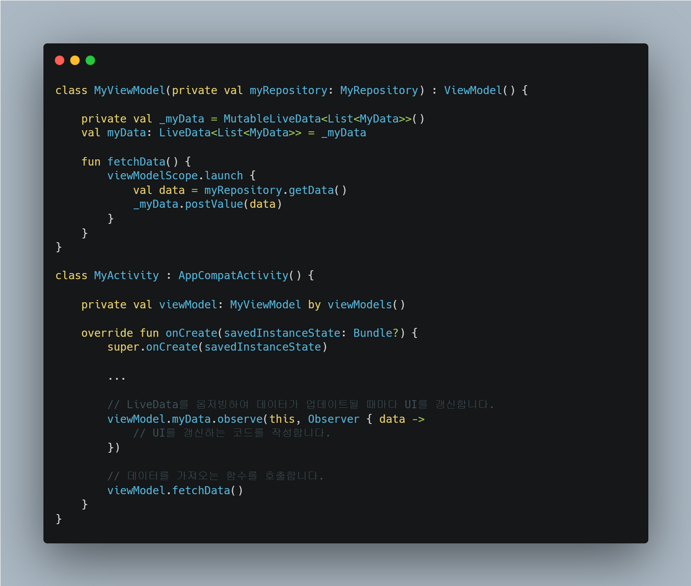

## MVVM (Model-View-ViewModel)

MVVM의 궁극적인 목표는 뷰를 애플리케이션의 비즈니스 로직과 완전히 독립적으로 만드는 것이라고 합니다.

- Model

  애플리케이션의 데이터와 비즈니스 로직을 담당하는 부분입니다.
  DB, Network, File 등의 데이터 소스와 상호 작용하여 데이터를 가져오고 저장합니다.
  ViewModel과 View는 Model에 직접적으로 접근할 수 없으며, Model은 View나 ViewModel의 존재를 알지 못합니다.

- ViewModel

  Model과 View 사이에서 중개자 역할을 수행하는 부분입니다.
  View에 필요한 데이터를 Model로부터 가져와서 가공하거나 변환하여 View에 전달합니다.
  View에서 발생하는 이벤트를 처리하고, Model로부터 데이터가 변경될 때마다 View에 이를 알려 View의 상태를 업데이트합니다.
  View와의 상호작용과 생명주기를 관리합니다.

- View

  사용자 인터페이스를 담당합니다.
  ViewModel로부터 전달받은 데이터를 사용하여 UI를 구성합니다.
  이벤트가 발생하면 ViewModel에 전달합니다. 
  View는 ViewModel에 대한 참조를 가지고 있지만, ViewModel은 View에 대한 참조를 가지고 있지 않습니다.

그림을 보시면 위의 MVP와 비슷하면서 조금 차이가 있습니다.

MVVM 패턴의 중요한 점은 바로 View와 ViewModel 간의 연결입니다.

### View와 ViewModel의 연결

바로 데이터 바인딩을 통해 연결되어 있습니다.

### Data Binding

데이터 바인딩이란 UI와 데이터 사이의 동기화를 담당하여 ViewModel에서 Model이 변경될 때 이를 감지하여 UI를 자동으로 업데이트합니다.

### 자동화된 감지와 업데이트

일반적으로 데이터 바인딩을 가능하게 하기 위해 Observer 패턴을 사용합니다.

Observer 패턴이란 관찰 대상 객체와 이를 관찰하는 객체가 존재하는데, 대상 객체는 자신의 상태가 변경될 때마다 등록된 모든 Observer 객체에게 알리는 역할을 하며, Observer 객체는 등록된 관찰 대상 객체의 상태 변화를 감지하고 이에 대한 처리를 수행합니다. 이를 통해 UI가 자동으로 업데이트됩니다.

안드로이드에서는 XML layout과 데이터 소스를 바인딩하는 데 사용하는 데이터 바인딩 라이브러리가 있습니다. 이것과 mvvm의 데이터 바인딩의 의미가 같으면서 다릅니다. mvvm 패턴에서의 데이터 바인딩은 뷰와 뷰모델을 연결하고, 뷰와 뷰모델 간의 데이터 흐름을 처리하기 위한 것을 얘기하고 그 역할을 할 수 있는 안드로이드 라이브러리가 AAC의 data binding입니다.

### data binding을 통한 View의 ViewModel을 향한 데이터 관찰

- Observable 객체

  데이터가 변경될 때마다 이를 감지하여 UI를 업데이트

- LiveData

  Lifecycle-aware 한 데이터 홀더로, 데이터가 변경될 때마다 Observer에게 알려 UI를 업데이트

- RxJava

  Observable 및 Observer를 사용하여 데이터 스트림을 처리하고 UI를 업데이트

- Kotlin Flow

  코루틴 기반의 비동기적인 데이터 스트림 처리를 지원하며, UI 업데이트에 사용

저렇게 대표적으로 4개의 여러 방법들이 하는 것은 데이터를 관찰하여 변화를 감지한다가 포인트입니다. 여기서 mvvm의 View와 ViewModel의 느슨한 결합으로 의존성이 감소하고 유연함과 확장 가능하게 해 줍니다.

### MVP와의 차이점

바로 포인트인 View와 ViewModel의 느슨한 결합입니다.
MVP의 View와 Presenter간의 의존성은 높습니다.
그러나 Data binding을 통해 MVVM 패턴은 서로의 의존성을 낮출 수 있게 됩니다.

아래의 코드는 아주 간단한 MVP 코드의 예시입니다. 
Presenter가 View를 받아서 View의 인터페이스 메서드를 직접 호출합니다. 
분리하고 의존성 주입 등의 기법을 사용할 수 있지만 기본적으로는 이렇습니다.
이렇게 되면 View와 Presenter 간의 결합도가 높아지게 됩니다.

이러한 문제를 MVVM에서는 Data binding을 통해 View와 ViewModel의 결합도를 낮추는 방식으로 개선합니다.

간단한 코드를 예로 보겠습니다. ViewModel에서는 repository에서 가져온 데이터를 LiveData에 저장합니다.

다른 건 일단 접어두고 observe 해서 불러온다는 부분만 생각해 봅시다.
이렇게 하면 이제 ViewModel에서 데이터가 변경되면 LiveData를 통해 UI를 자동으로 업데이트할 수 있습니다.
UI를 갱신하는 영역에 View에 관한 명령만 넣어주면 View의 처리는 될 것입니다.

View는 Model에서 데이터가 어떻게 처리되는지 알 수도 없고 알 필요도 없습니다. ViewModel에서 변하는 data를 보고 있다가 데이터가 변하면 UI를 업데이트하기만 하면 됩니다. 또한 ViewModel에서는 View에 대한 처리를 하지 않습니다. 데이터를 가공하고 데이터를 불러오면 어떻게 처리할지만 구현하면 됩니다. 데이터만 알맞게 바꿔주면 View가 알아서 데이터만 가져다가 업데이트하게 됩니다.

### 참고자료

- [한 번의 글로 이해하는 소프트웨어 아키텍처 패턴 ( MVC, MVP, MVVM )](https://dev-musa.tistory.com/entry/%ED%95%9C-%EB%B2%88%EC%9D%98-%EA%B8%80%EB%A1%9C-%EC%9D%B4%ED%95%B4%ED%95%98%EB%8A%94-%EC%86%8C%ED%94%84%ED%8A%B8%EC%9B%A8%EC%96%B4-%EC%95%84%ED%82%A4%ED%85%8D%EC%B2%98-%ED%8C%A8%ED%84%B4-MVC-MVP-MVVM)
