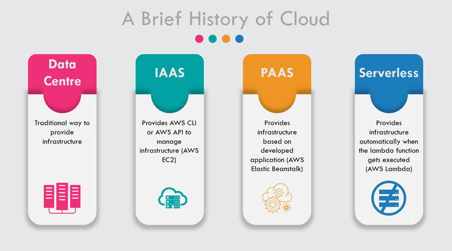
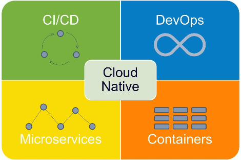

## Serverless Architecture

### 클라우드 인프라의 진화

- on-premise(데이터 센터)에서 시작하여 AWS가 출시된 후 IaaS(EC2)로 이동했습니다. AWS는 기본적으로 IaaS입니다.
- 이후 PaaS(Elastic Beanstalk)를 출시 하였습니다. PaaS에서는 애플리케이션을 업로드하기만 하면 AWS가 애플리케이션을 기반으로 인프라를 생성합니다. PaaS에서도 인프라를 유지 관리해야 합니다.
- PaaS 이후 AWS는 Server-Less(FaaS, BaaS)를 출시했습니다. 컨테이너가 기본 OS와 서버 확장을 관리하므로 IaaS 및 PaaS에 대해 걱정할 필요가 없습니다.

### 클라우드 네이티브 (Cloud Native)

- 클라우드의 이점을 최대로 활용할 수 있도록 애플리케이션을 구축하고 실행하는 방식을 말합니다.
- 마이크로서비스 아키텍처를 채택하고 컨테이너, 쿠버네티스와 같은 기술과 도구, DevOps, 애자일 방법론 등을 도입하여 개발자 생산성, 비즈니스 민첩성, 확장성, 가용성 및 비용 절감 효과를 크게 높일 수 있습니다.
- 즉, 분산된 환경에서 끊김없는 서비스를 제공하기 위해 다양한 역할을 수행하는 다수의 컴포넌트로 구성되며 시스템 변경사항을 다루기 위한 프로토콜이 존재하는 애플리케이션을 클라우드 네이티브 애플리케이션이라고 합니다.

### 서버리스 아키텍처 (Serverless Architecture)

- 서버리스 아키텍처는 "서버가 없다"라는 뜻이 아닙니다. **클라우드상에 서버는 존재합니다.**
- 서버리스 아키텍처는 **고객이 스스로 관리해야 하는 서버나 컨테이너가 없는** 클라우드 네이티브 개발 아키텍처를 의미한다.
- 즉 클라우드 서비스 업체가 애플리케이션의 일부를 실행하는데 필요한 컴퓨팅 리소스와 스토리지(저장소)를 **동적으로 할당하고, 사용자는 그 부분만큼만 비용을 지불**하는 것입니다.
- 서버리스는 FaaS와 BaaS로 구분할 수 있습니다.

#### FaaS (Function as a Service)

- FaaS는 **이벤트(트리거)에 따라 동작하는 함수로 구성**됩니다.
- 사용자가 작성한 코드를 서버리스 제공자의 서버에 업로드하게 되면 해당 서버는 업로드한 코드를 **함수 단위로 쪼개어 대기 상태**로 두게 됩니다.
- 요청이 들어오면 서버가 **대기상태에 두었던 함수를 실행시켜 처리**합니다.
- 작업이 끝나면 다시 대기상태로 만드는 구조입니다.
- 비용은 함수 호출 횟수, 걸리는 시간에 따라 청구됩니다.
- **즉 개발자가 사용자 정의 서버 측 로직을 작성하지만 클라우드 제공 업체가 관리를 전담하는 서버 컨테이너에서 실행되는 서비스로서의 기능입니다.**

#### Baas (Backend as a Service)

- 백엔드 개발에 필요한 여러 기능을 API로 제공하는 서비스입니다.
- SNS연동, DB와 같이 백엔드에 필요한 기능들을 사용자가 직접 구현하지 않고 제공되는 API로 해당 기능을 구현할 수 있게 해줍니다.
- 클라우드 공급자가 백엔드 개발 환경까지 제공해 준다고 보면 됩니다.
- 즉 애플리케이션 개발 시 요구되는 복잡한 백엔드(Back-End) 기능들을 개발자가 직접 개발하지 않고, 클라우드 공급자가 제공하는 서비스를 이용해 쉽고 안정적으로 구현하는 것입니다.
- 플랫폼 종류: AWS Lambda, MS Azure Function, Google Cloud Function

### 서버리스의 장 / 단점

- 장점

  - 기존 IaaS나 PaaS와는 다르게 **실제 사용량에 대해서만 비용이 청구되어 경제적입니다.**
  - 서버 인프라에 신경을 쓸 필요가 없으므로 애플리케이션의 품질 향상에 더 집중할 수 있습니다.
  - 요청이 들어올때만 실행되고 동적으로 자원을 할당하기 때문에 가용성이 높고 스케일링에 신경 쓸 필요가 없습니다.

- 단점

  - **서버가 항시 요청에 대기하고 있지 않기때문에 IaaS, PaaS보다 느립니다.**
    프로젝트의 규모가 커지거나 속도를 요구하는 프로젝트라면 사용에 있어 고민할 필요가 있습니다.
  - 기존 IaaS, PaaS 모델은 플랫폼을 바꾸는게 어렵지 않지만, 서버리스는 애플리케이션의 구조 자체를 바꾸기 때문에 다른 플랫폼으로 이전하는게 힘듭니다. (AWS에서 Google Cloud로 이전)
  - 단순 작업(이메일, 푸시 등)에는 적합하지만 긴 시간을 요하는 작업(영상 업로드, 백업 등)에는 비효율적입니다. 서버리스는 함수가 1회 호출 될 때 사용할 수 있는 메모리 및 시간에 제한이 있기 때문입니다. 작업이 끝나지 않은채로 해당 시간이 지나면 작업이 끝날때까지 일정 시간마다 계속 함수를 호출하므로 비효율적입니다.

### 참고자료

-[[Cloud] 서버리스(Serverless) 아키텍처](https://velog.io/@kwakwoohyun/Cloud-%EC%84%9C%EB%B2%84%EB%A6%AC%EC%8A%A4Serverless-%EC%95%84%ED%82%A4%ED%85%8D%EC%B2%98)
