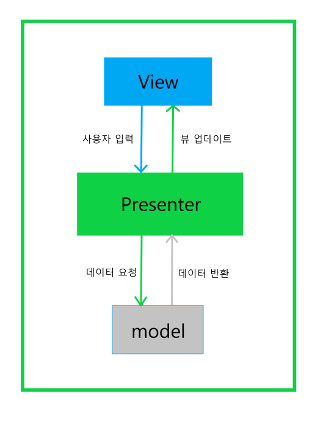
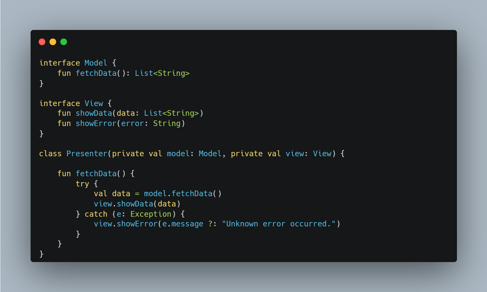

## MVP (Model-View-Presenter)

MVP 패턴은 MVC 패턴에서 발생할 수 있는 문제를 해결하고 개선하기 위해 만들어졌습니다.

- MODEL

  애플리케이션의 비즈니스 로직과 데이터를 담당하는 부분

- VIEW

  사용자 인터페이스를 담당하는 부분. 모델에 직접 접근하지 않으며, 프레젠터를 통해 모델과 상호작용합니다.

- Presenter

  뷰와 모델 사이의 중간자 역할을 합니다. 뷰로부터 입력을 받아 모델에 전달하고, 모델로부터 데이터를 받아 뷰에 전달합니다.

- 사용자는 View를 통해 애플리케이션에 대한 요청을 보냅니다.
- 뷰는 요청을 Presenter에 전달합니다.
- Presenter는 요청을 처리하기 위해 Model에 액세스 합니다.
- Model은 데이터를 검색하고 Presenter에 반환합니다.
- Presenter는 받은 데이터를 가공하고 View에 반환합니다.
- View는 반환된 데이터를 표시합니다.

6개의 과정을 통해 MVP 패턴은 비즈니스 로직과 VIew를 분리합니다. 
예를 하나 더 들어 간단한 To-Do 리스트 앱을 만들면 다음과 같습니다.

- 사용자가 새로운 할 일을 추가하려면, 뷰는 사용자에게 입력을 받고 받은 입력을 Presenter에게 전달합니다.
- Presenter는 요청을 처리하기 위해 모델에 새로운 할 일을 추가하도록 요청합니다.
- Model은 할 일을 DB에 저장합니다.
- Model은 Presenter에 저장된 할 일을 반환합니다.
- Presenter는 모델로부터 받은 할 일을 가공하여 View에 반환합니다.
- View는 반환된 할 일을 목록에 추가하여 표시합니다.

### MVC에서 MVP로 Controller가 Presenter로

앞서 MVC에서의 문제는 Controller에서 View와 Model의 강한 결합이 문제였습니다.
비즈니스 로직과 View를 분리하기 위한 문제를 해결하기에는 부족했던 MVC 패턴을 MVP에서는 어떻게 개선시켰습니다.

먼저 위의 코드에서 model과 view를 interface로 구현하였습니다. 
Presenter는 View와 Model 사이에서 중개자 역할을 합니다. fetchData() 함수는 Model에서 데이터를 가져와 View에 전달합니다. 이를 통해 View와 model 간의 직접적인 의존성을 방지할 수 있습니다. interface를 통해 구현하여 상속받고 구현체를 따로 만들어주어야 하지만 인터페이스의 존재가 View와 Model이 서로를 직접적으로 참조하지 않아 결합을 낮추게 됩니다.

위 코드에서 예외처리나 의존성 주입은 수행하지 않아 개선 사항이 필요하지만 기본적이 과정만을 보기 위해 작성했습니다. Presenter를 interface로 구현하여 따로 상속받아도 결국 목적은 비즈니스 로직과 뷰의 분리이기 때문에 문제가 없습니다.

### MVP 패턴의 단점

- 인터페이스의 중복 코드

  MVP 패턴에서는 View와 Presenter 간의 통신을 위해 인터페이스를 사용합니다. 이 인터페이스는 뷰에서 발생하는 이벤트를 Presenter로 전달하고, Presenter는 처리 후 결과를 다시 뷰로 전달합니다. 그러나 이러한 구현 과정에서 중복 코드가 많이 발생할 수 있습니다. 예를 들어, View와 Presenter 간의 통신을 위해 여러 개의 인터페이스를 구현해야 하는 경우 각각의 인터페이스에서 비슷한 코드를 반복해 작성해야 하므로 코드의 가독성과 유지 보수성이 떨어질 수 있습니다.

- Presenter의 증가

  특수한 경우가 아니면 View와 Presenter는  1:1의 관계를 가집니다. 만약, 뷰가 많아진다면 그만큼 Presenter가 많아지기 때문에 코드가 증가하고 그에 맞는 각각의 인터페이스가 생성되면서 복잡도가 증가할 수 있습니다.

### 참고자료

- [한 번의 글로 이해하는 소프트웨어 아키텍처 패턴 ( MVC, MVP, MVVM )](https://dev-musa.tistory.com/entry/%ED%95%9C-%EB%B2%88%EC%9D%98-%EA%B8%80%EB%A1%9C-%EC%9D%B4%ED%95%B4%ED%95%98%EB%8A%94-%EC%86%8C%ED%94%84%ED%8A%B8%EC%9B%A8%EC%96%B4-%EC%95%84%ED%82%A4%ED%85%8D%EC%B2%98-%ED%8C%A8%ED%84%B4-MVC-MVP-MVVM)
