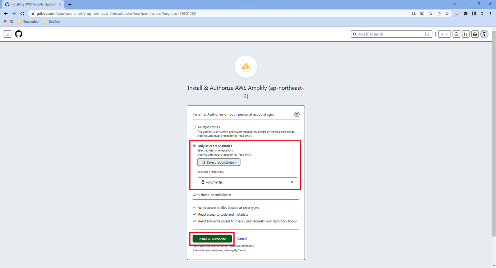
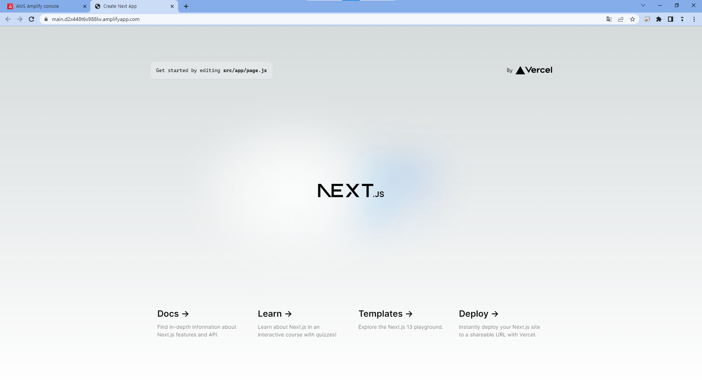

## Amplify

AWS 완전 관리형 서비스인 Amplify를 이용하여 Nextjs 어플리케이션을 배포합니다.
Nextjs의 SSR 기능을 완벽하게 지원합니다.

AWS Amplify를 활용하면 풍부한 기능의 풀 스택 웹 및 모바일 앱을 개발 단계부터 배포 단계까지 그 어느 때보다 손쉽게 구축할 수 있습니다.

### 장점

- 빌드 및 배포 자동화 구축이 프로젝트 생성과 동시에 완성됩니다.

- Amplify 콘솔에서 도메인 연결을 비롯한 SSL 인증을 진행할 수 있습니다.

- 브랜치 생성 및 제거시 동적으로 배포를 생성하고 삭제할 수 있습니다.

- 서버리스이므로 사용한만큼 비용을 지불합니다.

### AWS Amplify (@Nextjs)

#### 배포과정

- AWS Amplify 콘솔에 접속하여 Amplify Hosting 시작하기를 클릭합니다.
  

- 프로젝트를 Github에 보관하였으므로, 저장소를 선택하고 계속 버튼을 클릭하여 리포지토리를 연결합니다.
  

- Github에 로그인하여 Amplify와 연결합니다.
  

- 연결하고자 하는 계정을 클릭합니다.
  

- Amplify와 연동할 repository를 선택합니다.
  

- 리포지토리 선택이 완료되면, 배포하고자 하는 브랜치를 선택할 수 있습니다.
  

- 빌드 설정

  빌드 절차에 대한 내용을 현재 창에서 적용할 수 있습니다.
  프로젝트의 루트경로에 amplify.yaml을 저장하여 관리할 수 있습니다.
  

- 별도의 추가적인 설정없이 저장 및 배포를 선택합니다. 추후 수정 가능합니다.
  

- 생성이 완료되었다면, amplify가 자동으로 브랜치로부터 소스를 가져와 CI/CD를 수행합니다.
  

- 배포가 완료되고, Amplify를 활용하는 방법 알아보기를 통해 추가적인 기능을 확인할 수 있습니다.
  

- 주소를 클릭하면 배포가 완료된 것을 확인할 수 있습니다.
  

### 도메인 추가

- 좌측의 도메인 관리 탭에서 소유하고 있는 도메인을 이용하여 구성합니다.
  

- 원하는 도메인을 설정하여 저장시 자동으로 Route53에 전파됨과 동시에, SSL 적용을 수행합니다.
  

- 적용이 완료되면 아래 그림과 같이 도메인으로 배포된 어플리케이션을 확인할 수 있습니다.
  

### 브랜치 추가

- dev 브랜치를 추가합니다.
  

- Amplify 대시보드에서 브랜치 연결을 선택합니다.
  

- 새로운 브랜치를 인식하는것을 확인할 수 있습니다.
  

- 저장을 완료하면, 앞서 설정한 main 브랜치와 같이 CI/CD 파이프라인이 동작하는 것을 확인할 수 있습니다.
  

- 도메인 연결을 완료하면 아래와 같이 dev 브랜치도 손쉽게 배포 됨을 확인할 수 있습니다.
  

### 미리보기

- dev 브랜치를 main으로 merge 하기 위한 pull request를 생성합니다.
  

- amplify 미리보기 탭에서 main 브랜치에 대한 미리보기를 설정하면, 아래와 같이 미리보기 전용 어플리케이션 CI/CD가 동작하게 되며 url이 생성됩니다.
  

- 상태가 성공이 되었을때 url을 통해 pull request 요청된 작업 내용을 확인할 수 있습니다.
  

### Conclusion

AWS의 웹/앱 어플리케이션 호스팅 서비스인 Amplify를 통해 NextJS를 배포하였습니다.

Amplify를 이용하면 도메인 연결, CDN 구성, pull request 적용전 프로젝트에 대해서 미리보기 기능 등 프론트엔드 프로젝트를 개발에 편한 환경을 이용할 수 있습니다.

Amplify 단점으로는 프로젝트 비용이 증가할 수 있습니다.

- 빌드시 분당 $0.01가 청구됩니다.
- 데이터 전송량이 $0.15/GB 청구됩니다.
- CloudFront를 이용하여 배포할 경우 $0.12/GB 입니다.
- SSR 요청시 요청에 대해서 비용이 청구됩니다.

### 참고자료

- [[AWS] Amplify(@Nextjs)](https://velog.io/@xgro/AWS-Amplify-Nextjs)
