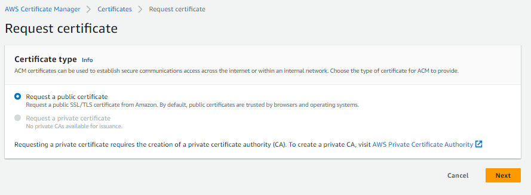
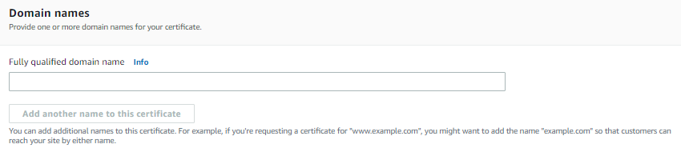
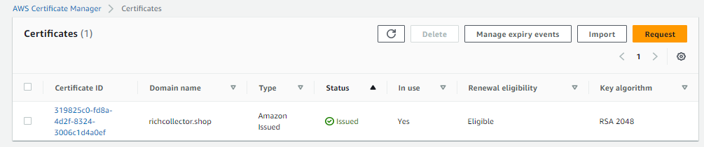
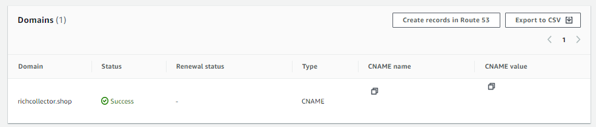

## Certificate Manager

### ACM 신청

보안성을 올려주는 암호화된 Text 문자열을 부착하는 것으로 Http => Https 접속하게 만들어줍니다. 업그레이드 버전으로는 Tls 인증서가 있습니다.
컴퓨터서버(서울)로 직접 붙여서 사용할 경우는 서울로 만들어 주는 것이 좋겠지만, CloudFront를 Global로 만들 것이기 때문에, Certificate Manager(ACM) 지역을 버지니아 북부로 설정 해줘야합니다. (내부정책)

- List certificate에서 Request를 눌러서 접속하여 certificate를 신청

- SSL을 적용할 도메인 주소를 입력해주고, default값으로 신청

- 신청 후 Status 값이 Pending validation이라고 뜨는데, 그 도메인 값이 정확한지 확인 하는 과정을 지나고 정확하다면 issued로 표시가 됩니다.
  (만약에 서브도메인을 붙여서 만들었다면, 기존도메인과 서브도메인+기존도메인을 각각 따로 인증서를 만들어 주어야합니다.)

- 주소가 맞는지 알려주어야 하는데, TXT레코드를 작성하여 내가 주인이다라는 것을 알려주어야 합니다. (CNAME 레코드로도 가능)
  Certificate ID를 눌러서 들어가보면, CNAME name과 CNAME value를 이용하여 인증을 처리 해줍니다. (값은 가려놓음)

- Route 53으로 가서 CNAME에 대한 값들을 세팅하여 주어도 되고, 상단에 `Create records in Route 53`을 눌러서 자동으로 생성해 주어도 됩니다.

