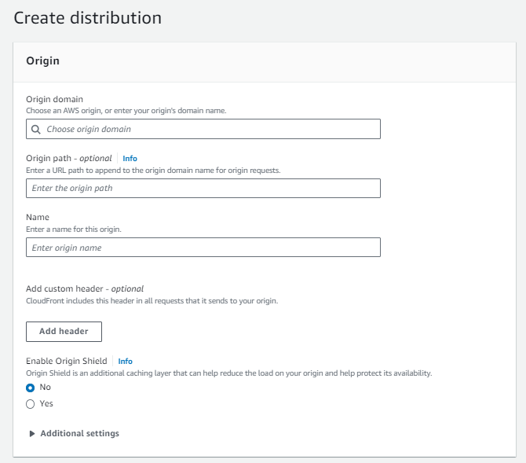
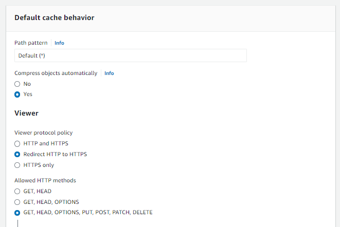
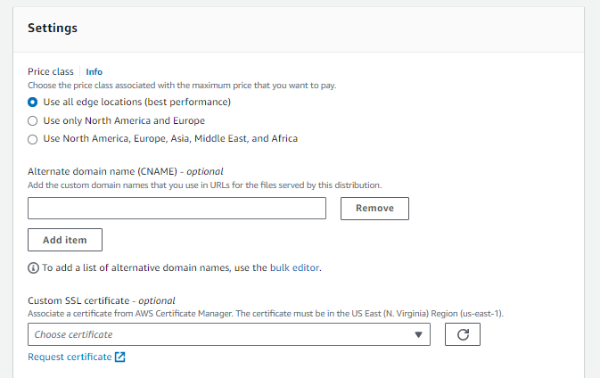

## CDN 신청

CContent Delivert Network로 페이지 내용을 전세계에 뿌려놓아 가장 가까운 곳에서 접속하게 해주는 것이기 때문에 Global로 만들어 줘야 합니다.

- CloudFront로 접속하여, Create distribution을 해줍니다. Choose origin domain을 해주면 기존에 만들어 놓은 도메인이 자동으로 검색이 되지만, 이 주소랑 s3에 주소가 다르니 s3에 표시된 주소를 입력해주기로 합니다. (http이후의 주소로 넣어 줍니다.)

- Viewer protocol policy에 있는 Redirect HTTP to HTTPS를 선택하여, http로 접속 시 https로 접속되게 만들어줍니다.
  또한, Allowed HTTP methods를 선택하여 어느정도까지 API를 허락해줄 것 인지도 설정할 수 있습니다. 전체를 허락해주는 것을 선택해 줍니다.

- Add item을 눌러서 사용할 도메인 주소를 입력해줍니다. (어디서 쓸 것 인지 설정 )

- 그 밑의 Custom SSL certificate - optional을 선택해 주면, 우리가 만든 인증서를 선택할 수 있습니다. (통과과 된 상태여야 합니다.)

- Create distribution을 해줍니다.

  해당 ID로 접속을하면 Distribution domain name을 복사하여 해당 Route 53의 A레코드의 값을 CDN의 주소로 연결해주면 됩니다.
  그렇게 되면 DNS에 접속 => CDN으로 접속 => 스토리지 루트가 완성됩니다.
