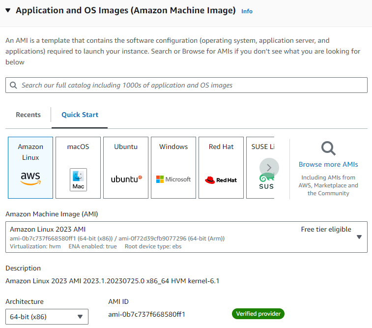
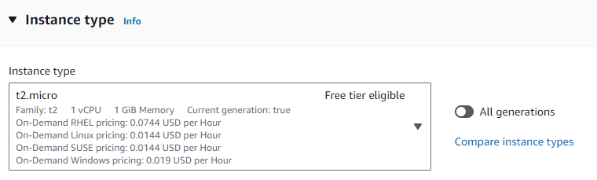
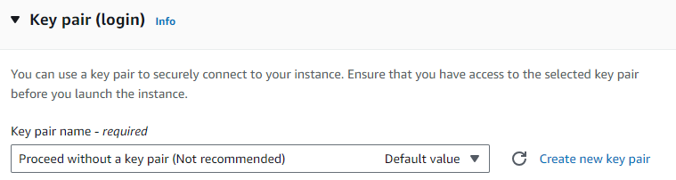
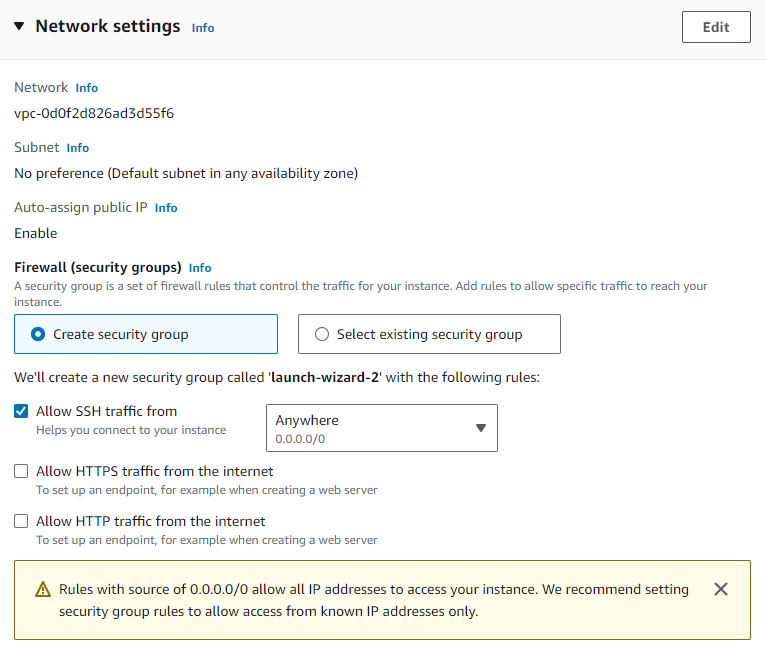
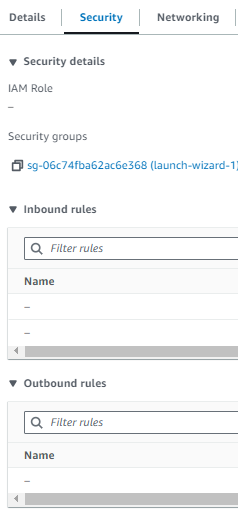
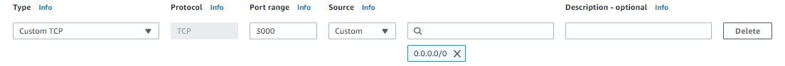

## EC2

### 인스턴스 만들기

가상의 컴퓨터를 만들어주는 작업으로 리전이 가까이 있을수록 속도가 빠릅니다. 어떤 운영체제를 하느냐는 관계 없지만, 키를 주고받는 암호화 과정이 필요하므로 복잡합니다.

기본적으로 보안이 깔려있는 Amazon Linux로 작업하는 편이 수월하며, window로 설치하여 작업을 하면, 편리한 부분이 있었으나 운영체제 자체가 용량이 큽니다.



연습을 위해 무료로 제공되는 Free tier를 사용합니다. 앞의 t2, c5 이런식으로 이름이 붙는데 알파벳에 따라 강점이 되는 부분들이 있어 사양을 고를 수 있습니다.



다른 운영체제는 터미널로 접속하기 위해서는 암호화가 필요하지만, 위에서 말한 암호화 과정이 Amazon Linux에서는 불필요하므로, 사용하지 않음을 체크해줍니다.



secure shell로 접속하는 것을 허락해주기 위해 선택해주고, 누구나 접속 가능하게 기본값인 0.0.0/0으로 세팅을 해줍니다. 127.0.0.1은 보통 로컬호스트입니다.



- 보안을 최우선으로 생각한다면, 위에서 세팅하지 않은 secure shell값과 ket pair값을 세팅하여 만들어 주어야합니다. 이렇게 instance를 만들게 되면 외부ip와 내부ip가 생기는데, 외부 ip는 컴퓨터끼리 내부 ip는 백엔드와 DB를 연결하는 네트워크를 구성할 수 있습니다.

- 혹여나 instance state에서 Terminate instance를 하는 경우가 있는데, 이것은 멈추는 것이 아니라, 만든 것을 삭제하는 것이므로 중지만 하려면 Stop instance를 이용합니다.

- instance를 클릭한 후 Connect를 눌러서 Connect해주는데, 우리는 Key pair를 세팅하지 않았기에 바로 연결을 진행합니다.

- 이제 컴퓨터에 필요한 node yarn등을 설치해주고, yum을 이용할 때가 있는데, 운영체제 자체에서 설치해주는 패키지 관리자입니다.

```
nvm 설치: curl -o- https://raw.githubusercontent.com/nvm-sh/nvm/v0.34.0/install.sh | bash
nvm 활성화: . ~/.nvm/nvm.sh
node 최신버전 설치: nvm install node (버전입력가능)
node버전 확인: node -e "console.log('Running Node.js ' + process.version)"

yarn설치: sudo npm install -g yarn
git 설치: sudo yum install git
git clone로 코드를 받아오고 yarn build, yarn start를 진행.
```

- 컴퓨터마다 방화벽이 존재하는데, 우리는 그 방화벽에 대해서 접속을 할 수 있게 허용을 해줘야합니다. 인스턴스를 클릭하고 secure탭에 들어가는 inbound와 outbound rules를 수정할 수 있는 곳이있는 보안 그룹이 있습니다. Security Groups을 선택하여 우리는 Inbound rules 외부에서 요청이 오는 것을 수정해야 하기 때문에, Edit inbound rules로 룰을 수정해줍니다.



Http(80번 포트밖에 선택불가)나 Tcp를 선택해주고 3000번 포트를 사용해야 하기때문에 Tcp로 3000을 세팅해주고 0.0.0.0/0을 세팅해 주었습니다.



이제 로드밸런서와 연결하기 위한 컴퓨터는 만들어졌고, 이 컴퓨터를 타겟 그룹안에 넣어서 로드밸런서와 연결을 해줍니다.

### 참고자료

- [프론트 배포 방법 1편[AWS EC2를 활용한 배포] with React ,Express 환경](https://velog.io/@kcj_dev96/%ED%94%84%EB%A1%A0%ED%8A%B8-%EB%B0%B0%ED%8F%AC-%EB%B0%A9%EB%B2%95-1%ED%8E%B8AWS-EC2-with-React-Express-%ED%99%98%EA%B2%BD)
