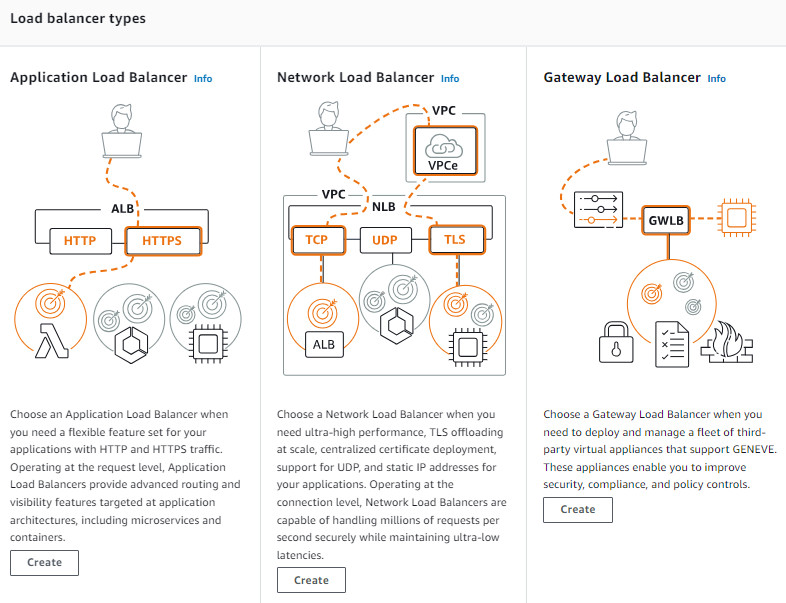
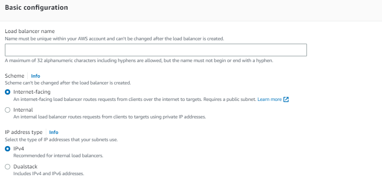
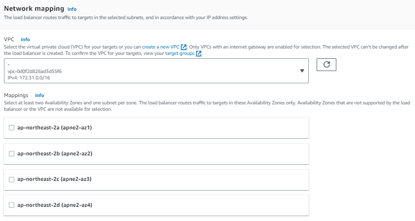
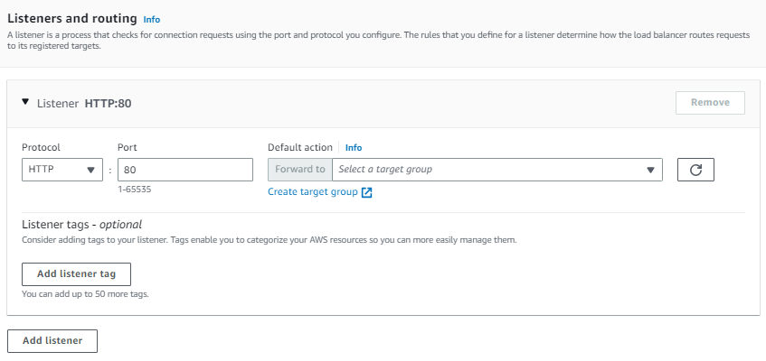
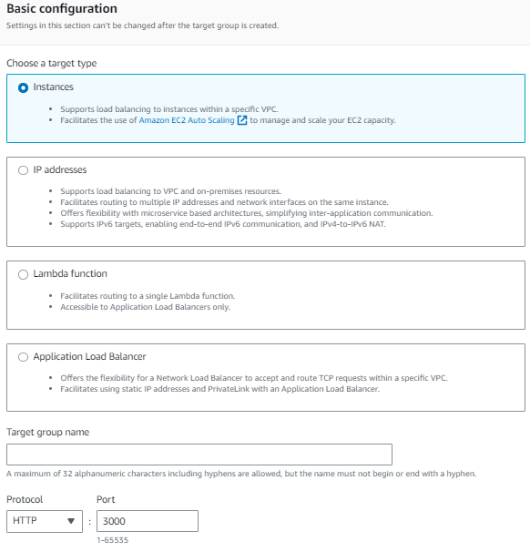
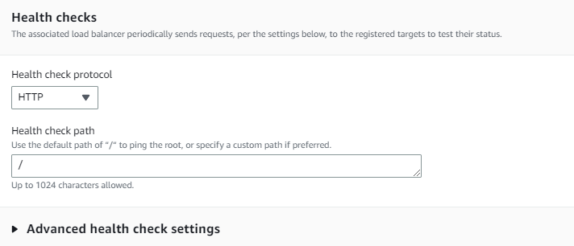
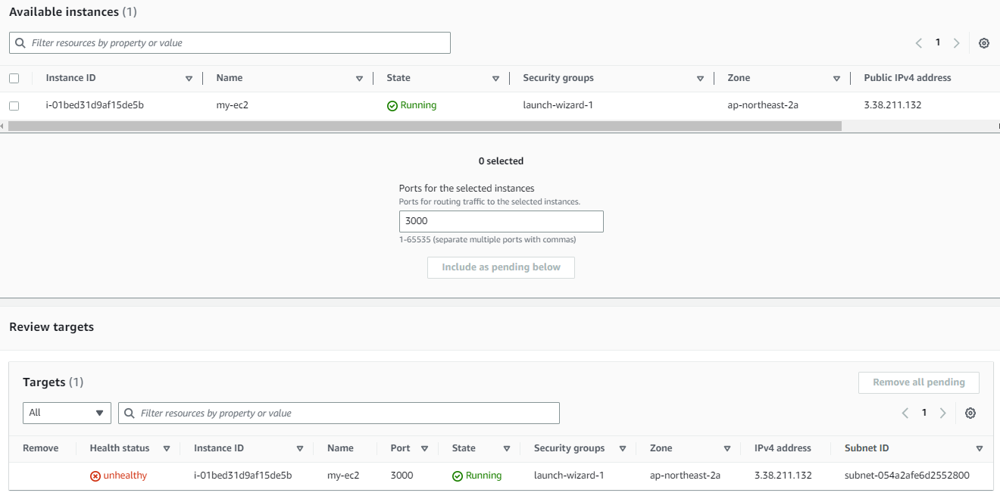

## Load Balancer

ec2에 Load Balancing란에 Load Balancers와 Target Groups을 설정할 수 있는 곳이 같이 있습니다. create load balancer을 하면, 3가지 방법이 나오는데 우리는 HTTP를 부하 분산해주는 방법을 선택해줍니다.

TCP UDP 방식이 있는데, 안정성이 높은 TCP는 속도가 느리고, UDP는 값을 일방적으로 보내 속도가 빠르지만 안정성이 낮습니다.
(보통 TCP는 JSON값을 UDP는 이미지와 같은 값을 보낼 때 사용)

- 인터넷 브라우저에서 접속한 것들을 분산해주는 역활을 할 것이기 때문에, internet-facing을 선택합니다. internal은 백엔드에서 DB로 가는 길을 분산할 때 사용합니다.

- 로드밸런서를 컴퓨터에 맵핑을 시켜주는 것인데, 분산되는 위치를 선택해주어야합니다. 적어도 2개의 값을 선택해야하고, ec2에서 만들어준 instance에 Availability zone에 값은 꼭 포함시켜줍니다.

- 여기에서 들어오는 port를 정할 수 있습니다. SSL인증서를 로드밸런서에 붙이지 않았기 때문에, http로 받는데 인증서를 붙였다면 https로 변경할 수 있습니다.

- 들어 오는 길을 만들어 주었다면, Create target group을 설정해주어 나가는 길도 설정해주어야 합니다.

- 서버가 죽었는지 살았는지 체크해주는 것 (Health checks)

- Available instances은 사용 가능한 인스턴스이며, Review targets안으로 넣어 주어야 합니다. 이제 로드밸런서를 생성할 때 타켓그룹을 선택해줄 수 있습니다. 조금만 지나면 로드밸랜서의 state가 Active로 변경됩니다.

ec2와 마찬가지로 로드밸런서도 방화벽이 존재하기에 security탭에서 보안을 풀어줍니다. 푸는법은 ec2와 동일합니다.
