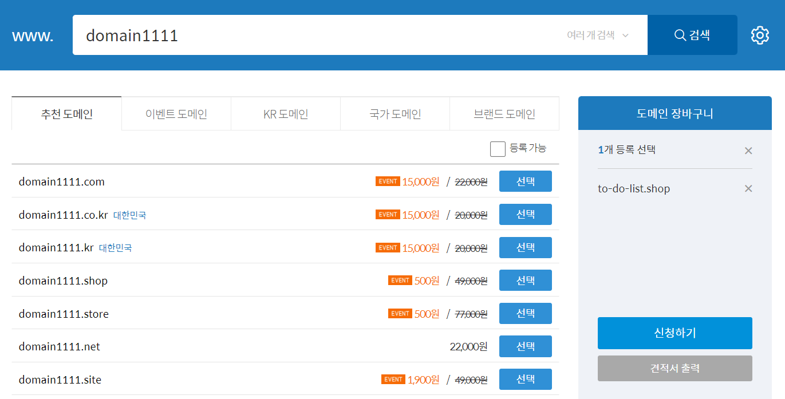
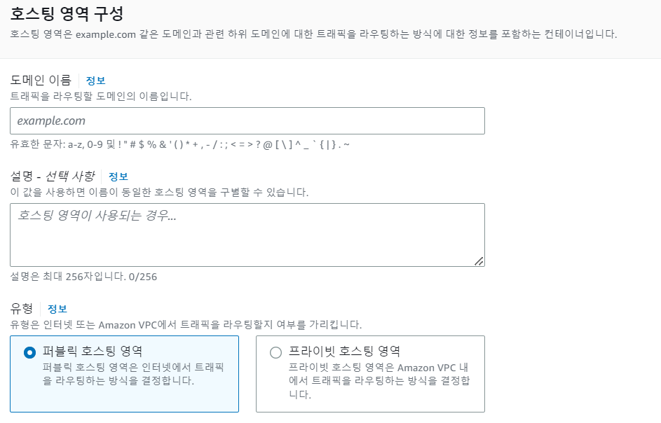
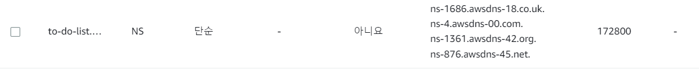
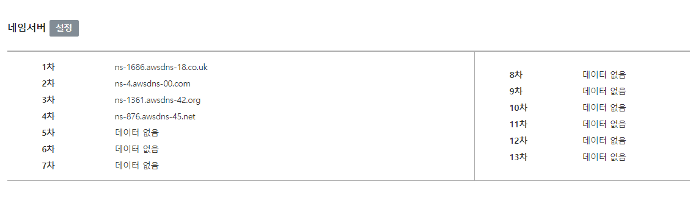
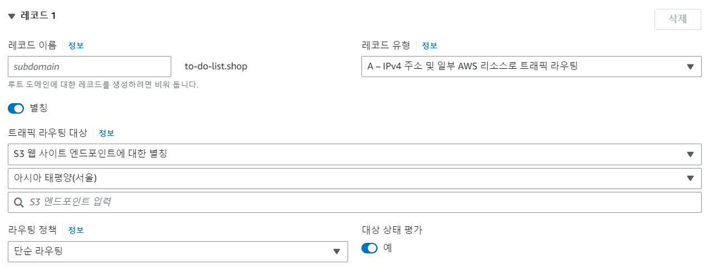

## Route 53

### 가비아에서 도메인 구입

도메인 => 도메인 검색으로 접속하면, 구매할 도메인이 사용 중인지 구매할 수 있는지를 확인 할 수 있습니다. 그 검색 결과에서 마음에 주는 형식으로 구매할 수 있지만, 테스트를 위한 용도로 할 예정이면 .shop .store 같은 도메인이 저렴하니 그것으로 구입하는 것이 좋습니다.

### Route 53에서 호스팅 영역 생성

호스팅 도메인 주소를 입력할 때 구매한 도메인 주소를 입력해 줍니다. s3와 연계할 시 s3도 같은 이름으로 버킷이 등록되어 있어야 등록이 편합니다.

- 네임서버 연결

설정을 어디에서 할 것이냐에 따라 방법이 달라집니다. 생성된 호스팅 영역을 누르면 안에 세부정보를 볼 수 있는데, AWS에서 제어를 해주고 싶다면, 그곳에서 유형이 NS인 라우팅 대상을 가비아의 NS에 넣어줍니다. (제어권을 넘겨 준다고 생각하면 편함)

- Route 53
  

- 가비아
  

- 레코드 생성

  연결할 S3, EC2 주소를 넣어 주는 곳입니다. A(IPv4)나 AAAA(IPv6)중에 해당 되는 것을 설정하고, 버킷 이름을 도메인과 같게 진행하였다면, 트래픽 라우팅 대상을 같게 진행하면 자동으로 찾아줍니다. CNAME은 표준 이름을 정하여 그곳으로 접속할 경우 설정된 곳으로 이동하게 해줍니다.

  

http로 접속을 하려면 여기까지만, 작업을 하면 몇분이 지나고 접속이 될 것입니다. 추가로 SSL 인증서(https) / 로드밸런싱 작업을 원하면 실시합니다.
