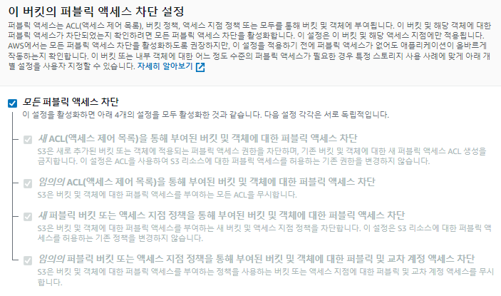

## S3 (Simple Storage Service)

파일을 저장하고 인터넷상으로 접근할 수 있게 해주는 서비스로, 정적인 파일들을 제공해주는 Storage입니다.
UI가 변하는 것이 동적인것이 아니라, 파일의 내용이 변하지 않는 것이 정적인 내용입니다.

- AWS S3에서 버킷을 생성

- 버킷 이름은 도메인과 연결하기 용이하게 같게 지어줍니다.
  해외 서비스를 하지 않고 국내 서비스를 한다면 서울 리전으로 선택합니다.

- 객체 소유권 선택
  객체 소유권의 선택란에서 해당 사항을 체크해 줍니다.
  (테스트만 할 예정이면, ACL 활성화됨으로 체크)

- 퍼블릭 엑세스 차단 설정
  디폴트로 퍼블릭 엑세스 차단 설정을 체크가 되어있을텐데, 테스트 용이라면 해제하여 접근이 가능하도록 합니다. 추후 설정을 위한다면 차단 후 이용합니다.

- 버킷 버전 관리
  버킷 버전 관리 비활성화로 둡니다. 설명에 잘 나와있듯이 버전 관리는 객체의 여러 버전을 동일한 버킷에서 관리하기 위한 수단입니다. 테스트용이라면 여러 버전으로 관리할 필요가 없지만, 버전 관리가 필요하면 체크합니다.

- 기본 암호화
  암호화를 활성화하면 파일들을 버킷에 업로드할 때 암호화하여 저장할 수 있습니다.

고급 설정은 따로 건들필요 없이, 버킷을 생성해줍니다.

### 정적 웹사이트 호스팅

버킷의 정적 웹 호스팅 설정은 다음과 같이 속성 탭에서 확인할 수 있습니다. 다른 곳을 통하여 호스팅할 예정이면, 비활성화 그것이 아닌 S3로 호스팅을 하겠다면 활성화합니다.
버킷 이름을 클릭하여, 안으로 들어가면 속성탭 맨 마지막에 자리하고 있습니다.

- 정적 웹사이트 호스팅 편집

  정적 웹 사이트 호스팅을 활성화해주고, 인덱스 문서와 오류문서를 등록해줍니다. 오류 문서를 등록하지 않으면 새로고침시 문제가 발생할 수 있고, 편집을 완료하면 버킷 웹 사이트 엔드포인트가 생성되어 나타납니다.

### Build한 정적 파일을 S3버킷에 업로드

빌드된 파일들을 드래그해서 화면에 직접 넣어도 되고, 업로드를 눌러서 파일을 올려도 됩니다.

- 파일의 ACL 퍼블릭 설정

  ACL 설정을 퍼블릭으로 했다고 해서 모든 권한이 퍼블릭이 된 것은 아닙니다. 올린 파일들의 대한 권한을 퍼블릭으로 설정해줍니다.

이제 엔드포인트로 접속하면, 웹사이트가 보일 것입니다.

### 정책 설정

- Least Privilege Principle

사용자나 프로세스에게 필요한 최소한의 권한만 부여하여 시스템의 보안을 강화하는 것을 의미합니다. 즉 보안은 다 막고 필요한 부분을 열어주는 것입니다.

- 기본적인 status 코드

  - 200번대는 성공
  - 300번대는 리다이렉트
  - 400 클라이언트
    서버가 생각한 잘못은 400번대로 전달됩니다.
  - 500 서버
    서버에서 핸들링하지 못한 에러일때도 500번이 전달됩니다.

### 버킷 정책

기본적으로 공개 액세스 차단을 풀어줘야 설정을 진행할 수 있습니다. 1차적으로 여기서 걸러주기 때문입니다.

- 정책 설정

  기본적으로 json 형식으로 작성
  Statement 안에 권한에 대한 내용을 넣어줍니다.
  Sid => Statement id
  Effect => 허용 / 불허의 내용을 넣어줍니다.
  Principal => 어느 대상에게 이 내용을 설정 할 것인지 명시합니다.
  version 언제 문법을 사용할 것인지 명시해 줍니다.
  object => 객체 => 파일
  Action => s3:GetObject
  Resource => 어떤 파일을 열어 줄 것인지 설정. arn/\* 하면 이 버킷의 모든 파일 접근이 가능해집니다.
  bucket-name => 허용할 버킷 ARN을 넣어줍니다.

모든 설정을 문서를 보고 적용하기는 힘듭니다. 문서 편집에서 친절히 설명을 해주기 때문에 거기서 필요한 설정들을 선택해서 넣어줍니다. 다시 업로드 할때에는 기존의 객체들을 한 번 삭제해주고 올려주는 것이 안전합니다.
