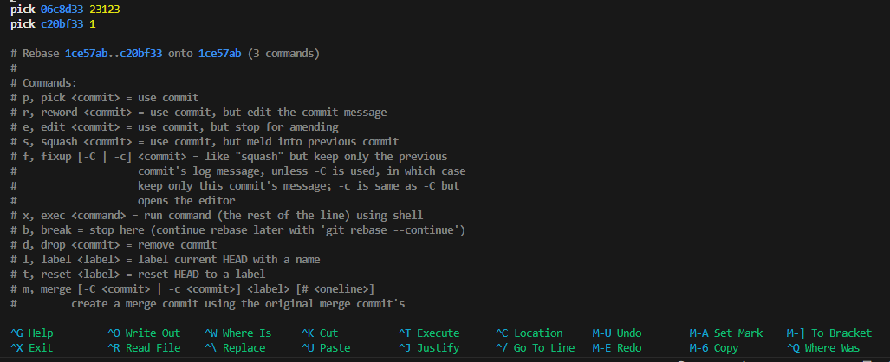
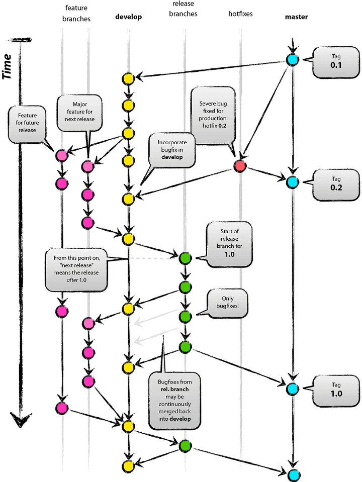

### Git을 사용하기 전 알아야 할 것

1. main 브랜치에 바로 올리지 않습니다.

   (모든 오류가 없는 Git관리자가 승인한 코드만 올라가도록 합니다.)

2. develope는 main을 복사하여 사용하고, 복사하여 개인사용 후 request에서 최종으로 merge합니다.

   (이렇게 잡고 브랜치를 생성해줘야 동급의 브랜치가 생성되고, 개인 사용을 해줘야 심각한 오류에서 벗어날 수 있습니다.)

3. develope에 올린 다음 로컬과 깃에서 branch 삭제 후 다시 사용

   (remote에는 origin 브랜치를 남겨줍니다.)

4. 커밋 메세지 간결하고 이해하기 쉽게 작성

   (나만 보는 것이 아닙니다. - 커밋 컨벤션 참고)

5. 한번에 너무 많은 양을 올려버리면 힘듦 (1일 1pr 날리기)

   서로 의존성이 없는 기능으로 해야합니다. (충돌)
   공통기능은 신중하게 만들어야하고, 경력자가 하는 것이 좋습니다.
   (전체 코드의 에러가 일어날수 있다.)

6. project board에 스케줄을 기록해줘도 되고, issues ⇒ New issues를 등록하여 체크할 수도 있습니다. 지라같은 툴로 작업이 겹치지 않게 체크할 수 있습니다. git checkout -b feature-#2 (해당 이슈번호로 체크하여 개발)

7. Repository 주소의 https://github.com/를 https://github1s.com/로 고쳐서 보면 vscode와 같이 볼 수 있어서 가독성이 좋아집니다.

### Git 명령어

#### 프로젝트 작업 시 자주 사용하는 명령어

- 생성: `git init .git`

- Git과 연결: `git remote add origin https: 연결할 곳`

- 리모트 확인:` git remote -v`

- 임시저장: `git add .`

- 저장확정: `git commit -m "메세지입력"`

  - 최신커밋취소+스테이지취소: `git reset HEAD^`

  - 최근커밋취소+스테이지취소+여러개: `git reset HEAD~n`

  - 커밋리셋: `git reset / git reset --mixed HEAD`

    - 최근 커밋하기 전 상태로 작업트리를 되돌림: `--soft`

    - 최근 커밋과 스테이징을 하기 전 상태로 작업트리를 되돌림(기본옵션): `--mixed`

    - 최근 커밋과 스테이징, 파일 수정을 하기 전 작업트리로 되돌림(복구불가): `--hard`

- 커밋확인: `git status`

- 업로드 완료: `git push origin 브랜치 입력`

- 브랜치 확인: `git branch`

- 브랜치 생성 후 이동: `git checkout -b qqq`

- 브랜치 삭제: `git branch -D 브랜치명`, `git push origin --delete 브랜치명`

- 브랜치 merge: `git merge develop` (main에서 하기)

- 받아오기: `git pull 브랜치 입력`

- 검토 후 병합 요청하기: `pull request (pr)`

- 최상위에서 받아오기 - 회사 레파지토리: `git pull upstream develop`

### Git Config 설정 확인 및 변경하기

- config list 보기: `git config --list`

- 이름변경: `git config —global user.name "로건"`

- 이메일변경:` git config —global user.email "로건@이메일.com"`

- vim으로 변경: `git config —global core.editor "vim"`

- 이름삭제: `git config --unset user.name`

- 이메일삭제: `git config --unset user.email`

- 이름삭제(글로벌): `git config --unset --global user.name`

- 이메일삭제(글로벌): `git config --unset --global user.email`

### default branch를 main으로

next.js가 아닌, CRA를 처음 시작하면 master로 브랜치가 생성되는데, 우선 .git을 삭제하여 줍니다.
` git config --global init.`defaultBranch main이후로 git init을 통해 로컬에서 생성하는 repository의 default branch는 main으로 생성됩니다.

- default branch 확인: `git config init.defaultBranch`

- default branch 변경: `git config init.defaultBranch main`

- 현재 branch명 변경: `git branch -m master main`

- remote repository의 default branch 변경

  - setting → branches → default branch에서 변경할 수 있습니다.

### 커밋메세지 변경

- 가장 최근의 commit 수정

  amend 를 이용하면 가장 마지막에 commit한 내용을 수정할 수 있습니다. `git cpmmit -amend`를 사용하고 커밋을 수정할 수 있는 창이 뜨면 i를 눌러 메시지를 수정하고, 수정을 완료한 후 `ctrl+x => Save modified buffer? => Y`를 해주면 됩니다. 아니면, 아래처럼 `--amend` 뒤에 바로 메시지를 입력하는 방법도 있습니다.

  `git commit --amend -m "메세지"`

- 오래전에 올린 commit 수정 or 한 번에 여러 commit 수정

  커맨드 라인에 git log로 확인할 수 있는데(q를 누르면 나갈 수 있습니다.), 이젠 수정하고 싶은 커밋 옆의 pick 이라는 문구를 reword 로 바꿔 주면 됩니다. `git rebase -i HEAD~원하는개수`를 입력하고, 수정하고 싶은 커밋 옆의 pick이라는 문구를 reword로 바꿔준 다음 ctrl+X를 누른 후 => Save modified buffer? => Y => enter => 여기에 수정할 커밋메세지를 입력해줍니다. => ctrl+X => Save modified buffer? => Y를 반복하여, git log를 확인하면 수정된 것을 확인할 수 있습니다.

- 첫 번째 커밋은 밑의 명령어를 사용해야 합니다.

  `git rebase -i --root`

```
pick 415f8ce 커밋메시지
reword c20bf33 커밋메시지 // 수정할 커밋
```

- 두 번째 커밋과 세 번째 커밋을 수정해보도록 하겠습니다.



이미 커밋을 push해 remote에 올린 상황일 때에는, force를 통해 수정된 커밋을 강제로 push 해주어야 합니다. github 공식 문서에 따르면 force pushing 을 최대한 사용하지 않아야 한다고 합니다. push 된 커밋의 로그를 갖고 있던 다른 팀원들이 로그를 수동으로 수정해줘야 하기 때문입니다.

`git push --force 브랜치이름`

### Git flow 전략

Git flow전략은 소스코드를 관리하고 출시하기 위한 브랜치 관리 전략(branch management strategy) 중 하나입니다.
Git flow에서 사용하는 브랜치의 종류는 5가지이며 항상 유지되는 메인 브렌치(Master, Develop)와 일정 기간 유지되는 보조 브랜치(feature, release, hotfix)로 나뉩니다.

- Master(Main) : 제품으로 출시될 수 있는 브랜치

- Develop : 다음 출시 버전을 개발하는 브랜치

- Feature : 기능을 개발하는 브랜치

- Release : 이전 출시 버전을 준비하는 브랜치

- Hotfix : 출시 버전에서 발생한 버그를 수정하는 브랜치

전반적인 git flow 전략을 소스코드는 다음 이미지와 같이 관리합니다.



### 참고자료

- [[Git] Git Flow 개념 이해하기](https://velog.io/@seongwon97/Git-Git-Flow-%EA%B0%9C%EB%85%90-%EC%9D%B4%ED%95%B4%ED%95%98%EA%B8%B0)
- [[GIT] ⚡️ 깃헙 Pull Request 보내는 방법 - 알기 쉽게 정리](https://inpa.tistory.com/entry/GIT-%E2%9A%A1%EF%B8%8F-%EA%B9%83%ED%97%99-PRPull-Request-%EB%B3%B4%EB%82%B4%EB%8A%94-%EB%B0%A9%EB%B2%95-folk-issue)
