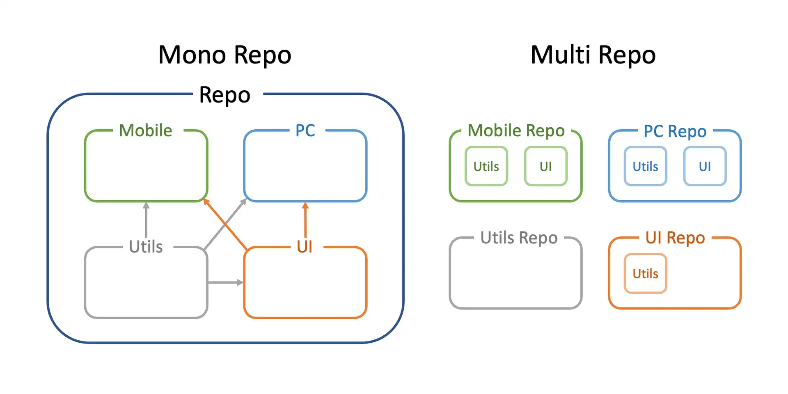

### Mono Repo와 Multi Repo

하나의 저장소(Repository)에서 여러개의 프로젝트를 관리하는 방식을 모노레포라고 합니다. 이번 포스트에서는 모노레포가 무엇인지 모노레포가 등장하기까지 어떻게 프로젝트 구성이 발전되어 왔는지 살펴보도록 하겠습니다.

### 사전지식

- 모놀로식 애플리케이션

  서비스에 필요한 모든 기능들을 포함하고 있어 소수의 개발자가 빠르게 개발할 수 있으나, 모듈화가 어렵고 유지보수가 어려워 질 수 있어 큰 프로젝트에 적합한 구조는 아닙니다.

- 멀티레포

  다른 프로젝트와 의존성을 가지지 않아 유지보수가 쉬워지고 강한 오너쉽을 가질 수 있으나, 프로젝트 별 코드 공유가 어려워 중복 코드가 만들어질 가능성이 높습니다.

- 모노레포

  프로젝트 사이의 코드 공유가 가능하여 중복 코드가 만들어질 가능성이 적고, NPM에 배포할 필요가 없어 의존성 관리가 쉽지만, 프로젝트가 많아질 수록 CI 속도가 느려질 수 있습니다. 프로젝트를 넘나드는 리팩토링이 가능하여 무분별한 리팩토링이 발생할 가능성이 있습니다.

### 프로젝트 구성의 발전

아래 그림을 보면 프로젝트를 구성하는 방법의 발전을 한눈에 확인 할 수 있습니다.

프로젝트 구성하는 방법은 모든 기능들을 담고 있는 모놀리식 애플리케이션에서, 기능들을 분리하여 각각의 저장소에서 관리하는 멀티레포, 하나의 저장소에서 여러개의 프로젝트를 관리하는 모노레포 형태로 발전해 갔습니다. 프로젝트를 구성하는 방법인 모놀리식 애플리케이션, 멀티레포, 모노레포를 하나씩 살펴보도록 하겠습니다.

#### 모놀리식 애플리케이션 (Monolithic application)

모놀리식 애플리케이션은 모듈화 없이 모든 구성 요소가 한 프로젝트 안에 통합된 소프트웨어 애플리케이션을 이야기합니다. DB 커넥션을 맺고, 데이터를 요청하며, 화면을 그리는 로직이 한 프로젝트 안에 구현된 초기 웹 서비스를 모놀리식 애플리션으로 볼 수 있습니다.

- 장점

  - 소수의 개발자가 빠르게 개발

- 단점

  - 관심사 분리가 어려워서 설계, 리팩토링이 어려움
  - 매번 거대한 프로젝트를 배포
  - 일부분의 에러가 전체 서비스에 영향을 줄 수 있음

#### 멀티레포 (Multi Repo)

멀티레포는 폴리레포(Poly Repo)라고도 불립니다. 모놀리식 애플리케이션을 모듈화하여 별도의 저장소에서 관리하는 구조입니다. 이렇게 분리된 프로젝트는 서로 독립적이기 때문에 개발, 테스트, 빌드 배포 등이 각각 존재하게 됩니다. 현재 보편적으로 사용되는 방법으로 하나의 서비스는 하나의 저장소에서 관리하는 형태입니다.

- 장점

  - 다른 프로젝트와 의존성을 가고 있지 않아 독립적으로 개발이 가능
  - 모듈화하여 관심사 분리가 쉬움
  - 강한 오너쉽

- 단점

  - 각 프로젝트의 코드 컨벤션 통일이 어려움
  - 코드 재사용이 어려워 중복 코드가 만들어질 가능성이 높음
  - 관리 포인트 증가

#### 모노레포 (Mono Repo)

하나의 저장소에 여러 프로젝트를 관리하는 구조입니다. NPM 배포 없이 프로젝트 간에 코드 공유가 가능합니다.

- 장점

  코드 재사용이 용이
  NPM에 배포할 필요가 없어 의존성 관리가 쉬움

- 단점
  CI 속도 저하 가능성이 있음
  무분별한 리펙토링의 가능성이 있음

### 언제 모노레포를 사용해야 하나?

모노레포의 최고의 장점은 프로젝트 사이의 코드 공유가 간편하다는 것입니다. 이 장점을 최대한 활용할 수 있는 상황에서 모노레포를 사용하는 것이 좋습니다. 아래의 경우가 모노레포를 사용하기 적절한 상황입니다.

- 유사한 서비스들을 만들 때

  한 서비스의 모바일 페이지, PC 페이지를 만들어야 할 경우 공통 기능들이 존재할 수 있기 때문에 모노레포로 구성하는 것이 좋습니다.

- 여러 프로젝트를 한 눈에 파악해야 할 때

  하나의 저장소에 여러 프로젝트를 구성할 수 있기 때문에 어떤 프로젝트들이 있는지 한 눈에 파악해야 할 때에도 모노레포를 사용하는 것이 좋습니다.

- 동일한 개발자 경험을 느껴야 할 때

  하나의 저장소에서 동일한 린트, 프리티어를 설정하여 동일한 개발자 경험을 줄 수 있습니다.

### 참고자료

- [[ETC] Monorepo - 개념](https://beomy.github.io/tech/etc/monorepo-concept/)
