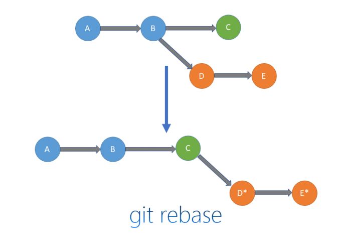
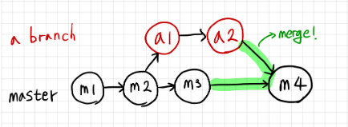
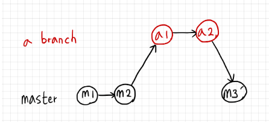
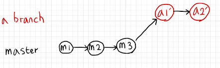

## Rebase와 Squash

### Rebase

Rebase 는 말 그대로 base를 재설정한다는 의미로, 하나의 브랜치가 다른 브랜치에서 파생되서 나온 경우, 다른 브랜치에서 진행된 커밋을 다시 가져와서 base를 재설정하는 것입니다.

- Rebase 는 커밋의 시간에 관계없이 마지막에 merge 되는 브랜치의 커밋을 가장 뒤에 붙이는 전략입니다.

#### 특징 요약

Merge 와 Rebase 는 실행결과는 같아도, 커밋 히스토리는 달라집니다.
Rebase 는 base 를 새롭게 설정한다는 의미로 이해하면 좋습니다.

#### Rebase 와 Merge의 특징

- Merge

  브랜치를 통합하는 것입니다.
  병합을 하면 합쳐진 브랜치의 커밋 메시지가 중복으로 쌓이며, 새로운 Merge 커밋을 생성합니다.

- Rebase

  base를 재설정한다는 의미로, 브랜치의 base를 옮깁니다.
  브랜치는 base 지점을 가지고 있어, base 에서부터 코드를 수정합니다.

#### Rebase VS Merge

- Merge 과정

  아래처럼 서브 브랜치(Feature 브랜치)에다 main 브랜치의 Merge를 시도할 경우, main 브랜치의 커밋을 feature 브랜치로 병합을 함으로써 feature 브랜치에 새로운 커밋이 발생합니다.

- Rebase 과정

  main 브랜치에 커밋 A,B 가 존재하고 feature 브랜치가 생성되었다 해봅시다. 그리고 feature 브랜치에는 커밋 D, E 를 생성했을 때, main 브랜치에서 feature 브랜치를 rebase 시켜봅시다.

  이는 곧 main 브랜치에서 feature 브랜치의 커밋 히스토리를 base로 해서 커밋 이력을 재정렬한다는 의미입니다.

  그러면 아래처럼 main 브랜치의 마지막 커밋 히스토리 맨뒤쪽에 이어서 feature 브랜치들의 커밋들이 뒤 이어서 붙게되는 구조를 보이게 됩니다.

  즉, rebase하여 C 지점으로 base를 이동시켜서 두 브랜치의 코드를 합치는데, 이때 D, E 커밋은 새로 지정된 C 지점 이후로 정렬됩니다.

브랜치 A 에 B 를 Rebase 한다면, 브랜치 A 의 맨 마지막 커밋에 꼬리를 물듯이 B 의 커밋 내역들이 뒤어서 달라붙게 됩니다. 즉, 선형적인 히스토리 구조 를 만들게됩니다.

#### Rebase 가 뭔지 잘 이해가 안간다면?

Rebase 란 현재 작업하는 브랜치에서 대상 브랜치를 base로 해서 커밋 이력을 재정렬한다고 볼 수 있습니다.
즉, Rebase란 현재 작업하는 브랜치를 대상 브랜치의 HEAD로 부터 분기된 브랜치로 간주하겠다는 뜻이 되기도 합니다.
예시를 통해 보시면 더 이해가 잘 되실겁니다. 자, 우선 Merge 먼저 다시 보겠습니다. master 브랜치로부터 a 브랜치가 생성이 되고 Merge 가 되는 과정은 잘 아실것이라고 생각합니다.

#### master 브랜치에서 a 브랜치를 rebase 하기

다음으로는 rebase 를 다시 살펴보죠. master 브랜치에서 a 브랜치를 rebase 한다면, a 브랜치의 HEAD로 부터 master 브랜치가 분기된 브랜치로 간주하겠다는 의미가 됩니다. ( = master 브랜치의 base를, 기존의 base 에서 a 브랜치의 HEAD를 base로 새롭게 잡은 것 )

이때 a 브랜치의 HEAD 는 커밋 a2 가 있는 곳입니다. 따라서 커밋 a2 뒤쪽으로 부터 master 브랜치가 파생(분기)되어 커밋들이 생성되는 구조를 이루게 됩니다.

#### a 브랜치에서 master 브랜치를 rebase 하기

반대로 a 브랜치에서 master 브랜치를 rebase 한다면, master 브랜치의 HEAD 로 부터 a 브랜치가 파생(분기)되어 나오는 구조로 이루어집니다. 따라서 master 브랜치의 HEAD 인 커밋 m3 로부터 a 브랜치의 커밋들이 이어지는 구조를 확인할 수 있습니다.

### Squash

git squash는 여러 개의 커밋을 하나의 커밋으로 합치는 방법입니다. 이렇게 하면 여러 개의 중간 커밋들을 깔끔하게 정리하여 하나의 의미 있는 커밋으로 만들 수 있습니다.

단순히 squash 명령만으로는 작업을 수행할 수 없습니다. 보통 git rebase의 interactive 모드를 사용하여 squash 작업을 진행합니다.

작업 중에 여러 차례의 커밋을 하는 것은 개발자에게 많은 이점을 제공합니다. 어떤 변화를 주었을 때의 결과를 확인하거나, 이전 상태로 롤백하기에 훨씬 용이하죠. 그런데 이렇게 많은 커밋들이 그대로 메인 브랜치에 병합되면 커밋 히스토리가 복잡해지고 이해하기 어려워집니다. 그래서 우리는 git squash를 통해 이러한 문제를 해결할 수 있습니다.

- `git rebase -i`

  - Rebase 시작: 작업을 정리하고 싶은 커밋의 개수만큼 이전으로 이동하여 rebase를 시작합니다.

    `git rebase -i HEAD~[커밋 개수]`

  - Interactive 모드: 텍스트 에디터가 열리며, 여러 커밋 목록이 표시됩니다. 합치고 싶은 커밋 앞의 키워드를 squash 또는 간단히 s로 변경합니다.

  - 커밋 메시지 정리: 커밋 메시지를 정리하거나 합친 커밋들의 메시지를 하나로 만듭니다.

  - Rebase 완료: 모든 변경 사항을 저장하고 에디터를 닫습니다.

  - 변경 사항 반영: 최종적으로 정리된 커밋을 원격 저장소에 반영합니다.

- `git merge --squash`

  - git checkout main-branch
  - git merge --squash feature-branch
  - git commit 병합할 커밋 내용

- 장점

  여러 커밋을 간단하게 하나로 합칠 수 있습니다.
  복잡한 Rebase 과정 없이 쉽게 사용 가능합니다.

- 주의점

  --squash 옵션으로 머지한 변경사항은 자동으로 커밋되지 않습니다. 따라서 수동으로 커밋해야 합니다.
  이미 원격 저장소에 푸시된 커밋에 대해 사용하는 것은 추천되지 않습니다.
  Git의 squash 기능은 커밋 히스토리를 깔끔하게 관리하는 데 큰 도움이 됩니다. 작업 중간중간에는 자유롭게 커밋을 해도 되지만, 최종적으로 PR을 요청하기 전에는 이러한 방법을 통해 커밋을 정리하는 것이 좋습니다. 이렇게 하면 프로젝트의 커밋 히스토리를 깔끔하게 유지할 수 있습니다.

### 참고자료

- [[Git] Rebase란, Fast-Forward Merge](https://velog.io/@msung99/Git-Rebase%EB%9E%80-%EB%AC%B4%EC%97%87%EC%9D%B8%EA%B0%80)
- [Git Squash: 커밋 기록 깔끔하게 관리하기](https://velog.io/@lgs03042/Git-Squash-%EC%BB%A4%EB%B0%8B-%EA%B8%B0%EB%A1%9D-%EA%B9%94%EB%81%94%ED%95%98%EA%B2%8C-%EA%B4%80%EB%A6%AC%ED%95%98%EA%B8%B0)
