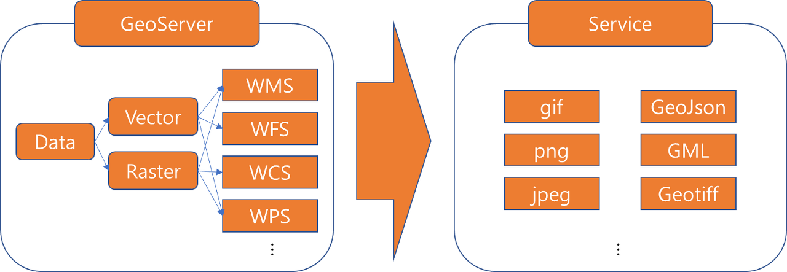

## GeoServer

GeoServer 는 지리공간 데이터를 공유하고 편집할 수 있는 Java 로 개발된 오픈 소스 GIS 소프트웨어 서버입니다. 상호운용성을 전제로 개발되었기 때문에, 개방형 표준을 사용하여 다양한 공간 데이터 소스를 서비스할 수 있게 합니다.

참고 [링크](https://geoserver.org/)

### WMS(Web Map Service)

- GIS(지리 정보 시스템) 데이터베이스에서 데이터를 사용하기 위해 맵 서버에서 생성된 지도 **이미지를 인터넷상에서 제공하기 위한 표준 프로토콜**
- WMS 요청은 관심 영역과 지리적 레이어를 처리하는것으로 정의
- WMS 요청에 대한 응답은 이미지(JPEG, PNG 등)로 제공
- 데이터서버에 저장된 레이어 또는 분석을 통해 생성된 벡터 및 래스터 데이터를 시각화(Visualiziont)하는 서비스
- Open Geospatial Consortium (OGC)에 의해 개발되어 최초로 공개

### WFS(Web Feature Service)

- 웹에서 **벡터형식으로 지리정보를 생성,수정,교환되는 방식의 인터페이스 표준**
- Http로 요청하고 XML, GeoJson등으로 받음
- DB에 저장된 레이어 또는 분석을 통해 생성된 백터,레스터 데이터를 가지고옴
- 사용자가 편집할 수 없는 WMS와 달리 피쳐 자체로 접근하여 편집 가능

### WCS(Web Coverage Service)

- 정적 지도(서버에서 그림으로 렌더링)를 반환하기 위해 공간 데이터를 묘사하는 WMS와 달리 WCS는 자세한 설명과 함께 사용 가능한 데이터를 제공
- 개별 지리 공간 기능을 반환하는 WFS와 달리 WCS는 시공간 도메인을 속성 범위(다차원적일 수 있음)와 관련시키는 시공간 변화 현상을 나타내는 커버리지를 반환
- GML , GeoTIFF , HDF-EOS , CF-netCDF 또는 NITF 와 같은 다양한 데이터 형식으로 적용 범위를 전달

### WPS(Web Processing Service)

- 지리자료의 처리, 알고리즘, 계산 등을 수행하기 위한 OGC 서비스
- 지리정보들에 대한 다양한 처리 서비스(Geo-Processing이란 GIS 데이터를 조작하기 위해 사용되는 작업으로 하나 이상의 입력데이터를 이용하여 자료 처리 후 결과물을 반환하는 형식이며, 일반적으로 중첩, 래스터 분석, 데이터 변환등이 있음 service)들을 웹 상에서 정의하고 접근할 수 있도록 하기 위한 인터페이스이며 모든 OGC 표준 웹 서비스들과 상호호환성을 갖도록 정의
- **특정 데이터에 직접 바인딩되어 있지 않으며, 클라이언트에 의해 동적으로 주어지는 데이터 또는 데이터 참조(WFS 결과물 등)들을 입력으로 받아들여 이를 처리하는 프로세스 서비스들로 구성**
- 간단한 계산(버퍼 연산 등)에서부터 복잡한 분석 연산(기후 모델의 생성 등)을 지원하며, 원칙적으로 WPS인터페이스를 기반으로 구현함에있어 어떠한 제약사항도 없음

### 한줄 요약

- WMS : 배경지도나 주제도의 시각화 및 범례
- WFS : 벡터 데이터의 공간 및 속성 조회와 편집
- WCS : 래스터 데이터의 추출(Subset, Resampling, Reprojection)
- WPS : 공간분석 및 처리

### 참고자료

- [[GeoServer] GeoServer란?](https://clsung.tistory.com/category/GIS/GeoServer)
