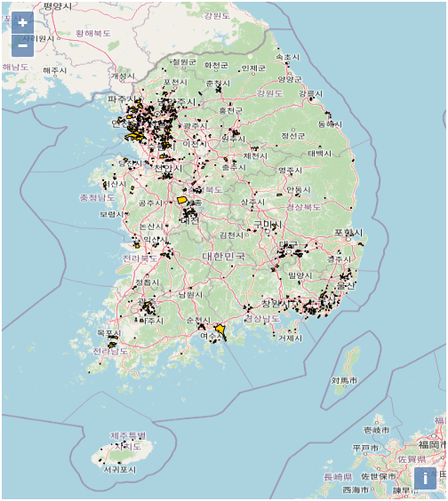
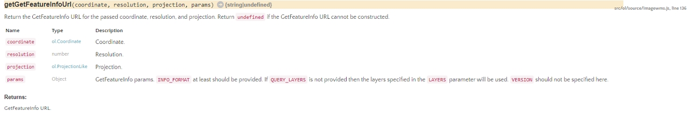

## Image Layer

Image Layer를 생성하기 위해 GeoServer에 택지정보시스템에서 제공하는 지구정보데이터를 레이어로 발행시켜두고 진행하였습니다.

Image Layer 를 생성하기 위해 배경지도 맵을 생성합니다.
Vector Layer와 동일하게 Map객체를 Layer와 View 객체를 나누어 선언하여도 되고 함께 사용해도 됩니다.

```jsx
21;
// 배경지도 레이어
let layers = [
  new ol.layer.Tile({
    source: new ol.source.OSM(),
  }),
];

// 배경지도의 View 객체
let view = new ol.View({
  center: [127.80418588898218, 35.88559485525495],
  projection: "EPSG:4326",
  zoom: 7,
});

// 배경지도가 있는 Map
const map = new ol.Map({
  layers: layers,
  target: "map",
  id: "map",
  view: view,
});
```

배경지도 맵을 생성한 뒤 이제 Image Layer를 생성할텐데, 그 전에 Openlayers에서 Image Layer를 사용할 수 있는 Source가 다양하게 있습니다.

- ol.source.ImageArcGISRest
- ol.source.ImageCanvas
- ol.source.ImageMapGuide
- ol.source.ImageStatic
- ol.source.ImageWMS
- ol.source.Raster

이 중에서 ol.source.ImageWMS를 사용했습니다.
가장 기본적으로 사용되는 WMS source이고, GeoServer에 발행한 레이어를 호출할 수 있습니다.

```jsx
let wmsSource = new ol.source.ImageWMS({
  url: "http://192.168.0.50:9001/geoserver/wms", // GeoServer를 설치한 서버의 URL 과 port를 사용합니다.
  params: { LAYERS: "Sample:the_geom" }, // 발행했던 레이어의 이름을 사용합니다. 작업공간이 여러개면서 같은 레이어를 사용할 경우 작업공간 이름까지 선언해주면 더 명확합니다.
  // url : 'http://192.168.0.50:9001/geoserver/Sample/wms?service=WMS&version=1.1.0&request=GetMap&layers=Sample:the_geom', // 혹은 url에 service, request, layers, version 등의 요소를 추가하여 사용할 수 도 있습니다.
  ratio: 1,
  serverType: "geoserver",
});

let wmsLayer = new ol.layer.Image({
  source: wmsSource,
});

map.addLayer(wmsLayer);
```

어떻게 보면 Vector Layer보다 쉽게 레이어를 호출합니다.



이렇게 호출된 Image Layer에 각 속성정보를 알고 싶을 때는 Openlayers Source의 함수 중 `getGetFeatureInfoUrl()`을 사용하여 확인할 수 있습니다.



`getGetFeatureInfoUrl()`은 좌표, 해상도, 좌표계, 데이터를 읽을 포맷으로 파라미터를 주면 사용자가 읽은 포맷 형식으로 데이터를 제공받을 수 있습니다.

```jsx
map.on("click", function (evt) {
  document.getElementById("info").innerHTML = ""; // 속성정보를 표출할 div 초기화

  let viewResolution = view.getResolution(); //
  let url = wmsSource.getGetFeatureInfoUrl(
    evt.coordinate,
    viewResolution,
    "EPSG:4326",
    { INFO_FORMAT: "text/html" }
  ); // 좌표, 해상도, 좌표계, 읽을 포맷

  if (url) {
    document.getElementById("info").innerHTML =
      '<iframe width="100%" seamless="" src="' + url + '"></iframe>';
  }
});
```

위와같이 작성하게 되면 지도에 feature 를 클릭하면 info div에 속성정보가 나타나게 됩니다.

### Image Layer feature 클릭 이벤트 화면


### 참고자료

- [[Openlayers] Vector Layer 와 Image Layer - 2](https://clsung.tistory.com/8)
