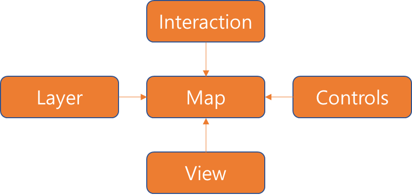
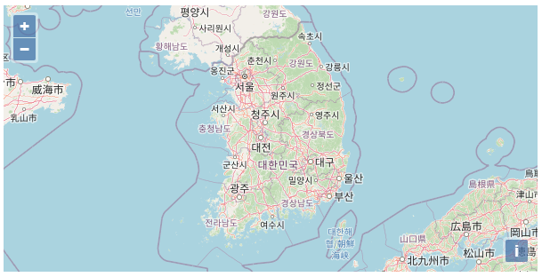

## Openlayers



Openlayers에서 지도서비스가 나타나기 위해서는 Map이 핵심요소로 필요합니다.
Map은 지도화면에 배경지도(BingMaps, GoogleMap, Kakao, Naver, OSM, 브이월드) 또는 배경지도 위에 WMS/WFS 레이어를 표출하기 위해 필요한 필수 객체 입니다.

Map을 사용하여 지도를 화면에 표출하기 위해서는 Layer와 View, Interaction, Controls와 같은 요소가 필요한데 각각을 설명하자면,
Layer는 배경지도 또는 레이어를 표출하기 위해 사용하는 객체입니다. 하나 이상의 레이어가 필요하여 Map에서 배열로 사용됩니다.

View는 해상도, 화면 레벨, 좌표 등 지도의 시각적 효과에 대한 변수들을 정의합니다.
Controls는 화면에 고정된 위치에 사용되는 버튼등에 이벤트를 적용하여 회전, 위치이동 등의 이벤트를 제공합니다.

Interaction은 마우스, 키보드 등의 이벤트로 효과를 제공합니다. (true, false)
참고 [링크](https://openlayers.org/)

설명만으로는 이해가 잘 안될 수 있어 Openlayer를 이용하여 지도 화면을 띄워보도록 하겠습니다.

```jsx
<link rel="stylesheet" href="https://openlayers.org/en/v4.6.5/css/ol.css" type="text/css">
<script src="https://cdn.polyfill.io/v2/polyfill.min.js?features=requestAnimationFrame,Element.prototype.classList,URL"></script>
<script src="https://openlayers.org/en/v4.6.5/build/ol.js"></script>
```

먼저 Openlayers를 사용하기 위해 js와 css를 추가해줍니다.

```jsx
<div id="map" class="map" style="width: 600px; height: 50%;"></div>
```

그리고 body안에 div태그에서 지도 화면을 띄울 곳을 정합니다.

```html
<script>
  var layers = [
    new ol.layer.Tile({
      source: new ol.source.OSM(),
    }),
  ];
  var map = new ol.Map({
    layers: layers,
    target: "map",
    view: new ol.View({
      center: [14206608.022807065, 4345508.083662013],
      zoom: 6,
    }),
  });
</script>
```

Map객체에 필요한 Layer와 View객체를 추가하여 OSM기반의 배경지도를 화면에 표출하는 소스 입니다.

```html
<!DOCTYPE html>
<html lang="ko">
  <head>
    <meta charset="UTF-8" />
    <meta http-equiv="X-UA-Compatible" content="IE=edge" />
    <meta name="viewport" content="width=device-width, initial-scale=1.0" />
    <title>Openlayers-baseMap</title>
    <link
      rel="stylesheet"
      href="https://openlayers.org/en/v4.6.5/css/ol.css"
      type="text/css"
    />
    <script src="https://cdn.polyfill.io/v2/polyfill.min.js?features=requestAnimationFrame,Element.prototype.classList,URL"></script>
    <script src="https://openlayers.org/en/v4.6.5/build/ol.js"></script>
  </head>
  <body>
    <div id="map" class="map" style="width: 600px; height: 50%;"></div>
    <script>
      var layers = [
        new ol.layer.Tile({
          source: new ol.source.OSM(),
        }),
      ];
      var map = new ol.Map({
        layers: layers,
        target: "map",
        view: new ol.View({
          center: [14206608.022807065, 4345508.083662013],
          zoom: 6,
        }),
      });
    </script>
  </body>
</html>
```



여기에 추가로 WMS나 WFS, Vector, Tile 등 다양한 Layer 객체를 배경지도 위에 올려 표현할 수 있고,
`PostgreSQL`등의 공간정보 사용이 가능한 데이터베이스와 `Geoserver`를 이용하여 많은 퍼포먼스를 낼 수 있습니다.

### 참고자료

- [[Openlayers] GIS 오픈소스 Openlayers란?](https://clsung.tistory.com/5)
