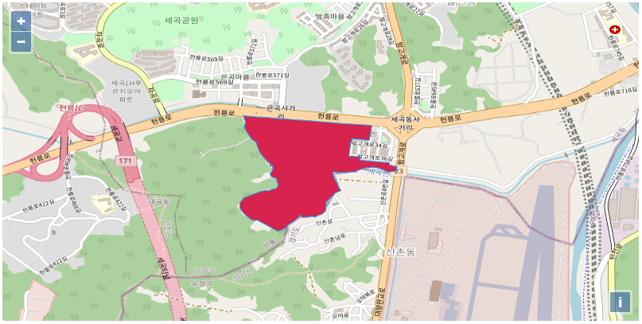
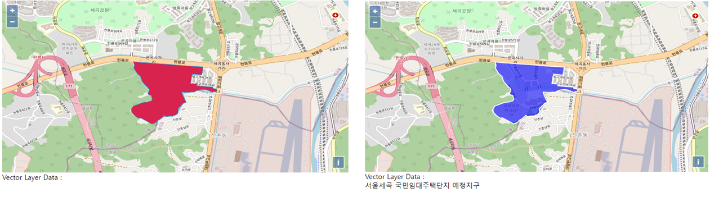
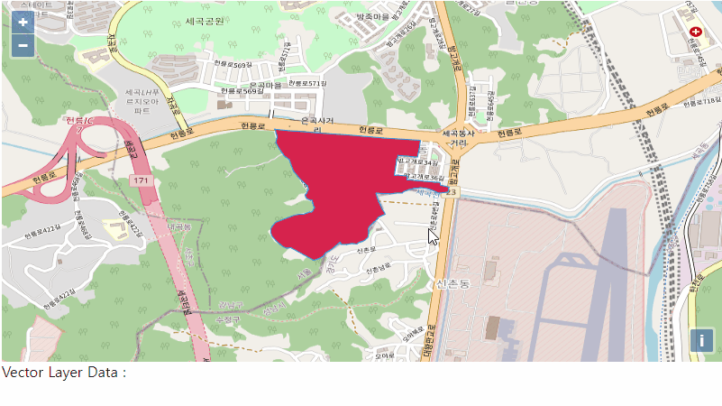

## Vector Layer

Vector 레이어를 생성하기 위해서는 우선 내가 생성하고자 하는 레이어의 데이터가 필요합니다.
택지정보시스템에서 제공하는 지구정보데이터 중 하나의 데이터를 커스터마이징하여 사용하였습니다.
먼저 Vector Layer 를 생성하기 위해 배경지도 맵을 생성합니다.

```jsx
// 배경지도 레이어
let layers = [
  new ol.layer.Tile({
    source: new ol.source.OSM(),
  }),
];
// 배경지도의 해상도, 위치, 레벨 설정
let view = new ol.View({
  center: [127.10369206558485, 37.462755923721225],
  projection: "EPSG:4326",
  zoom: 15,
});
// WFS Layer(Vector) 가 있는 Map
const map = new ol.Map({
  layers: layers,
  id: "map",
  target: "map",
  view: view,
});
```

위와 같이 각각의 객체를 나누어 사용하여도 되고,

```jsx
const map = new ol.Map({
  layers: [
    new ol.layer.Tile({
      source: new ol.source.OSM(),
    }),
  ],
  id: "map",
  target: "map",
  view: new ol.View({
    center: [127.10369206558485, 37.462755923721225],
    projection: "EPSG:4326",
    zoom: 15,
  }),
});
```

한번에 선언하여 맵을 사용할 수 있습니다.

이렇게 배경지도를 생성하고 난 뒤 Vector Layer를 생성할 차레입니다.
Vector Layer는 Openlayers에서 제공하는 포맷 중 하나인 GeoJSON 형식으로 가지고 왔습니다.

```json
//WFS데이터
const geoJson={"type":"Feature","properties":{"zoneCode":"11680DA2005001","zoneName":"서울세곡국민임대주택단지예정지구","stepCode":"PC"},"geometry":{"type":"Polygon","coordinates":[[[127.1063733,37.4640793,0.0],[127.1063833,37.4641394,0.0],[127.1064778,37.464681,0.0],[127.1047184,37.464804,0.0],[127.1044987,37.4648193,0.0],[127.1037383,37.4648909,0.0],[127.1029872,37.4649399,0.0],[127.1026356,37.4649628,0.0],[127.10166,37.4650265,0.0],[127.1006197,37.465108,0.0],[127.1005497,37.4651136,0.0],[127.1005075,37.4651169,0.0],[127.1004826,37.4651194,0.0],[127.0996025,37.4652087,0.0],[127.0995163,37.4652174,0.0],[127.0995566,37.4651815,0.0],[127.0995902,37.4650503,0.0],[127.0996391,37.4649353,0.0],[127.0996492,37.4648481,0.0],[127.0996378,37.4647666,0.0],[127.0995942,37.4645815,0.0],[127.0997194,37.4643419,0.0],[127.0997588,37.4642833,0.0],[127.0998869,37.4640891,0.0],[127.0999187,37.4640408,0.0],[127.099968,37.4639661,0.0],[127.100238,37.4637608,0.0],[127.1002862,37.4635808,0.0],[127.100413,37.4632244,0.0],[127.100717,37.4628659,0.0],[127.1010823,37.4625112,0.0],[127.1011359,37.4623895,0.0],[127.1011282,37.4623793,0.0],[127.1011405,37.4623342,0.0],[127.10111,37.4623069,0.0],[127.101091,37.4622772,0.0],[127.1010568,37.4622081,0.0],[127.1010621,37.4621719,0.0],[127.1010357,37.4621446,0.0],[127.1010185,37.4621271,0.0],[127.1009859,37.4621228,0.0],[127.1009717,37.4621031,0.0],[127.1009725,37.4620688,0.0],[127.101006,37.4620237,0.0],[127.1010133,37.4619893,0.0],[127.101021,37.4619745,0.0],[127.1010378,37.4619419,0.0],[127.1010406,37.461939,0.0],[127.1010821,37.4618966,0.0],[127.1011887,37.4618516,0.0],[127.1012469,37.4618361,0.0],[127.1012522,37.4618358,0.0],[127.1013267,37.4618279,0.0],[127.1013299,37.4617598,0.0],[127.1013435,37.4617261,0.0],[127.1013516,37.4616894,0.0],[127.1013678,37.4616447,0.0],[127.1013689,37.4615936,0.0],[127.1013776,37.4615446,0.0],[127.1014264,37.4614878,0.0],[127.1013141,37.4613057,0.0],[127.1012766,37.461283,0.0],[127.1012668,37.4612785,0.0],[127.1011796,37.4612724,0.0],[127.1010823,37.4612335,0.0],[127.1008972,37.4611763,0.0],[127.1007006,37.4611592,0.0],[127.1004587,37.4611275,0.0],[127.0995616,37.460774,0.0],[127.0993922,37.4605753,0.0],[127.0993402,37.460487,0.0],[127.0993505,37.4602831,0.0],[127.0994026,37.4601428,0.0],[127.0995651,37.4599418,0.0],[127.0996856,37.4598223,0.0],[127.0997964,37.4597234,0.0],[127.0999333,37.4596142,0.0],[127.100106,37.4595595,0.0],[127.1003036,37.4595856,0.0],[127.1003149,37.4595794,0.0],[127.1003386,37.4595663,0.0],[127.1010049,37.4591995,0.0],[127.1013932,37.4589725,0.0],[127.1016008,37.4590387,0.0],[127.1018291,37.4591827,0.0],[127.1019657,37.4593498,0.0],[127.1021106,37.4594236,0.0],[127.1021445,37.4594393,0.0],[127.1022708,37.459521,0.0],[127.1022995,37.4595387,0.0],[127.102646,37.4598674,0.0],[127.1026827,37.4597781,0.0],[127.1027003,37.4597329,0.0],[127.1028087,37.4597254,0.0],[127.1029542,37.4597325,0.0],[127.103073,37.4597611,0.0],[127.1031674,37.459766,0.0],[127.1032543,37.4597701,0.0],[127.1034514,37.4597574,0.0],[127.1035588,37.4598353,0.0],[127.1036495,37.4598677,0.0],[127.1038207,37.459932,0.0],[127.1038999,37.4600065,0.0],[127.1039547,37.4600568,0.0],[127.1039812,37.4601836,0.0],[127.1039864,37.4602315,0.0],[127.1039861,37.4602688,0.0],[127.1039978,37.4602688,0.0],[127.1039919,37.4604538,0.0],[127.1040353,37.4605576,0.0],[127.1040582,37.4605856,0.0],[127.1041827,37.4607269,0.0],[127.1042611,37.460802,0.0],[127.1043109,37.4608172,0.0],[127.1044202,37.4609565,0.0],[127.1044388,37.460985,0.0],[127.1044841,37.4610294,0.0],[127.1045325,37.4610566,0.0],[127.1046371,37.4610998,0.0],[127.1047922,37.46116,0.0],[127.1047616,37.4612636,0.0],[127.1046237,37.4614448,0.0],[127.1045623,37.4616124,0.0],[127.1045229,37.4616837,0.0],[127.1044829,37.4617559,0.0],[127.104477,37.4617746,0.0],[127.104353,37.4621748,0.0],[127.104717,37.4621546,0.0],[127.1048787,37.4621611,0.0],[127.1049343,37.4621545,0.0],[127.1050422,37.4621417,0.0],[127.1051403,37.4621462,0.0],[127.1052828,37.4621705,0.0],[127.10562,37.4621785,0.0],[127.105668,37.4622361,0.0],[127.1059373,37.4623546,0.0],[127.1061539,37.4624013,0.0],[127.1061791,37.4624068,0.0],[127.1063594,37.4624174,0.0],[127.106479,37.4624244,0.0],[127.1066839,37.462411,0.0],[127.1068918,37.46237,0.0],[127.1071967,37.4622332,0.0],[127.1073135,37.4621808,0.0],[127.1074382,37.4621858,0.0],[127.1075262,37.4621894,0.0],[127.1077909,37.4622245,0.0],[127.1078208,37.4624344,0.0],[127.1078376,37.4624651,0.0],[127.1076816,37.4625014,0.0],[127.1074559,37.4625457,0.0],[127.1074139,37.4625539,0.0],[127.1074334,37.4626746,0.0],[127.1074223,37.4626756,0.0],[127.107347,37.4626816,0.0],[127.1071586,37.4626968,0.0],[127.1069913,37.4627112,0.0],[127.1069498,37.4627147,0.0],[127.1067477,37.4627298,0.0],[127.1067228,37.4627336,0.0],[127.1066783,37.4627404,0.0],[127.1066767,37.4627406,0.0],[127.1064691,37.4627552,0.0],[127.1064221,37.4627602,0.0],[127.1062607,37.4627751,0.0],[127.1061922,37.4627809,0.0],[127.1060057,37.4627942,0.0],[127.1059456,37.462799,0.0],[127.105826,37.4628083,0.0],[127.1058291,37.4628309,0.0],[127.1058298,37.4628366,0.0],[127.1058516,37.4629966,0.0],[127.1058023,37.4630001,0.0],[127.1054841,37.4630227,0.0],[127.1054475,37.4630262,0.0],[127.1053363,37.4630338,0.0],[127.1053006,37.4630167,0.0],[127.1052331,37.4630225,0.0],[127.1053323,37.4637225,0.0],[127.1053377,37.46376,0.0],[127.1053425,37.4637941,0.0],[127.1053602,37.4637983,0.0],[127.1053776,37.4638025,0.0],[127.1053942,37.463971,0.0],[127.1054661,37.4639647,0.0],[127.1054919,37.4639616,0.0],[127.1055527,37.4639557,0.0],[127.1057135,37.463944,0.0],[127.1058477,37.4639327,0.0],[127.1061737,37.4639029,0.0],[127.1063419,37.4638908,0.0],[127.1063486,37.4639312,0.0],[127.1063733,37.4640793,0.0]]]}};
```

이 데이터를 이제 Vector Layer로 생성하는데, 이때 Openlayers의 ol.format.GeoJSON() 을 사용합니다.

```jsx
// geojson이 담길 vector layer의 feature(단위 집합들)
let features = new ol.format.GeoJSON().readFeatures(geoJson);
// feature 들을 담을 vector source
let vectorSource = new ol.source.Vector({
  features: features,
});
```

이렇게 feature를 source에 담아 생성한 뒤 레이어를 생성하면 Vector Layer가 생성되고 이를 map 객체에 addLayer 함수를 이용해 추가해주면 지도화면에 데이터가 지도로 표출됩니다.

```jsx
// vector layer
let vectorLayer = new ol.layer.Vector({
  source: vectorSource,
});

map.addLayer(vectorLayer); // vector layer를 Map에 추가
```


위와 같은 화면이 나타나면 정상적으로 Vector Layer를 생성한 것입니다.
Openlayers 에서 Vector Layer의 Default 색상을 저렇게 표현합니다.



Vector Layer에 스타일을 적용하게 되면 이렇게 눈에 확 띄는 색상이라던지 내가 원하는 다양한 색을 입혀볼 수 있습니다.
스타일을 적용하기 위해서는 Style 객체를 사용해야 하는데요.

```jsx
// 벡터 레이어의 스타일 색
let style = new ol.style.Style({
  fill: new ol.style.Fill({ color: "rgba(215, 35, 77, 1)" }), // rgb 코드 사용 가능
  // fill : new ol.style.Fill({color : '#d7234d'}), // HEX 코드 사용 가능
  stroke: new ol.style.Stroke({ color: "rgba(34, 160, 235, 1)" }),
});
```

이렇게 스타일 객체를 생성할 수 있습니다.

내가 원하는 색을 넣은 스타일 객체를 이제 Vector Layer 에 적용해주면 되는데, 위에서 언급했듯이 Vector Layer 는 Vector Source 를 가지고 있고 그 안에 Feature 들이 집합으로 있기 때문에 Feature 에다가 스타일을 적용해야 합니다.

```jsx
// feature에 스타일 적용(feature는 배열 구조로 수많은 feature가 있을 수 있다)
for (var i in features) features[i].setStyle(style);
```

이렇게 해주면 내가 원하는 색상도 스타일 객체를 통해 Vector Layer에 담게 되었습니다.

생성한 Vector Layer를 클릭하여 원하는 정보를 볼 수 있습니다.
위에 선언한 geoJson에는 여러 데이터가 존재하는데, 그 중에서 key가 "zoneName"인 데이터를 화면에 나타내보도록 하겠습니다.

```jsx
// feature를 클릭할 수 있는 select
let selectSingleClick = new ol.interaction.Select({
  condition: ol.events.condition.click, // click 하는 이벤트 (pointMove, singleclick, altClick 등)
  style: new ol.style.Style({
    stroke: new ol.style.Stroke({
      color: "white",
      width: 2,
    }),
    fill: new ol.style.Fill({
      color: "rgba(0,0,255,0.6)",
    }),
  }),
});
```

Vector Layer의 feature를 클릭하여 선택하는 Select객체를 생성합니다.

- condition : Select 객체 사용시 click, move 등의 이벤트를 설정

- style : Select 객체 사용시 색상 변경

```jsx
// map 객체에 add
map.addInteraction(selectSingleClick);
```

Map객체에 Select객체를 추가해줍니다.

그리고나서 마지막으로 생성한 Vector Layer의 feature를 클릭할 경우의 이벤트 함수를 작성해줍니다.

```jsx
// 기존 색상을 담는 객체
let \_style = null;
// feature 를 선택할 때 이벤트
selectSingleClick.on('select', function(e) {
if(e.target.getFeatures().a[0] != undefined){
\_style = e.target.getFeatures().a[0]; // 기존 색상 담기
e.target.getFeatures().a[0].setStyle(null); // 기존 색상 제거
}
if(e.target.getFeatures().a.length > 0){
document.getElementById('info').innerHTML = e.target.getFeatures().a[0].N.zoneName;
}else{
\_style.setStyle(style); // 기존 색상 추가
document.getElementById('info').innerHTML = "";
}
});
```

### Vector Layer feature 클릭 이벤트 화면



이렇게 색상을 변경함으로써 어떤 feature 를 선택했는지와 선택한 feature 의 data도 불러온 것을 확인할 수 있습니다.



### 참고자료

- [[Openlayers] Vector Layer 와 Image Layer - 1](https://clsung.tistory.com/tag/FEATURE)
