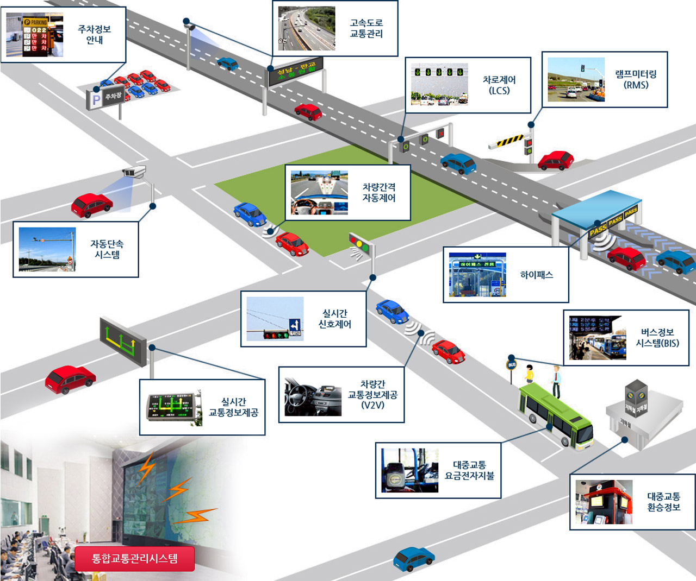

## 지능형 교통 체계 (Intelligent Transportation Systems, ITS)

국가교통체계효율화법 제2조 (정의)
지능형교통체계(ITS, Intelligent Transport Systems)란 교통수단 및 교통시설에 대하여 전자·제어 및 통신 등 첨단 교통기술과 교통정보를
개발·활용함으로써 교통체계의 운영 및 관리를 과학화·자동화하고, 교통의 효율성과 안전성을 향상시키는 교통체계를 의미합니다.

### 참고자료

- [ITS 정의 What is ITS(Intelligent Transport Systems)?](https://intl.its.go.kr/korea/system)
