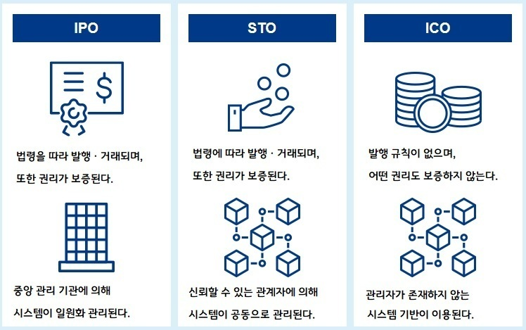

## 토큰증권 (STO, Security Token Offering)

주식 투자 경험이 있는 투자가라면 IPO와 어감이 비슷하다고 느낄지 모릅니다.

IPO는 Initial Public Offering의 약칭으로 신규 주식 공개를 가리키며, 미상장 기업이 거래소에 상장하여 주식을 공개하는 것을 가리킵니다. 시큐리티 토큰이란 유가증권의 성질을 가진 토큰(디지털 데이터)을 가리키며, 이 토큰을 활용하는 자금 조달 방법이 STO라 불립니다.

STO와는 별개로 토큰을 활용하는 자금 조달에는 ICO라 불리는 방법도 있습니다. ICO는 Initial Coin Offering의 약칭으로 암호 자산(가상화폐)을 사용하는 자금 조달법으로서 2017~2018년에 걸쳐 빠르게 확장되는 자금 조달 방법입니다. STO는 ICO에서 발생한 다양한 문제를 해결하는 한 가지 접근방식으로서, 암호 자산을 통해 기른 기술적인 노하우를 활용하면서 법령 준수의 관점에서 유가증권 규제의 틀을 채용하며, 기술적인 선진성과 법률에 의한 투자가 보호ㆍ거버넌스라는 특징을 가집니다.

우리 정부는 2023년 2월 4일, 토큰증권(Securities Token) 관련 가이드라인을 발표했습니다. 가이드라인의 주요 골자로는 1) 디지털자산의 증권 여부 판단원칙에 대한 예시 및, 2) 토큰증권의 발행∙유통 규율 체계 정비 방안 등이 포함됩니다.

현재 모든 증권은 발행 형태와 상관없이 자본시장법의 규율 대상이 됩니다. 이에 따라 토큰증권에는 투자자 보호와 시장질서 유지를 위한 공시, 인ㆍ허가 제도, 불공정거래 금지 등 기존 증권들에 적용되던 규제가 모두 적용되게 됩니다. 한편, 증권이 아닌 디지털 자산은 자본시장법이 적용되지 않고, 향후 국회에서 입법이 추진되고 있는 ‘디지털 자산 기본법’에 따라 규율 체계가 마련될 예정입니다.

### STO의 특징과 매력

- 자금 조달 방법의 다양화와 기대 효과

지금까지 자금 조달이라고 하면, 은행 차입ㆍ사채 발행(Debt finance)과 주식 발행(Equity finance)을 먼저 검토했었습니다. 각 자금 조달 방법마다 장단점이 존재하지만, STO는 지금까지의 자금 조달 방법으로는 충족하기가 비교적 어려운 니즈를 충족할 가능성이 있습니다.

예를 들어, 벤처 기업이 자금 조달을 검토할 때, 기존에는 VC(벤처 캐피탈) 및 엔젤 투자가로부터 출자를 모집하고, 주식을 제삼자 할당 증자 형식으로 자금을 조달했습니다. 이러한 방법으로는 일반적으로 기업이 일정 기간 후까지 IPO를 지향하는 사명을 지게 된다.

과연 주식 이외의 조달 방법, 전문 투자가 이외를 대상으로 하는 자금 조달 수단은 검토할 수 없는 걸까. 투자가의 출자 목적은 회수 중에서도 중시하는 요소가 다양하여, 경영에 적극적으로 참여하는 투자가 및 캐피탈 게인을 추구하는 투자가 및 펀드로서 금전 이외의 가치를 원하는 투자가 등 다양한 투자가가 존재한다.

앞으로 주식이 아니라 시큐리티 토큰에서의 자금 조달을 실현함으로써 다양한 투자가층의 니즈에 맞는 투자 기회를 제공하면서 자본 정책의 유연성을 높일 것으로 기대된다. 이러한 경우 STO를 활용함으로써 새로운 투자가층에 대한 접근과 주식 이외의 파이넌스를 검토할 수 있다.

그밖에도, 지금까지는 크라우드 펀딩 등을 활용하는 경우가 많았던 프로젝트 기반의 사업에 대한 STO의 활용도 기대할 수 있다. 크라우드 펀딩은 법률적으로 정리된 바가 없어, 투자형 크라우드 펀딩을 제외하면 팬들의 응원과 공감을 바탕으로 하는 경우가 많아, 큰 금액을 모집하기 어려운 상황이었다.

STO에서는 기존의 접근방식에 ‘투자’의 스킨을 적용함으로써 기존의 자원에 더하여 ‘출자와 회수’의 관계를 구축할 수 있다. 투자가는 자신이 관심을 가진 비즈니스나 취미에 대해 투자하고, 사업이 성공하면 기존의 덤에 더하여 금전적인 회수도 얻을 수 있도록 설계할 수 있어, ‘투자가가 곧 팬’이라는 식을 성립시킨다. 공감 투자라 불리는 사례가 증가하는 상황에서, 자금 조달과 마케팅ㆍ커뮤니케이션을 양립시킨 에코시스템을 구축하는 방법이 주목을 받고 있다.

위와 같이 STO는 전통적인 유가증권의 토큰화 이외의 방법으로도 활용할 수 있다. 결과적으로 지금까지 프로 투자가 등에 한정되었던 금융 상품이 줄어들어 개인 투자가가 구입할 수 있게 될 가능성이 있다.

또한 중장기적으로는 기술적 발전의 은혜를 입으면서도, 시큐리티 토큰을 취급하는 금융 시장 인프라를 정비하고 고도화하며, PTS를 포함하는 세컨더리 마켓을 성립시키고, 기술을 활용하여 업무의 효율을 향상하고 자동화함으로써 비용 절감 효과를 기대할 수 있어, 시장이 발전 및 확대될 것으로 기대된다. STO는 다른 국가들에서도 빠르게 검토되고 있는 영역이므로, 앞으로는 국제적인 시장이 형성되어 유동성이 향상될 것으로 기대된다. 시장의 발전을 위해 금융 상품 거래법 이외의 환경이 정비될 것이 요구된다.

### STO의 생태계

토큰증권 생태계는 크게 3개 참여자로 구성. 향후 관련법의 구체화 여부에 따라 세부적인 내용은 달라지겠지만, 토큰증권(ST) 생태계에는 크게 3개의 주체가 존재할 것으로 예상됨.

STO 기초자산: 토큰 발행을 위한 실물자산. 토큰화 할 자산의 가치평가 후 증권형 토큰 발행사에 넘어감. 부동산, 미술품, 저작권 등 실제 실물 가치를 지닌 자산에 해당되며, 특히, 기존 유동화가 제한적이고, 접근성이 낮았던 자산일수록 자산을 소싱하는 자산 소싱 업체의 역량이 중요해질 전망임.

토큰증권 발행사(Security token issuer, 발행 프로토콜): STO 프로토콜 플랫폼은 블록체인 기반의 네트워크(메인넷) 및 프로토콜(규칙) 등을 만들고 실제 토큰을 발행함. 특히, 실물 기반 자산의 법적 정의가 중요한 만큼, 실제 네트워크에 KYC(실명 인증), AML(자금출처 확인) 등의 기능을 담당하는 적합한 검증인(or 블록체인 노더)의 구성이 중요해질 전망임.

토큰증권 유통 플랫폼: 발행된 증권형 토큰을 2차 시장에서 거래할 수 있는 유통 플랫폼. 미국의 경우 tZero, Securitize 등이 대표적인 거래소이며 생태계 내 가장 많은 수수료 수익을 취하는 주체임.

현재 국내는 물론 해외에서도 토큰증권을 유통하기 위해서는 대체로 기존 금융사에 준하는 기능이 요구되며, 국내는 이를 ‘투자매매 중개업자’ 라이선스를 가진 주체로 제한하고 있음.

### 참고자료

- [ICT/정보통신 토큰 증권(STO: Security Token) 이해와 생태계](https://www.irsglobal.com/bbs/rwdboard/17641)
