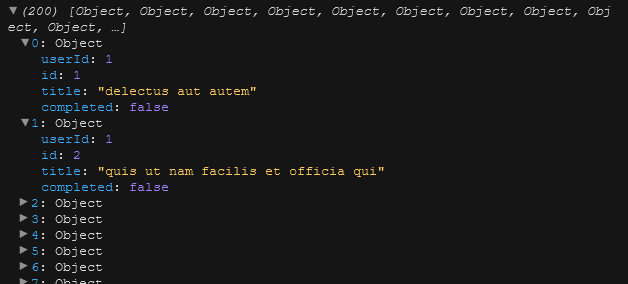
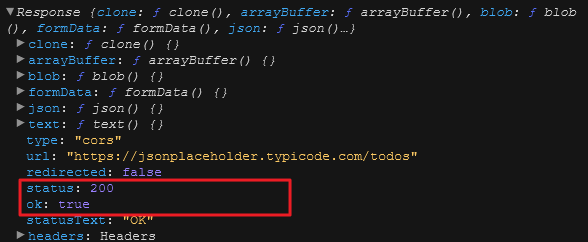
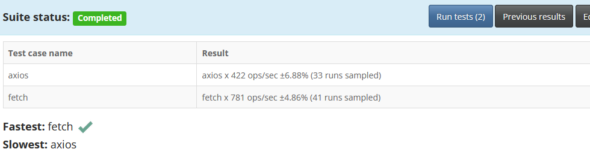

## Axios vs Fetch

흔히 우리는 백엔드 또는 서드파티 API에 네트워크 요청이 필요한 애플리케이션을 개발할 때 Axios 및 Fetch와 같은 HTTP 클라이언트를 사용합니다.

- Fetch 및 Axios에 대한 간략한 개요

  Fetch API는 네트워크 요청을 위해 fetch()라는 메서드를 제공하는 인터페이스입니다. 모던 브라우저에 내장되어 있어 따로 설치할 필요가 없습니다.

  Axios는 서드파티 라이브러리로 CDN 혹은 npm 이나 yarn과 같은 패키지 매니저를 통해 설치하여 프로젝트에 추가할 수 있습니다.

  Fetch 와 axios는 모두 promise 기반의 HTTP 클라이언트입니다. 즉 이 클라이언트를 이용해 네트워크 요청을 하면 이행(resolve) 혹은 거부(reject)할 수 있는 promise가 반환됩니다.

### Axios 설치하기

Axios를 node.js 환경에서 사용한다면, 다음 설치 방법 중 하나를 사용할 수 있습니다.

- NPM을 사용하여 설치

  `npm install axios`

- Yarn을 사용하여 설치

  `yarn add axios`

그 후 프로젝트에서 import 해야합니다.
`import axios from "axios";`

- 만약 브라우저에서 Axios를 사용한다면 아래와 같이 CDN을 사용할 수 있습니다.

```jsx
<script src="https://cdn.jsdelivr.net/npm/axios/dist/axios.min.js"></script>
```

### Fetch와 Axios의 기능 비교

- 문법

  Fetch는 두 개의 인자를 받습니다. 첫 번째 인자는 가져오고자 하는 리소스의 URL입니다. 두 번째 인자는 요청의 설정 옵션을 포함하는 객체로 선택적 인자입니다.

  두 번째 인자로 설정 옵션을 넘기지 않을 경우, 기본적으로 GET 요청을 생성합니다.

#### Fetch

`fetch(url);`

설정 옵션을 넘기면 다음과 같이 요청에 대해 커스텀 설정을 할 수 있습니다.

```jsx
fetch(url, {
  method: "GET", // 다른 옵션도 가능합니다 (POST, PUT, DELETE, etc.)
  headers: {
    "Content-Type": "application/json",
  },
  body: JSON.stringify({}),
});
```

#### Axios

```jsx
axios(url, {
  // 설정 옵션
});
```

아래와 같이 HTTP 메서드를 붙일 수도 있습니다.

```jsx
axios.get(url, {
  // 설정 옵션
});
```

fetch 메서드처럼 HTTP 메서드 없이 요청할 경우 기본적으로 GET 요청을 생성합니다.

`axios(url);`
또, 두 번째 인자를 사용해서 커스텀 설정하는 것도 가능합니다.

```jsx
axios(url, {
  method: "get", // 다른 옵션도 가능합니다 (post, put, delete, etc.)
  headers: {},
  data: {},
});
```

아래처럼 작성할 수도 있습니다.

```jsx
axios({
  method: "get",
  url: url,
  headers: {},
  data: {},
});
```

### 차이점

#### JSON 데이터 처리

아래 예제에서는 JSONPlaceholder라는 REST API에 GET 요청을 통해 투두 리스트의 아이템을 가져오며 fetch와 Axios의 차이점을 알아봅니다.

- Fetch

```jsx
const url = "https://jsonplaceholder.typicode.com/todos";

fetch(url)
  .then((response) => response.json())
  .then(console.log);
```

콘솔창에 출력된 결과는 다음과 같습니다.



fetch()는 .then() 메서드에서 처리된 promise를 반환합니다. 이 때는 아직 우리가 필요한 JSON 데이터의 포맷이 아니기 때문에 응답 객체의 .json() 메서드를 호출합니다. 그러면 JSON 형식의 데이터로 이행(resolve)된 또 다른 promise를 반환합니다. 따라서 일반적인 fetch 요청은 두 개의 .then() 호출을 갖습니다.

- Axios

```jsx
const url = "https://jsonplaceholder.typicode.com/todos";

axios.get(url).then((response) => console.log(response.data));
```

Axios를 사용하면 응답 데이터를 기본적으로 JSON 타입으로 사용할 수 있습니다. 응답 데이터는 언제나 응답 객체의 data 프로퍼티에서 사용할 수 있습니다.

다음과 같이 설정 옵션을 통해 responseType을 지정하여 기본 JSON 데이터 타입을 재정의 할 수도 있습니다.

```jsx
axios.get(url, {
  responseType: "json", // options: 'arraybuffer', 'document', 'blob', 'text', 'stream'
});
```

#### 자동 문자열 변환(stringify)

이제 JSONPlaceholder API를 사용해서 데이터를 전송해보겠습니다.

이를 위해서는 데이터를 JSON 문자열로 직렬화해야 합니다. POST 메서드로 JavaScript 객체를 API로 전송하면 Axios가 자동으로 데이터를 문자열로 변환해줍니다.

- Fetch API

  JSON.stringify()를 사용하여 객체를 문자열으로 변환한 뒤 body에 할당해야 합니다.

```jsx
const url = "https://jsonplaceholder.typicode.com/todos";

const todo = {
  title: "A new todo",
  completed: false,
};

fetch(url, {
  method: "post",
  headers: {
    "Content-Type": "application/json",
  },
  body: JSON.stringify(todo),
})
  .then((response) => response.json())
  .then((data) => console.log(data));
```

또한 Fetch를 사용하면 명시적으로 Content-Type을 application/json으로 설정해야 합니다.

- Axios

  아래는 Axios로 post 요청을 수행하는 코드입니다.

```jsx
const url = "https://jsonplaceholder.typicode.com/todos";

const todo = {
  title: "A new todo",
  completed: false,
};

axios
  .post(url, {
    headers: {
      "Content-Type": "application/json",
    },
    data: todo,
  })
  .then(console.log);
```

Axios로 post요청을 할 때 요청 본문(request body)으로 보내고자 하는 data는 data 프로퍼티에 할당합니다. 컨텐츠 유형 헤더도 설정할 수 있습니다. 기본적으로 axios는 Content-Type을 application/json으로 설정합니다.

응답 객체를 한 번 살펴보겠습니다.

응답 데이터는 다음과 같이 response.data에 있습니다.

```jsx
.then(response => console.log(response.data));
```

#### 에러 처리

Fetch와 axios는 모두 이행(resolve) 되거나 거부(reject)된 promise를 반환합니다. Promise가 거부(reject)되면 .catch()를 사용하여 에러를 처리할 수 있습니다. Axios로 에러를 처리하는 방법은 Fetch에 비해 더 간결합니다.

- Fetch

  404 에러나 다른 HTTP 에러 응답을 받았다고 해서 promise를 거부(reject)하지 않습니다. Fetch는 네트워크 장애가 발생한 경우에만 promise를 거부(reject) 합니다. 따라서 .then절을 사용해 수동으로 HTTP 에러를 처리해야 합니다.

다음 코드를 살펴보겠습니다.

```jsx
const url = "https://jsonplaceholder.typicode.com/todos";

fetch(url)
  .then((response) => {
    if (!response.ok) {
      throw new Error(
        `This is an HTTP error: The status is ${response.status}`
      );
    }
    return response.json();
  })
  .then(console.log)
  .catch((err) => {
    console.log(err.message);
  });
```

응답 블록에서 응답의 ok 상태가 false인 경우 .catch 블록에서 처리되는 커스텀 에러를 발생시킵니다.

다음과 같이 응답 객체에서 사용할 수 있는 메서드를 살펴볼 수 있습니다.

`.then(console.log)`



위 사진은 fetch가 성공했을 때의 스크린샷입니다. 만약 잘못된 URL 엔드포인트를 요청했을 경우 ok와 status 속성은 각각 false와 404값을 가지게 됩니다. 이에 에러를 발생시키고 .catch()절에서 커스텀 에러 메세지를 출력합니다.

- Axios

  .catch()를 사용한 일반적인 에러 처리는 다음과 같습니다.

```jsx
const url = "https://jsonplaceholder.typicode.com/todos";

axios
  .get(url)
  .then((response) => console.log(response.data))
  .catch((err) => {
    console.log(err.message);
  });
```

Axios의 promise는 상태코드가 2xx의 범위를 넘어가면 거부(reject)합니다. 에러 객체에 응답(response) 또는 요청(request) 프로퍼티가 포함되어 있는지 확인하여 에러에 대한 자세한 정보를 확인할 수 있습니다.

```jsx
.catch((err) => {
// 에러 처리
if (err.response) {
// 요청이 이루어졌고 서버가 응답했을 경우

    const { status, config } = err.response;

    if (status === 404) {
      console.log(`${config.url} not found`);
    }
    if (status === 500) {
      console.log("Server error");
    }

} else if (err.request) {
// 요청이 이루어졌으나 서버에서 응답이 없었을 경우
console.log("Error", err.message);
} else {
// 그 외 다른 에러
console.log("Error", err.message);
}
});
```

에러 객체의 response 프로퍼티는 클라이언트가 2xx 범위를 벗어나는 상태 코드를 가진 에러 응답을 받았음을 나타냅니다. 에러 객체의 request 프로퍼티는 요청이 수행되었지만 클라이언트가 응답을 받지 못했음을 나타냅니다. 요청 또는 응답 속성이 모두 없는 경우는 네트워크 요청을 설정하는 동안 오류가 발생한 경우입니다.

#### 응답 시간 초과 / 요청 취소

각각의 HTTP 클라이언트에서 HTTP 요청이 시간 초과될 경우 어떻게 처리하는지 살펴봅시다.

- Fetch

  요청을 취소하기 위해서는 AbortController 인터페이스를 사용할 수 있습니다. 다음과 같이 사용할 수 있습니다.

```jsx
const url = "https://jsonplaceholder.typicode.com/todos";

const controller = new AbortController();
const signal = controller.signal;
setTimeout(() => controller.abort(), 4000);

fetch(url, {
  signal: signal,
})
  .then((response) => response.json())
  .then(console.log)
  .catch((err) => {
    console.error(err.message);
  });
```

controller 객체를 생성하고나서 signal 객체와 abort() 메서드에 접근했습니다. 이 signal객체를 설정 옵션을 통해 fetch()에 넘깁니다. 이렇게 하면 abort 메서드가 호출될 때마다 fetch 요청이 종료됩니다. 보시다시피 setTimeout 기능을 사용하여 서버가 4초 이내에 응답하지 않으면 작업이 종료됩니다.

- Axios

  timeout 속성을 설정 객체에 추가하여 요청이 종료될 때까지의 시간을 밀리초로 지정할 수 있습니다.

다음 코드 스니펫에서는 만약 요청이 4초 이상 걸릴 경우에 종료하고 console창에 error를 로깅하고 있습니다.

```jsx
const url = "https://jsonplaceholder.typicode.com/todos";

axios
  .get(url, {
    timeout: 4000, // 기본 설정은 '0'입니다 (타임아웃 없음)
  })
  .then((response) => console.log(response.data))
  .catch((err) => {
    console.log(err.message);
  });
```

#### 성능

Fetch와 axios 모두 promise 기반이기 때문에 성능 문제를 일으키지 않습니다. 그러나 `measurethat.net`을 사용하여 성능을 측정할 수 있습니다.

온라인 도구를 사용하여 연속 테스트한 결과 다음과 같은 결과를 확인할 수 있었습니다.

아래와 같은 그래프 결과를 확인할 수 있습니다.



위에서 확인할 수 있듯이 native Fetch가 axios 보다 살짝 더 빠릅니다. 두 클라이언트 모두 비동기이기 때문에 크게 중요하지 않습니다.

- 브라우저 지원

  Axios와 Fetch는 모두 모던 브라우저에서 광범위하게 지원됩니다. IE 11과 같은 오래된 환경에서는 ES6 Promise를 지원하지 않기 때문에 폴리필을 사용해야 합니다. 또한 Fetch의 경우 이전 브라우저에서의 구현을 지원하기 위해 다른 폴리필을 추가해야 할 것입니다.

- 결론

  이 글에서는 Fetch와 axios에 대해 실제 시나리오를 통해 비교해보았습니다. 결국, 프로젝트에서 어떤 방법을 선택할 지는 개인의 선호도와 사용 편의성에 따라 달라집니다.
