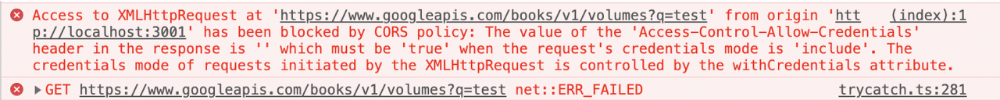

## CORS

CORS(Cross-Origin Resource Sharing)는 출처가 다른 자원들을 공유한다는 뜻으로, 한 출처에 있는 자원에서 다른 출처에 있는 자원에 접근하도록 하는 개념입니다. 직역하면, 교차되는 출처 자원들의 공유입니다. 다른 출처에 있는 자원을 요청한다고 하면, 이를 교차 출처 요청이라고 부릅니다.

교차 출처 리소스 공유(Cross-Origin Resource Sharing, CORS)는 추가 HTTP 헤더를 사용하여, 한 출처에서 실행 중인 웹 애플리케이션이 다른 출처의 선택한 자원에 접근할 수 있는 권한을 부여하도록 브라우저에 알려주는 체제입니다. 웹 애플리케이션은 리소스가 자신의 출처(도메인, 프로토콜, 포트)와 다를 때 교차 출처 HTTP 요청을 실행합니다.

### 출처란

평소 접근하는 URL이 어떤 구성요로 이루어져 있는지 아래에 나와 있습니다.

```jsx
https://beomy.github.io/tech/browser/cors/
```

위의 구성요소 중에서 Protocol + Host + Port 3가지가 같으면 동일 출처(Origin)라고 합니다.

- 동일 출처 예시

  - `http://Example.com:80`

  - `http://example.com HTTP`

    기본 Port인 80번이 생략되어있으므로 동일 출처입니다

  - `http://example.com/app1/index.html`

  - `http://example.com/app2/index.html`

    Protocol, Host, Port(생략)이 같으며, Path부터 다르므로 동일 출처입니다.

- 다른 출처 예시

  - `http://example.com/app1`

  - `https://example.com/app2`

    Protocol이 다릅니다.

  - `http://example.com`

  - `http://www.example.com`

  - `http://myapp.example.com`

    Host가 다릅니다.

  - `http://example.com`

  - `http://example.com:8080`

    80, 8080으로 포트가 다릅니다.

다른 출처 요청일 경우, CORS 정책에 준수하여 요청해야만 정상적으로 응답을 받습니다.

### 다른 출처 요청의 위험성

``, `<script>`, `<frame>`, `<video>`, `<audio>` 등이 웹에 등장하면서, 페이지 로딩 이후에 브라우저에서 이러한 하위 자원들을 가져올 수 있게 되었습니다. 그러므로 동일 출처, 다른 출처 모두 호출이 가능하게 되었습니다.

- 은행 계좌

홈페이지를 서핑하고 있는데, `<script>`가 심어진 evil.com 페이지를 열었다고 생각해봅시다. 굉장히 유용한 정보를 담고 있는 사이트이지만, 페이지를 열면서 `<script>`가 실행되어 은행에 'Delete /account'를 요청하도록 되어 있습니다. AJAX 호출로 은행 API를 호출하여 나의 은행 계좌를 삭제해버리는 사고가 발생합니다.

따라서, 다른 출처의 접근을 막기 위해서 동일 출처 정책이 등장했습니다.

### 동일 출처 정책(Same-origin policy)

다른 출처로부터 조회된 자원들의 읽기 접근을 막아 다른 출처 공격을 예방합니다. 그러나, 다른 출처에서 얻은 이미지를 담는 ``, 외부 주소를 담는 `<link>` 같은 여러 태그들을 허용합니다. 동일 출처 정책의 정확한 구현 명세는 없지만 최신의 브라우저들은 일정 규칙을 따르고 있습니다. ( RFC6454 )

동일출처 정책은 다른 출처 자원을 가져오는 것을 굉장히 제한적으로 허용했습니다. 또한 SPA와 미디어 중심 웹 사이트들이 더욱 늘어나고 있으므로 관련 규칙들도 계속 늘어납니다. 따라서, 다른 출처 리소스에 접근성을 높이기 위해서 CORS가 등장했습니다.

### 동일 출처 요청 vs 다른 출처 요청 그림


요청하는 클라이언트와 요청받는 서버가 같은 출처에 있으면 동일 출처, 서로 다른 서버에 있으면 다른 출처 요청입니다.

- 왼쪽의 핸드폰의 URL은 domain-a.com 입니다.

- 오른쪽 서버의 URL은 domain-a.com과 domain-b.com 2가지 입니다.

- domain-a.com 유저가 domain-a.com 서버에 요청하면 동일 정책이기 때문에 아무런 문제가 없지만,
  domain-a.com 유저가 domain-b.com 서버에 요청하면 호스트(Host\_가 다르기 때문에 다른 출처 요청을 합니다.

- 도메인 이외에, 같은 프로젝트 내에 정의된 css 파일 요청은 동일 출처 요청이고, font같은 경우에는 다른 외부 사이트에서 실시간으로 import를 통해 가져온다면 다른 출처 요청입니다.

이처럼, 같은 출처가 아닌 외부에 자원을 요청하는 경우가 있는지 잘 확인해보아야 합니다.

기본적으로 동일 출처 요청만 자유롭게 요청이 가능하며 동일 출처 정책(Same-Origin Policy) 이라고 합니다.

하지만 기준을 완화하여 다른 출처 요청도 할 수 있도록 기준을 만든 체제가 다른 출처 정책(Cross-Origin Policy)입니다.

### 다른 출처 요청 정책 3가지

1. 단순요청(Simple Request)

- GET, HEAD, POST 요청만 가능합니다.

- Accept, Accept-Language, Contet-Language, Content-Type과 같은 CORS 안전 리스트 헤더 혹은 User-Agent 헤더

- Contet-Type 헤더는 application/x-www-form-urlencoded, multipart/form-data and text/plain만 가능합니다.

- ReadableStream 객체가 사용되지 않습니다.

- XMLHttpRequest 객체를 사용하여 요청하면, 요청에서 사용된 XMLHttpRequest.upload에 의해 반환되는 객체에 어떠한 이벤트 리스너도 등록되지 않습니다.

```jsx
const xhr = new XMLHttpRequest();
const url = "https://www.api.com?q=test";
xhr.open("GET", url);
xhr.onreadystatechange = requestHandler;
xhr.send();
```


- 브라우저는 다른 출처에 자신의 주소 https://www.site.com를 origin에 담아서 요청을 보냅니다.

- 서버는 요청을 확인하고 다른 출처 주소 https://www.site.com에 에 접근이 가능하다는 access-control-allow-origin에 해당 주소를 담아서 결과를 리턴합니다.

- 특히, access-control-allow-origin은 CORS 헤더의 중요 요소 중 하나로 어떤 요청을 허용할지 결정합니다. 이 헤더 값은 하나의 출처가 될 수도 있고 "\*"를 사용해 어떤 출처도 허용하도록 할 수 있습니다.

- 만약 서버가 이 헤더에 응답하지 않거나, 헤더 값이 요청의 출처와 일치하지 않는 도메인인 경우, 브라우저는 응답을 차단합니다. 또한 요청한 출처가 서버의 access-control-allow-origin에 포함되어 있는 경우도 마찬가지 입니다.

2.  프리 플라이트(Preflight Request)

    OPTIONS 메서드로 HTTP 요청을 미리 보내 실제 요청이 전송하기에 안전한지 확인합니다. 다른 출처 요청이 유저 데이터에 영향을 줄 수 있기 때문에 미리 전송한다는 의미입니다.

**요청헤더**

- origin

  어디서 요청을 했는지 서버에 알려주는 주소

- access-control-request-method

  실제 요청이 보낼 HTTP 메서드

- access-control-request-headers

  실제 요청에 포함된 header

**응답 헤더**

- access-control-allow-origin

  서버가 허용하는 출처

- access-control-allow-methods

  서버가 허용하는 HTTP 메서드 리스트

- access-control-allow-headers

  서버가 허용하는 header 리스트

- access-control-max-age

  프리 플라이트 요청의 응답을 캐시에 저장하는 시간

```jsx
const xhr = new XMLHttpRequest();
const url = 'https://www.api.com?q=test';
xhr.open(‘GET', url);
xhr.setRequestHeader(‘custom-header', ’test')
xhr.onreadystatechange = requestHandler;
xhr.send();
```


- 프리플라이트 요청은 OPTIONS 를 사용해 자신의 주소 https://www.api.com?q=test 를 보냅니다. 또한 origin, access-control-request-method, access-control-request-headers를 같이 보냅니다.

- 정상적인 응답으로 access-control-allow-origin, access-control-allow-method, access-control-allow-headers, access-control-max-age를 응답받습니다.

- 정상 요청과 응답이 가능하다는 프리 플라이트 덕분에 실제 요청을 합니다. 그리고 정상적인 응답을 받습니다.

3. 신용 요청(Credentialed Request)

   쿠키, 인증 헤더, TLS 클라이언트 인증서 등의 신용정보와 함께 요청합니다. 기본적으로, CORS 정책은 다른 출처 요청에 인증정보 포함을 허용하지 않습니다. 요청에 인증을 포함하는 플래그가 있거나 access-control-allow-credentials가 true로 설정 한다면 요청할 수 있습니다.

인증정보를 포함하여 요청을 보내겠습니다.

```jsx
const xhr = new XMLHttpRequest();
const url = "https://www.api.com?q=test";
xhr.open("GET", url);
xhr.withCredentials = true;
xhr.send();
```


만약 서버 응답에 access-control-allow-credentials 가 true로 설정되지 않았거나 access-control-allow-origin 헤더에 있는 값이 허용된 출처가 아니라면 아래와 같이 오류가 발생합니다.



### 어떤 요청 방식을 사용해야 할까요?

프리플라이트 요청을 사용하는게 좋습니다. 프리 플라이트 요청으로 실제 요청이 실행되기 이전에 검사를 하고 허용할지 않할지를 결정할 수 있기 때문입니다.

### 참고자료

- [CORS란 무엇인가?](https://escapefromcoding.tistory.com/724)
