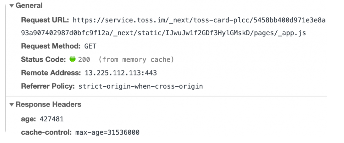
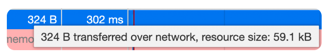
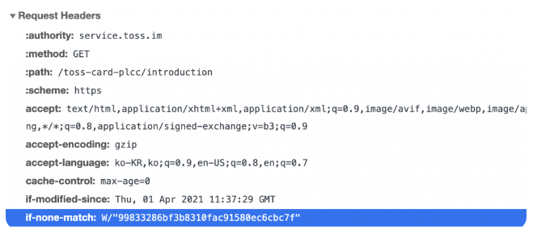
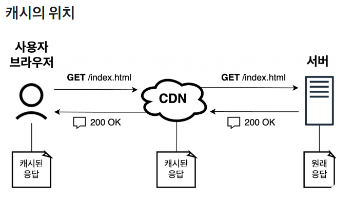
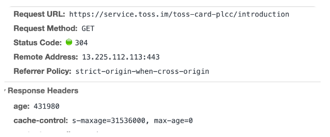
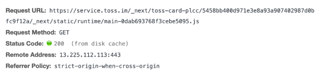

## Cache (캐시 디렉토리)

- 캐싱 대상

  주로 브라우저에 의해 자동으로 관리되는 일반적인 웹 페이지, 이미지, 스타일 시트 등의 정적 자원을 캐싱하는 데 사용됩니다.

- 캐시 위치

  브라우저가 사용자의 로컬 디바이스에 캐시를 저장하는 디렉토리입니다. 이 캐시는 브라우저의 설정에서 관리되며 사용자는 브라우저의 캐시를 비울 수 있습니다.

- 동작 방식

  브라우저는 HTTP 응답 헤더의 Cache-Control 및 Expires와 같은 지시를 기반으로 자동으로 캐싱을 처리합니다. 일반적으로, 브라우저는 캐시된 자원을 사용하고, 서버에 변경이 감지되면 새로운 자원을 가져옵니다.

- 사용법

  브라우저에서 자동으로 관리되므로 개발자가 직접 캐시를 조작하는 데 제한이 있습니다. 사용자의 브라우저 설정에서 캐시를 지울 수 있습니다.

### 캐시의 생명 주기

HTTP에서 리소스(Resource)란 웹 브라우저가 HTTP 요청으로 가져올 수 있는 모든 종류의 파일을 말합니다. 대표적으로 HTML, CSS, JS, 이미지, 비디오 파일 등이 리소스에 해당합니다.

웹 브라우저가 서버에서 지금까지 요청한 적이 없는 리소스를 가져오려고 할때, 서버와 브라우저는 완전한 HTTP 요청/응답을 주고받습니다. HTTP 요청도 완전하고, 응답도 완전합니다. 이후 HTTP 응답에 포함된 Cache-Control 헤더에 따라 받는 리소스의 새명 주기가 결정됩니다.

### 캐시의 유효기간: max- age

서버의 Cache-Control 헤더의 값으로 `max-age=<seconds>` 값을 지정하면, 이 리소스의 캐시가 유효한 시간은 `<seconds>`초가 됩니다.

### 캐시의 유효 기간이 지나기 전

한 번 받아온 리소스의 유효 기간이 지나기 전이라면, 브라우저는 서버에 요청을 보내지 않고 디스크 또는 메모리에서만 캐시를 읽어와 계속 사용합니다.

위 개발자 도구 캡처와 같이 어떤 JavaScript 파일을 요청하는 경우를 가정합시다. 이 리소스가 가지는 Cache-Control 헤더 값은 `max-age=31536000`이기 때문에, 이 리소스는 1년(31,536,000초)동안 캐시할 수 있습니다.

스크린샷에서는 유효한 캐시가 메모리에 남아 있기 때문에 (from memory cache)라고 표기된 것을 확인할 수 있습니다.

**"서버에 요청을 보내지 않고"라고 하는 말에 주의합시다.** 한번 브라우저에 캐시가 저장되면 만료될때까지 캐시는 계속 브라우저에 남아 있게 됩니다. 때문에 CDN Invalidation을 포함한 서버의 어떤 작업이 있어도 브라우저의 유효한 캐시를 지우기는 어렵습니다.

Cache-Control max-age 값 대신 Expires 헤더로 캐시 만료 시간을 정확히 지정할 수도 있습니다.

### 캐시의 유효 기간이 지난 이후: 재검증

그렇다면 캐시의 유효 기간이 지나면 캐시가 완전히 사라지게 될까요? 그렇지는 안습니다. 대신 브라우저는 서버에 조건부 요청(Conditional request)을 통해 캐시가 유효한지 재검증(Revalidation)을 수행합니다.

재검증 결과 브라우저가 가지고 있는 캐시가 유효하다면, 서버는 [304 Not Modified] 요청을 내려줍니다. [304 Not Modified] 응답은 HTTP 본문을 포함하지 않기 때문에 매우 빠르게 내려받을 수 있습니다. 예를 들어, 위 스크린샷을 살펴보면 59.1kb 리소스의 캐시 검증을 위해 324바이트만의 네트워크 송수신만을 주고 받았음을 볼 수 있습니다.

`if-none-match`와 `if-modified-since`가 포함된 요청

대표적인 재검증 요청 헤더들로는 아래와 같은 헤더가 있습니다.

1. `if-none-match`

   캐시된 리소스의 `ETag`값과 현재 서버 리소스의 `ETag`값이 같은지 확인합니다.

2. `if-modified-since`

   캐시된 리소스의 Last-Modified값 이후에 서버 리소스가 수정되었는지 확인합니다.

위의 `ETag`와 `Last-Modified`값은 기존에 받았던 리소스의 응답 헤더에 있는 값을 사용합니다.

재검증 결좌 캐시가 유효하지 않으면, 서버는 [200 OK] 또는 적합한 상태 코드를 본문과 함께 내려줍니다. 추가로 HTTP 요청을 보낼 필요 없이 바로 최신 값을 내려받을 수 있기 때문에 매우 효율적입니다.

> max-age=0 값이 Cache-Control 헤더로 설정되었을 때, 매번 요청할 때마다 서버에 재검증 요청을 보내야 할 것입니다. 그렇지만 일부 모바일 브라우저의 경우 웹 브라우저를 껐다 켜기 전까지 리소스가 만료되지 않도록 하는 경우가 있습니다. 네트워크 요청을 아끼고 사용자에게 빠른 웹 경험을 제공하기 위해서라고 합니다.
> 이 경우에는 웹 브라우저를 껐다 켜거나, 아래에서 소개할 `no-store`값을 사용합니다.

### no-cache와 no-store

Cache-Control에서 가장 헷갈리는 두가지 값이 있다면 바로 `no-cache`와 `no-store`입니다. 이름은 비슷하지만 두 값의 동작은 매우 다릅니다.

`no-cache`값은 대부분의 브라우저에서 max-age=0과 동일한 뜻을 가집니다. 즉, 캐시는 저장하지만 사용하려고 할 때마다 서버에 재검증 요청을 보내야 합니다.

`no-store`값은 캐시를 절대로 해서는 안되는 리소스일 때 사용합니다. 캐시를 만들어서 저장조차 하지 말라는 가장 강력한 Cache-Control값입니다. no-store를 사용하면 브라우저는 어떤 경우에도 캐시 저장소에 해당 리소스를 저장하지 않습니다.

CDN과 같은 중간 서버를 사용할 때, 캐시는 여러 곳에 생길 수 있습니다. 서버가 가지고 있는 원래 응답을 CDN이 캐시합니다. CDN의 캐시된 응답은 사용자 브라우저가 다시 가져와서 캐시합니다. 이처럼 HTTP 캐시는 여러 레이어에 저장될 수 있기 때문에 세심히 다루어야 합니다.

### CDN Invalidation

일반적으로 캐시를 없애기 위해서 "CDN Invalidation"을 수행한다고 이야기합니다. CDN Invalidation은 위 다이어그램에서 가운데에 위치하는 CDN에 저장되어 있는 캐시를 삭제한다는 뜻입니다. 브라우저의 캐시는 다른 곳에 위치하기 때문에 CDN 캐시를 삭제한다고 해서 브라우저 캐시가 삭제되지는 않습니다.

경우에 따라 중간 서버나 CDN이 여러개 있는 경우도 발생하는데, 이 경우 전체 캐시를 날리려면 중간 서버 각각에 대해서 캐시를 삭제해야 합니다.

이렇게 한버 저장된 캐시는 지우기 어렵기 때문에 Cache-Control의 max-age값은 신중히 설정하여야 합니다.

### Cache-Control: public과 private

CDN과 같은 중간 서버가 특정 리소스를 캐시할 수 있는지 여부를 지정하기 위해 Cache-Control헤더 값으로 public 또는 private를 추가할 수 있습니다.

public은 모든 사람과 중간 서버가 캐시를 저장할 수 있음을 나타내고, private는 가장 끝의 사용자 브라우저만 캐시를 저장할 수 있음을 나타냅니다.

기존과 max-age값을 조합하려면 `Cache-Control: public, max-age=86400`과 같이 콤마로 연결할 수 있습니다.

### s-maxage

중간 서버레서만 적용되는 max-age값을 설정하기 위해 s-maxage값을 사용할 수 있습니다.

예를들어, Cache-Control 값을 s-maxage=31536000, max-age=0과 같이 설정하면 CDN에서는 1년 동안 캐시되지만 브라우저에서는 매번 재검증 요청을 보내도록 설정할 수 있습니다.

### 활용법

#### HTML 파일

일반적으로 https://service.toss.im/toss-card/introduction과 같은 HTML 리소스는 새로 배포가 이루어질 때마다 값이 바뀔 수 있습니다. 때문에 브라우저는 항상 HTML 파일을 불러올 때 새로운 배포가 있는지 확인해야 합니다.

이런 리소스에 대해 Cache-Control 값으로 max-age=0, s-maxage=31536000을 설정했습니다. 이로써 브라우저는 HTML 파일을 가져올 때마다 서버에 재검증 요청을 보내고, 그 사이에 배포가 있었다면 새로운 HTML 파일을 내려받습니다.

CDN은 계속해서 HTML 파일에 대한 캐시를 가지고 있또록 했스비다. 대신 배포가 이루어질 때마다 CDN Invalidation을 발생시켜 CDN이 서버로부터 새로운 HTML 파일들을 받아오도록 설정했습니다.

#### JS, CSS 파일

Javascript나 CSS 파일은 프론트엔드 웹 서비스를 빌드할 때마다 새로 생깁니다. 임의의 버전 버호를 URL 앞부분에 붙여서 빌드 결과물마다 고유한 URL을 가지도록 설정하였습니다.

이렇게 JS, CSS 파일을 관리했을 때, 같은 URL에 대해 내용이 바뀔 수 있는 경우는 없습니다. 내용이 바뀔 여지가 없으므로 리소스의 캐시가 만료될 일도 없습니다.

이런 리소스에 대해 Cache-Control 값으로 max-age의 최대치인 max-age=31536000을 설정하고 있습니다. 이로써 새로 배포가 일어나지 않는 한, 브라우저는 캐시에 저장된 Javascript 파일을 계속 사용합니다.

캐시 설정을 섬세히 제어함으로써 사용자는 더 빠르게 HTTP 리소스를 로드할 수 있고, 개발자는 트래픽 비용을 절감할 수 있습니다. 위에서 Cache-Control과 ETag 헤더를 리소스의 성격에 따라 잘 설정하는 것만으로 캐시를 정확하게 설정할 수 있다는 것을 살펴보았습니다.

### 참고자료

- [웹 서비스 캐시 똑똑하게 다루기](https://toss.tech/article/smart-web-service-cache)
