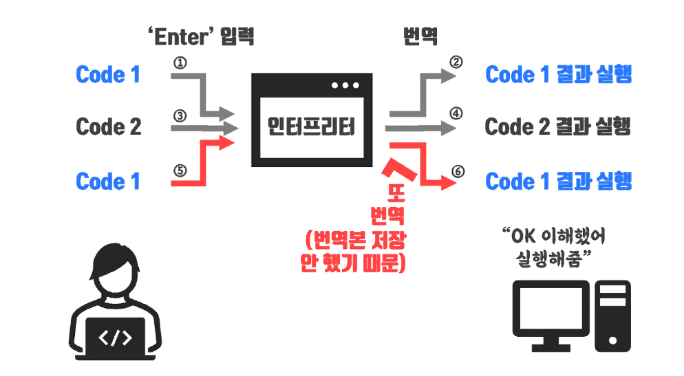

## Compile, Transpile, Interpreter

### 컴파일 (Compile)

한 언어로 작성된 소스 코드를 다른 언어로 변환하는 것이 컴파일입니다.
C언어를 기계어로 옮기는 것, Java를 Bytecode로 옮기는 것 모두 이 정의에 따르면 Compile에 해당합니다.
심지어 TypeScript를 JavaScript로 옮기는 것 역시 이 범주안에 속한 다고 할수 있기도 합니다. (엄밀히 말하면 트랜스파일링입니다.)

- C → Assembly
- Java → bytecode

꼭 고수준의 언어를 바이트 단위의 기계어로 변환해야 컴파일이라고 말하는 것이 아닙니다. 컴파일은 한 언어로 작성된 코드를 다른 언어로 옮기는 일 자체를 통칭한다고 보면 됩니다.

### 트랜스파일 (Transpile)

한 언어로 작성된 소스 코드를 비슷한 수준의 추상화를 가진 다른 언어로 변환하는 것이 트랜스파일입니다.
Transpile은 Compile의 Subset인데, 추상화 정도가 유사한 언어를 다른 언어로 Compile하는 것을 특별히 Transpile이라고 부른다고 보면 됩니다.
예를들어 높은 버전의 자바스크립트 코드를, IE 호환성을 위해 낮은 버전의 자바스크립트로 변환하는 Babel도 이 범주에 속합니다.

타입스크립트를 자바스크립트로 컴파일 하는 것 역시 엄밀히 따지자면 트랜스파일링입니다.
자바스크립트를 대상으로 하는 트랜스 파일러는 Babel, tsc(TypeScript Compiler), ESBuild등이 있습니다.

- C ++ → C
- ES6 → ES5 (Babel)
- typescript / coffeescript → Javascript
- sass / scss → css

### 인터프리터 (Interpreter)

인터프리터(Interpreter)는 사람이 알아보기 쉬운 프로그래밍 언어로 작성한 코드를 한 줄 씩 즉시 기계어로 번역하는 번역기라고 생각하면 됩니다. 
예를 들어 인터프리터에서는 `print('hello')` 라는 코드를 작성한 다음 엔터(Enter)를 치는 순간 컴퓨터 기계언어로 번역된다고 보면 됩니다.
이처럼 인터프리터는 즉각적인 번역에 특화된 번역기로 번역 속도가 빠릅니다. 하지만 단점으로는 한 줄 작성하고 엔터칠 때마다 새롭게 번역을 하니, 프로그램을 매번 실행하기에는 느리게 됩니다.

### 컴파일러 vs 인터프리터

인간이 읽기 편한 고수준의 프로그래밍 언어를 컴퓨터가 읽을 수있게 저수준의 기계어로 변환하기 위해 대표적으로 2가지가 있다고 보면됩니다.
위에서 다룬 컴파일러와 인터프리터 방식이 바로 그것입니다.

컴파일러는 프로그램 전체를 스캔하여 이를 모두 기계어로 번역합니다.
전체를 스캔하기 때문에 대개 컴파일러는 초기 스캔 시간이 오래 걸립니다. **하지만 전체 실행 시간만 따지고 보면 인터프리터 보다 빠릅니다.**
그리고 컴파일러는 전체 코드를 검사한 후에 오류 메시지를 생성하기 때문에 프로그램을 실행 전에 오류를 발견 할 수 있습니다.
대표적인 언어로 C,C++,JAVA 등이 있습니다.

반대로 인터프리터는 프로그램 실행시 한 번에 한 문장씩 번역합니다.
그렇기 때문에 한번에 전체를 스캔하고 실행파일을 만들어서 실행하는 컴파일러보다 실행시간이 더 걸립니다. 하지만 인터프리터는 컴파일러보다 메모리 효율이 좋습니다.
또한 인터프리터는 오류 메시지 생성과정이 컴파일러와 다릅니다. 인터프리터는 한번에 한문장씩 번역하기 때문에 프로그램을 실행시키고 한 문장씩 번역될때 오류를 만나게 되면 바로 프로그램을 중지하게 됩니다. 그래서 프로그램을 실행해봐야지만 오류 발견이 가능해서 사용성에 문제가 될 수 있습니다.
대표적인 언어로 Python, Ruby, Javascript 등이 있습니다.

#### 컴파일러(compiler)

- 전체 파일을 스캔하여 한꺼번에 번역
- 초기 스캔시간이 오래 걸리지만, 한번 실행 파일이 만들어지고 나면 빠릅니다.
- 기계어 번역 과정에서 많은 메모리를 사용합니다.
- 전체 코드를 스캔하는 과정에서 모든 오류를 한꺼번에 출력해주기 때문에 실행 전에 오류를 알 수 있습니다.

#### 인터프리터(interpreter)

- 프로그램 실행시 한 번에 한 문장씩 번역합니다.
- 한번에 한문장씩 번역후 실행 시키기 때문에 실행 시간이 느립니다.
- 컴파일러와 같은 오브젝트 코드 생성과정이 없기 때문에 메모리 효율이 좋습니다.
- 프로그램을 실행시키고 나서 오류를 발견하면 바로 실행을 중지 시킵니다. 실행 후에 오류를 알 수 있기 때문에 사용성이 문제가 될수 있습니다.

### 정리

|                 |                          컴파일러                           |                         인터프리터                         |
| :-------------: | :---------------------------------------------------------: | :--------------------------------------------------------: |
|   개발 편의성   |    코드를 수정하고 실행하려면 컴파일을 다시 해야합니다.     |          코드를 수정하고 즉시 실행할 수 있습니다.          |
|    실행 속도    |                          빠릅니다.                          |                         느립니다.                          |
|      보안       |            프로그램의 코드가 유출되지 않습니다.             |           프로그램의 코드가 유출될 수 있습니다.            |
|    파일용량     | 프로그램의 실행 파일 전체를 전송해야 하므로, 용령이 큽니다. | 프로그램의 코드만 전송하면 실행이 되므로, 용량이 적습니다. |
| 프로그래밍 언어 |           C, C++처럼 비교적 저수준에 가까운 언어            |        Python, Ruby처럼 비교적 고수준에 가까운 언어        |

### 참고자료

- [컴파일 / 트랜스파일 / 인터프리터 비교 쉽게 설명](https://inpa.tistory.com/entry/CS-%F0%9F%96%A5%EF%B8%8F-%EC%BB%B4%ED%8C%8C%EC%9D%BC-%ED%8A%B8%EB%9E%9C%EC%8A%A4%ED%8C%8C%EC%9D%BC-%EC%9D%B8%ED%84%B0%ED%94%84%EB%A6%AC%ED%84%B0-%EB%B9%84%EA%B5%90-%EC%89%BD%EA%B2%8C-%EC%84%A4%EB%AA%85)
