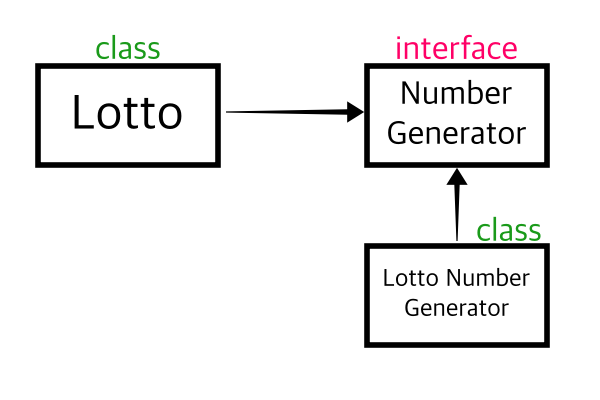

## SOLID (객체지향 5가지 원칙)

- SRP (Single Responsibility Principle) : 단일 책임 원칙
- OCP (Open-Closed Principle) : 개방 폐쇄 원칙
- LSP (Liskov Substitution Principle) : 리스코프 치환 원칙
- ISP (Interface Segragation Principle) : 인터페이스 분리 원칙
- DIP (Dependency Inversion Principle) : 의존관계 역전 원칙

### SRP 단일 책임 원칙, Single Responsibility Principle

하나의 클래스는 하나의 책임만 가져야합니다.

책임이란 기준이 모호하기 때문에 변경을 책임의 기준으로 삼으면 설계에 용이할 수 있습니다.
어떠한 역할에 대해 변경사항이 발생했을때, 영향을 받는 기능만 모아둔 클래스라면, 동일한 책임을 지닌 기능이 모인 집합으로써 SRP 원칙이 적용된 설계로 볼 수 있을것 같습니다.
이처럼 변경사항이 있을때, 애플리케이션의 파급 효과가 적으면 이 원칙을 잘 따른것으로 볼 수 있습니다.

- 장점

  클래스간의 결합도가 낮아져 유지보수가 용이해집니다.

하나의 클래스가 하나의 기능만 수행하므로 코드의 가독성이 높아지고 코드의 재사용성도 높아집니다.

- 단점

  클래스 수가 많아집니다.

이는 클래스를 구분하기 위한 이름을 지어야하고, 클래스간의 관계를 파악하기 위해 추가적인 시간과 노력이 필요하다는 의미입니다.

### OCP 개방 폐쇄 원칙, Open Closed Principle

개방 폐쇄 원칙을 높은 응집도와 낮은 결합도라는 원리로 설명할 수 있습니다.

- 높은 응집도

응집도가 높다는건 하나의 모듈, 클래스가 하나의 책임 또는 관심사에만 집중되어 있다는 뜻입니다. 같은 책임, 관심사를 기반으로 하나의 객체로 설계하기 때문에 객체의 변경이 발생하더라도 다른 곳에 미치는 영향이 제한적입니다.

- 낮은 결합도

  책임과 관심사가 다른 객체 또는 모듈과는 낮은 결합도를 유지해야 합니다. 이는 높은 응집도보다 더 민감한 원칙입니다.

결합도란 하나의 오브젝트가 변경이 일어날때 관계를 맺고있는 다른 오브젝트에게 변화를 요구하는 정도입니다.
즉 낮은 결합도란, 하나의 변경이 발생할 때 다른 모듈과 객체로 변경에 대한 요구가 전파되지 않는 상태라고 볼 수 있습니다.
다른 곳에서는 개방폐쇄원칙을 확장에 열려있고, 변경에 닫혀있다고도 합니다.

- 확장에 열려있다

  모듈의 확장성을 보장하는 것을 의미합니다.
  새로운 변경사항이 발생했을 때 유연하게 코드를 추가 또는 수정할 수 있기 때문이라고 합니다.

- 변경에 닫혀있다

  객체를 직접적으로 수정하는건 제한해야합니다. 기능이 추가되거나 수정할 때, 객체를 직접적으로 수정해야 한다면 새로운 변경사항에 대해 유연하게 대응할 수 없는 애플리케이션입니다.
  이는 유지보수의 비용증가가 될 수 있으며, 객체지향적인 설계로 볼 수 없습니다.
  따라서 객체를 직접 수정하지 않고도 변경사항을 적용할 수 있도록 설계해야 한다. 그래서 변경에 닫혀있다고 표현한 것으로 추론됩니다.
  결과적으로 OCP는 추상화를 의미하는 것으로 해석됩니다. 객체를 추상화함으로써 확장엔 열려있고, 변경엔 닫혀있는 유연한 구조를 만들 수 있는 것입니다.

OCP를 구현하기 위해서는 DI , IoC가 필요합니다.

- 장점

  새로운 요구사항이나 기능이 추가될 때 기존 코드를 변경하지 않고 새로운 코드를 추가할 수 있습니다.

이는 코드의 재사용성과 유지보수성을 높이는 장점이 있습니다.
기존 코드의 변경이 최소화되므로 신뢰성이 높은 코드를 작성할 수 있습니다.
또한 개발자들은 기존 코드를 이해하고 수정할 필요 없이 새로운 코드를 작성할 수 있어 생산성이 향상됩니다.

- 단점

  인터페이스 설계에 대해 추가적인 고민이 필요합니다.

OCP를 너무 지나치게 적용하면 코드의 복잡도가 증가할 수 있으므로 적절한 수준에서 적용해야 합니다.

### LSP 리스코프 치환 원칙, Liskov Substitution Principle

객체는 프로그램의 정확성을 깨지 않으면서 하위 타입의 인스턴스로 바꿀 수 있어야 합니다.

하위 클래스는 인터페이스 규약을 지켜서 작성되어야합니다. 다형성을 지원하기 위한 원칙, 인터페이스를 구현한 구현체는 믿고 사용하려면 LSP가 필요합니다.
인터페이스의 메소드를 사용한다고 하면, 어떤 구현체를 사용하든 호출부에서 기대하는대로 동작되어야 한다는 것 입니다.

```java
interface Calculator {
    int add(int num1 , int num2);
}
```

호출부에서 add()를 호출하면, 내부 로직을 모르더라도 파라미터에 들어온 데이터를 합산해서 반환해줄 것이라는 것을 기대하고 사용할테니 인터페이스의 구현체, 하위 클래스들은 이런 규약을 지켜서 설계 되어야합니다.

- 장점

  LSP를 사용하면 부모 클래스를 사용하는 코드가 자식 클래스에서도 동일하게 작동하므로 코드의 가독성이 높아지고, 재사용성도 높아집니다.

자식 클래스에서 새로운 기능을 추가하거나 기존 기능을 변경해도 부모 클래스를 사용하는 코드에 영향을 주지 않으므로 유지보수가 용이해집니다.

- 단점

  LSP를 따르기 위해서는 인터페이스 설계에 대한 추가적인 고민이 필요합니다.

또한 LSP를 지키지 않으면 다형성을 지원하지 못하고, 가독성과 유지보수성이 떨어지는 문제가 발생할 수 있어 인터페이스를 잘 설계하고 상속 관계를 적절하게 구성해야합니다.

### ISP 인터페이스 분리 원칙 , Interface Segragation Principle

범용 인터페이스 하나보다는 특정 클라이언트를 위한 여러 개의 인터페이스 분리가 더 좋다고 합니다.

운전자가 자동차를 운전한다 라는 명제를 객체간 관계로 비유하면 자동차에 대한 인터페이스, 운전자에 대한 인터페이스를 각각 분리하는 것입니다.
그러면 운전자는 택시기사가 될 수도있고, 우버 드라이버가 될 수 있습니다. 자동차는 버스가 될 수도 있고, 택시가 될 수도 있고 확장성이 커지는 셈입니다.

- 장점

  ISP를 따르면 인터페이스가 작고 단순해지므로, 인터페이스의 구현체를 변경하더라도 클라이언트 코드에 영향을 주지 않습니다.

또한 ISP를 따르면 인터페이스를 사용하는 클라이언트 코드가 필요한 기능만 사용하므로, 코드의 가독성이 높아지고, 재사용성도 높아집니다.

- 단점

  하지만 ISP를 따르기 위해서는 인터페이스 설계에 대한 추가적인 고민이 필요합니다.

ISP를 지나치게 적용하면 인터페이스 수가 많아져 코드의 가독성이 떨어지는 문제가 발생할 수 있습니다.

### 의존관계 역전 원칙 , Dependency Inversion Principle

프로그래머는 구체화가 아니라 추상화에 의존해야 합니다. 즉 구현 클래스가 아니라 인터페이스에 의존하라는 이야기입니다.

연극을 예로 들면 배역과 배우로 예를 들 수 있습니다. 이 때, 연극은 특정 배우를 염두에 두고 기획되기 보다 배역에 집중해서 기획되어야 합니다.
특정 배우에 의존했는데 만약 그 배우가 스케줄 또는 당일 컨디션때문에 연극에 출연이 불발 될 경우 해당 연극은 차질이 불가피해집니다. 따라서 연극은 배우가 아닌 배역에 의존해야합니다.



- 의존관계

  이렇게 의존관계를 설계하면 LottoNumberGenerator 객체에 대한 변경사항이 발생하거나 혹은 객체를 삭제할 일이 있어도 Lotto 클래스에는 직접적인 코드 변경을 할 필요가 없어집니다.

- 장점

  DIP를 따르면 구체적인 구현체가 아니라 추상화된 인터페이스에 의존하므로, 구현체를 변경하더라도 클라이언트 코드에 영향을 주지 않습니다.

인터페이스를 사용하는 클라이언트 코드와 구현체가 독립적으로 개발될 수 있으므로, 코드의 재사용성과 유지보수성이 높아집니다.

- 단점

  DIP를 따르기 위해서는 인터페이스 설계에 대한 추가적인 고민이 필요합니다.

DIP를 지나치게 적용하면 인터페이스 수가 많아져 코드의 가독성이 떨어지는 문제가 발생할 수 있습니다.
적절한 수준에서 추상화와 구체화를 조절하는 것이 중요합니다.

### 참고자료

- [SOLID 원칙과 각 원칙의 장단점](https://github.com/esperar/estudy/blob/master/Back-End/backend/solid.md)
- [객체지향 5가지 원칙](https://github.com/esperar/estudy/blob/master/Back-End/JAVA/5%EC%9B%90%EC%B9%99.md)
