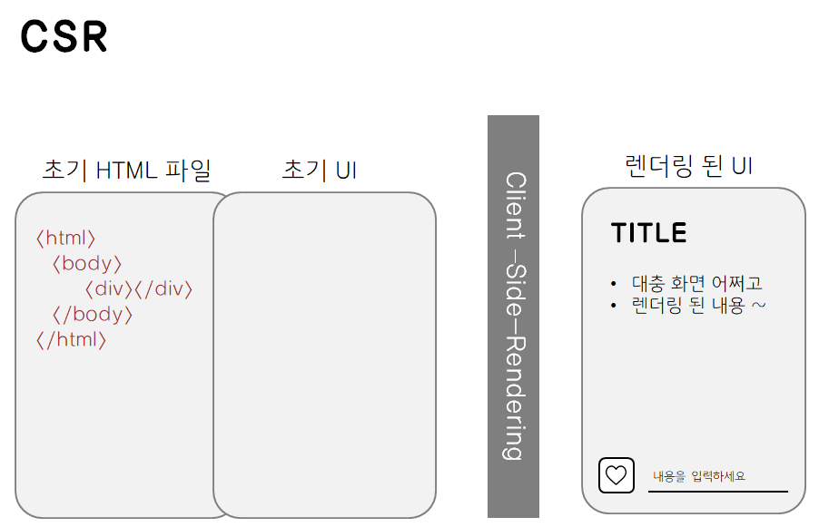
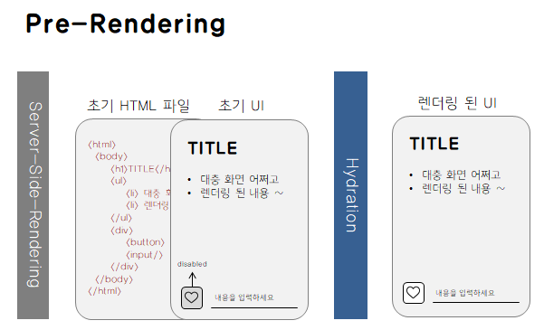

## SPA(Single Page Application) ,CSR(Client Side Rendering), SSR(Server Side Rendering)

### SPA와 MPA

#### SPA (Single Page Application)

하나의 HTML 파일을 기반으로 자바스크립트를 이용해 동적으로 화면의 컨텐츠를 바꾸는 방식의 웹 어플리케이션입니다.

사용자가 다른 페이지로 이동할 때 전체 페이지를 새로고침하지 않고 필요한 데이터만 서버에서 가져와서 현재 페이지를 업데이트 합니다. 이는 Ajax와 같은 기술을 사용하여 구현되었습니다.

##### SPA의 한계

- 초기 로딩시간

  - 최적화 전략: 코드 스플리팅, 레이지 로딩

- SEO 최적화 문제

  - 해결 전략: 서버 사이드 렌더링(SSR), 프리렌더링

- 브라우저 호환성 문제

  - 대응 전략: 폴리필, Babel과 같은 트랜스파일러 사용

##### SPA 핵심구성

- 클라이언트 사이드 라우팅

  - 브라우저에서 URL변경에 따른 뷰 전환 처리

  - 페이지 리로드 없는 빠른 사용자 경험 제공

  - History API나 React Router, Vue Router와 같은 라이브러리로 구현

- 뷰 렌더링

  - 사용자 인터페이스의 동적 업데이트

  - 컴포넌트 기반 아키텍쳐

- 상태 관리

  - 어플리케이션 상태의 중앙집중식 관리

  - 데이터 흐름의 일관성 유지

- 데이터 통신

  - 서버와의 비동기 통신

  - 필요한 데이터만 로드하여 효율적인 데이터 관리

##### 라이프 사이클 단계

- 초기화 단계 (Initialization)

- 뷰 렌더링 단계 (View Rendering)

- 이벤트 처리 단계 (Event Handling)

- 데이터 업데이트 단계 (Data Update)

- 종료 단계 (Termination)

#### MPA (Multiple Page Application)

사용자가 페이지를 요청할 때마다, 웹 서버가 요청한 UI와 필요한 데이터를 HTML로 파싱해서 보여주는 방식의 웹 어플리케이션입니다.

전통적인 방식을 이용한다면, SPA가 사용하는 렌더링 방식은 CSR이고, MPA가 사용하는 렌더링 방식은 SSR입니다.

### CSR

CSR에선 브라우저가 서버에 HTML과 JS 파일을 요청한 후 로드되면 사용자의 상호작용에 따라 JS를 이용해서 동적으로 렌더링을 시킵니다.

- 장점

  - 첫 로딩만 기다리면, 동적으로 빠르게 렌더링이 되기 때문에 사용자 경험(UX)이 좋습니다.

  - 서버에게 요청하는 횟수가 훨씬 적기 때문에 서버의 부담이 덜 합니다.

  - 유저의 수정을 통해 즉각적으로 출력되는 화면이 변동하기에 대화형 웹 애플리케이션, 유저 대시보드와 같은 경우에 사용하기 좋습니다.

- 단점

  - 모든 스크립트 파일이 로드될 때까지 기다려야 합니다.

  - 리소스를 청크(Chunk) 단위로 묶어서 요청할 때만 다운받게 하는 방식으로 완화시킬 수 있지만 완벽히 해결할 수는 없습니다.

  - 검색엔진의 검색 봇이 크롤링을 하는데 어려움을 겪기 때문에 검색엔진 최적화(Search Engine Optimization)의 문제가 있습니다.

  - 구글 봇의 경우는 JS를 지원하지만, 다른 검색엔진의 경우 그렇지 않기 때문에 문제가 됩니다.

### SSR

SSR에선 브라우저가 페이지를 요청할 때마다 해당 페이지에 관련된 HTML, CSS, JS 파일 및 데이터를 받아와서 렌더링을 시킵니다.

- 장점

  초기 로딩 속도가 빠르기 때문에 사용자가 컨텐츠를 빨리 볼 수 있습니다.
  JS를 이용한 렌더링이 아니기 때문에 검색엔진 최적화가 가능합니다.
  항상 최신 상태를 유지해야 하는 경우에 좋습니다.

- 단점

  매번 페이지를 요청할 때마다 새로고침 되기 때문에 사용자 경험이 SPA에 비해서 좋지 않습니다.
  서버에 매번 요청을 하기 때문에 서버의 부하가 커집니다.

사용자에게 동적 콘텐츠를 제공하는 뉴스 웹사이트, 블로그, 전자 상거래 플랫폼 등이 적합합니다.

- 대형 eCommerce 사이트: 빠른 페이지 로딩과 SEO 최적화
- 뉴스 포털 사이트: 실시간 뉴스 업데이트와 빠른 콘텐츠 전달
- 블로그 플랫폼: 사용자의 글을 신속하게 검색 엔진에 노출

### SSG (Static-Site-Generation)

HTML을 빌드 타임에 각 페이지별로 생성하고 해당 페이지로 요청이 올 경우 이미 생성된 HTML 문서를 반환합니다.

- 장점

  - 퍼포먼스에 집중 (CDN을 통해 더 빠른 응답 가능)

  - 마케팅 페이지 / 블로그 게시물 / 제품의 목록 등과 같이 정적 생성하여 각 요청에 동일한 문서를 반환할 수 있는 경우

- 단점

  - 데이터가 가변적으로 변하는 웹사이트에는 적합하지 않습니다.

  - 즉, 사용자들이 모두 같은 내용의 정보만 봐도 괜찮은 웹애플리케이션에는 적합하나 그렇지 않으면 적합하지 않습니다.

주로 콘텐츠가 정적이며 자주 변경되지 않는 회사 소개 페이지, 개인 포트폴리오, 블로그 등이 SSG에 적합합니다.

### SSR과 CSR의 차이점

#### SSR과 CSR의 비교

- 렌더링 위치의 차이

  - SSR: 서버에서 페이지 렌더링

  - CSR: 클라이언트(브라우저)에서 페이지 렌더링

- 로딩 속도 및 사용자 경험

  - SSR: 빠른 초기 로딩, 서버 부하 증가 가능성

  - CSR: 초기 로딩 지연, 사용자 인터랙션 우수

- SEO 최적화

  - SSR: 검색 엔진 친화적

  - CSR: 검색 엔진 최적화에 추가 작업 필요

#### SSR 또는 CSR을 선택해야 하는 상황

- SSR 선택 상황

  - 콘텐츠 중심의 웹사이트, 블로그, 뉴스 사이트

  - SEO 중요성이 높은 프로젝트

- CSR 선택 상황

  - 사용자 인터랙션이 중요한 애플리케이션

  - SPA (Single-Page Application)

  - 대화형 웹 애플리케이션

- 상황에 따른 결정 요소

  - 사용자 경험, 로딩시간, SEO 요구사항 고려

#### 하이브리드 접근 방식

- 하이브리드 접근 방식의 명칭

  - Universal Rendering / Isomorphic Rendering

- 하이브리드 접근 방식의 개념

  - SSR과 CSR의 결합

  - 초기 로딩은 SSR, 이후 상호작용은 CSR 처리

- 하이브리드 사례

  - Airbnb, Netflix 등 대규모 웹 애플리케이션

  - 사용자의 초기 접속 속도 향상과 상호작용, 경험 강화

- 하이브리드 접근 방식의 장점

  - 빠른 초기 로딩(SSR)과 풍부한 인터랙션(CSR) 결합

  - SEO와 사용자 경험의 균형

- 하이브리드 접근 방식의 단점

  - 구현의 복잡성 증가

  - 서버와 클라이언트 코드의 관리 및 동기화 필요

### 알아두면 좋은 것

SSR은 동적 데이터가 자주 변경되는 경우에 적합하고, SSG는 정적인 콘텐츠에 적합합니다. 따라서 블로그라는 공통된 콘텐츠 유형에서 업데이트 빈도와 동적 요소의 존재 여부에 따라 SSR 또는 SSG 중 하나를 선택할 수 있습니다.

#### 현대 웹 개발에서의 SSR과 CSR의 역할

- SSR의 확장된 역할

  - 정적 사이트 생성기(SSG)와의 결합. ( 예: Hugo, Jekyll )

  - 마이크로서비스 및 API 기반 아키텍처와의 통합

- CSR의 확장된 역할

  - 실시간 데이터 처리 및 대화형 애플리케이션의 핵심

  - 웹어셈블리(WebAssembly)와의 통합으로 성능 향상

- 기술적 전망

  - 점진적 향상(Progressive Enhancement)의 중요성 증가

  - 사용자 접근성 및 웹 표준 준수의 중요성 부각

- 다양한 프레임워크의 발전

  - SSR: Next.js, Nuxt.js, Gatsby, Sapper

  - CSR: React, Angular, Vue, Svelte

- 라이브러리와 도구의 발전

  - 상태 관리: Redux, MobX, Vuex, Recoil

  - 테스팅 도구: Jest, Mocha, Cypress

  - 빌드 및 번들링 도구: Webpack, Rollup, Parcel

### 용어 공부

- SEO(Search Engine Optimization)

  검색 엔진 최적화 라는 말로, 특정 웹 페이지가 검색 결과 상위에 노출 될 수 있도록 하는 작업입니다. 검색 엔진이 이해하기 쉽도록, 기본적으로 특정 검색어를 웹 페이지에 적절히 배치하고 다른 웹 페이지에서 링크가 많이 걸릴 수 있는 등 검색 결과 상위에 노출될 수 있도록 하는 작업을 말합니다.

### 참고자료

-- [[Next.js] Hydration](https://velog.io/@hamjw0122/Next.js-Hydration)
