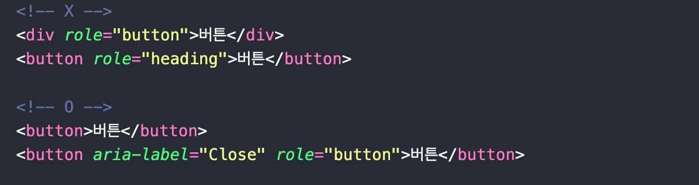
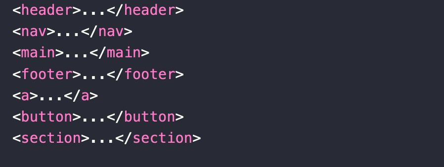
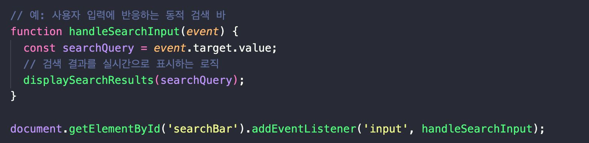

## 접근성 및 사용자 경험(UX)

- 웹 접근성 준수

- 사용자 인터렉션 및 인터페이스 설계

- 반응형 및 모바일 최적화 디자인

### 웹 접근성의 중요성

- 웹 접근성은 모든 사용자가 웹 콘텐츠와 기능에 쉽게 접근할 수 있도록 보장하는 것을 의미합니다.

- 이는 웹사이트 사용에 있어 다양한 제약을 가진 사용자들이 쉽게 접근할 수 있도록 보장하는 것을 포함하며, 법적 요구사항을 충족하는 데도 중요합니다.

### ARIA의 사용 예시

- Accessible Rich Internet Applications의 약자로 웹 페이지, 특히 동적 콘텐츠, 그리고 Ajax, HTML, JS 및 관련 기술로 개발된 사용자 인터페이스 구성요소의 접근성을 증가시키는 방법에 대해 규정한 **W3C가 출판한 기술사양입니다.**

- ARIA는 웹 콘텐츠와 애플리케이션을 더 접근성 높게 만드는 데 도움을 줍니다.

- ‘aria-label’, ‘role’ 속성을 사용하여 스크린 리더(화면 낭독기) 사용자를 위한 추가 정보 제공합니다.

### HTML 구조 최적화

- 적절한 HTML 태그와 구조는 웹 접근성을 향상시키는데 중요합니다.

- ‘header’, ‘nav’, ‘main’, ‘footer’와 같은 시맨틱 태그를 사용합니다.

### User Interaction 및 Interface 설계

- User Interaction은 웹사이트나 애플리케이션의 성공에 중요한 역할을 합니다.

- 좋은 인터랙션 디자인은 사용자의 만족도를 높이고, 목표 달성에 기여합니다.

- 인터랙티브 요소는 사용자 경험의 핵심입니다.

- 사용자의 행동에 반응하여 변화하는 인터렉티브 그래픽, 사용자 입력에 따라 실시간으로 정보를 제공하는 동적 검색 바 등

### 반응형 웹 디자인의 중요성

- 반응형 웹 디자인은 다양한 디바이스와 화면 크기에 맞추어 콘텐츠를 적절히 조정하는 디자인 접근법

- 모바일 사용자 증가와 다양한 디바이스 사용에 따른 필수적인 요소

### CSS 미디어 쿼리 예시

• CSS 미디어 쿼리는 다양한 화면 크기와 조건에 따라 스타일을 적용할 수 있게 합니다.

### 참고자료

- [원티드 챌린지]()
