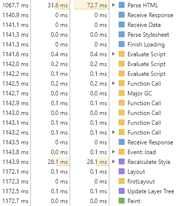

## 렌더링 원리

브라우저가 화면에 나타나는 요소를 렌더링 할 때, 웹킷(Webkit)이나 게코(Gecko) 등과 같은 렌더링 엔진을 사용합니다. 렌더링 엔진이 HTML, CSS, Javascript로 렌더링할 때 **CRP(Critical Rendering Path)** 라는 프로세스를 사용하며 다음 단계들로 이루어진다.

- HTML 파싱 후, DOM(Document Object Model) 트리 구축

- CSS 파싱 후, CSSOM(CSS Object Model) 트리 구축

- Javascript 실행

  - 주의! HTML 중간에 스크립트가 있다면 HTML 파싱이 중단됩니다.

    렌더링 엔진은 HTML 한 줄씩 순차적으로 파싱하며 DOM을 생성해 나가다가 JavaScript를 만나면 DOM 생성을 임시 중단합니다.
    DOM 생성을 임시 중단하고, 자바스크립트 코드를 파싱하기 위해 자바스크립트 엔진에 제어권을 넘기게 되는데, 파싱이 끝나면 다시 렌더링 엔진에 제어권을 넘겨 중단된 부분부터 HTML 파싱을 재개하며 DOM 트리를 생성합니다.

- DOM과 CSSOM을 조합하여 렌더트리(Render Tree) 구축

  display: none 속성과 같이 화면에서 보이지도 않고 공간을 차지하지 않는 것은 렌더트리로 구축되지 않습니다.

- 뷰포트 기반으로 렌더트리의 각 노드가 가지는 정확한 위치와 크기 계산 (Layout/Reflow 단계)

- 계산한 위치/크기를 기반으로 화면에 그림 (Paint/Repaint 단계)

실제로 크롬 개발자 도구를 이용해 다음 코드를 어떻게 렌더링 하는지 살펴보았다.

```jsx
<!DOCTYPE html>
<html lang="en">
  <head>
    <meta charset="UTF-8" />
    <meta name="viewport" content="width=device-width, initial-scale=1.0" />
    <link rel="stylesheet" href="style.css" />
    <title>테스트</title>
  </head>
  <body>
    <div></div>
    <script src="script.js"></script>
  </body>
</html>
body {
  background-color: red;
}
div {
  width: 100px;
  height: 100px;
  background-color: blue;
}
document.querySelector('div').addEventListener('click', () => {
  console.log('Click div');
});
```



위 로그를 보면 알 수 있는 것처럼 위에서 언급한 CRP가 진행된다.

- Parse HTML을 통해 HTML 파싱 후, DOM 트리 구축

- Parse Stylesheet를 통해 CSS 파싱 후, CSSOM 트리 구축

- Evaluate Script를 통해 Javascript 실행

- 렌더트리 구축

- Layout을 통해 뷰포트 기준으로 렌더트리 노드들의 각 크기/위치 계산

- Paint를 통해 Layout에서 계산한 값들로 각 요소를 화면에 그림

### 용어 설명

- CRP

  CRP (Critical Rendering Path, 중요 렌더링 경로)는 브라우저가 HTML, CSS, Javascipt를 화면에 픽셀로 변화하는 일련의 단계를 말합니다. CRP는 Document Object Model (DOM), CSS Object Model (CSSOM), 렌더 트리 그리고 레이아웃을 포함합니다.

- 블링크(Blick)

  블링크(Blink)는 Google에서 개발한 오픈 소스 웹 렌더링 엔진으로, Chromium 프로젝트에서 파생되었습니다. 이 엔진은 웹킷(WebKit)에서 파생되었으며, 웹 브라우저인 Google Chrome 및 다른 일부 브라우저에서 사용됩니다.

- 웹킷(WebKit)

  초기에 애플에서 개발되었으며, Safari 웹 브라우저에 사용되었습니다. 나중에 Google에서는 Chromium 프로젝트를 통해 Blink 렌더링 엔진을 파생시켰지만, 여전히 웹킷 엔진은 여러 브라우저에서 사용되고 있습니다.

- 게코(Gecko)

  Mozilla Foundation에서 개발한 렌더링 엔진으로, Firefox 웹 브라우저에서 사용됩니다. 이 엔진은 웹 표준을 준수하고 웹의 안정성과 보안을 중요시하는 Mozilla의 철학을 반영하고 있습니다.

- 파싱

  하나의 프로그램을 런타임 환경(예를 들면, 브라우저 내 자바스크립트 엔진)이 실제로 **실행할 수 있는 내부 포맷으로 분석하고 변환하는 것을 의미**합니다. 즉, 파싱은 문서의 내용을 토큰(token)으로 분석하고, 문법적 의미와 구조를 반영한 파스 트리(parse tree)를 생성하는 과정입니다.

- DOM

  DOM(Document Object Model)이란? 웹 페이지를 이루는 태그들을 자바스크립트가 이용할 수 있게끔 브라우저가 트리구조로 만든 객체 모델을 의미합니다. 영어 뜻풀이 그대로 하자면 문서 객체 모델을 의미합니다. 문서 객체란 html, head, body와 같은 태그들을 javascript가 이용할 수 있는 (메모리에 보관할 수 있는) 객체를 의미합니다. DOM은 HTML과 스크립팅 언어(JavaScript)를 서로 이어주는 역할을 합니다.

- CSSOM

  CSSOM(CSS Object Model)이란? CSS 내용을 파싱하여 자료를 구조화 한 것을 CSSOM이라고 합니다. 즉 DOM처럼 CSS의 내용을 해석하고 노드를 만들어 트리 구조로 만든 것을 CSSOM이라 합니다.

- 렌더트리

  렌더트리(Render Tree)란? 렌더 트리는 CSSOM과 DOM 트리의 결합으로 만들어집니다. 렌더 트리는 웹 페이지에 나타낼 각 요소들의 위치(Layout, 레이아웃)을 계산하는데 사용되고 픽셀을 화면에 렌더링하는 페인트(Paint) 즉 화면에 요소들을 표현하는 프로세스를 위해 존재합니다.

- Layout

  Layout(Reflow)이란? 뷰포트 내에서 노드의 정확한 위치와 크기를 계산합니다. 이것이 바로 'Layout' 단계이며 경우에 따라 'Reflow' 라고도 합니다.

- Paint

  Paint란? 노드와 해당 노드의 계산된 스타일 및 기하학적 형태에 대해 파악했으므로, 렌더링 트리의 각 노드를 화면의 실제 픽셀로 변환하는 마지막 단계에 이러한 정보를 전달합니다. 이 단계를 흔히 '페인팅' 또는 '래스터화'라고 합니다.
