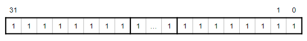
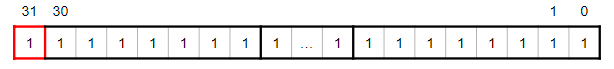
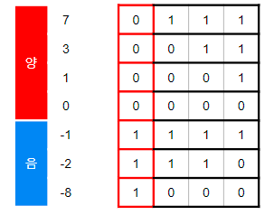
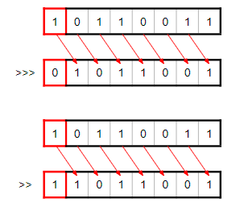

## 비트연산

컴퓨터는 근본적으로 모든 처리를 비트연산을 통해서 수행합니다.
결론부터 말하자면, 비트연산을 사용하는 목적은 **빠른 응답**을 위해서 입니다.
일반적인 4칙연산(+,-,\*,/)은 피연산자와 연산자의 조합을 확인하고 변환하여 처리합니다.
그러므로 비트연산을 직접적으로 처리하면 더 빠른 연산을 시행할 수 있는 것입니다.

**시프트 연산은 숫자타입만 가능합니다.**

### 정수의 범위와 부호에 대한 구조

대부분의 정수는 4byte의 크기를 가지며, 4byte를 모두 양의 정수로 표현한다면 아래와 같습니다.
(4byte = 32bit = 0 ~ 2^32-1개의 범위를 가집니다.)

음의 정수를 포함하는 정수는 위와 조금 달라집니다.
최상위 비트가 "1"이며 30비트부터 정수값을 가집니다.
(-2^31 ~ 2^31-1의 범위를 가집니다.)

양의 정수는 비트가 "1"을 채워갈수록 크기가 커지는 규칙이 있습니다.
음의 정수도 마찬가지로 가장 큰 수 일수록 비트 "1"이 채워집니다.
즉, 음의 정수의 가장 큰 수는 "-1"이며 모든 비트가 "1"로 채워진 상태를 뜻합니다.

+,-의 기준은 최상위 비트에 따라 정해지며, 가장 큰 수 일수록 "1"이 채워집니다.

### 비트연산의 피연산자

사칙연산의 피연산자는 + - \* / 를 뜻하는 기호입니다.

비트연산의 피연산자는 & | ^ ~ 를 뜻하는 기호입니다.

- AND 연산

  양 연산자의 같은 자리에 비트가 "1"일 때 "1"을 반환합니다.

- OR 연산

  "1" 비트가 있다면 어느 연산자 상관없이 "1"을 반환합니다.

- XOR 연산

  양 연산자의 같은 자리에 비트가 같다면 "0", 다르다면 "1"을 반환합니다.

- NOT 연산

  연산자 모든 비트를 반대로 바꾸어 반환합니다.

- 시프트

  시프트연산의 피연산자는 <<, <<<, >>, >>> 입니다.
  양의 정수와 음의 정수에 따라 시프트 연산이 조금 다릅니다.

  - 양의 정수 시프트

    양의 정수에서 시프트할 때 추가되는 비트는 무조건 "0"으로만 채워집니다.

  - 음의 정수 시프트

    크게 산술적 시프트와 논리적 시프트가 있습니다.

논리적 시프트는 부호비트방식이며 부호가 보존되지 않으며 추가된 비트(padding bit) 는 "0"이 채워 집니다.

위의 그림은 위) 논리적 시프트, 아래) 산술적 시프트를 나타냅니다.

산술적 시프트는 보수법에 따라 추가된 비트(padding bit)가 달라집니다.
1진 보수법 : 추가된 비트는 모두 "1"로 채워집니다.
2진 보수법 : 왼 쉬프트는 "0"으로 채워지고, 오른 쉬프트는 "1"로 채워집니다.
기본적으로 2진 보수법을 따릅니다.

### 참고자료

- [[자료구조] 비트연산](https://kurukurucoding.tistory.com/63)
