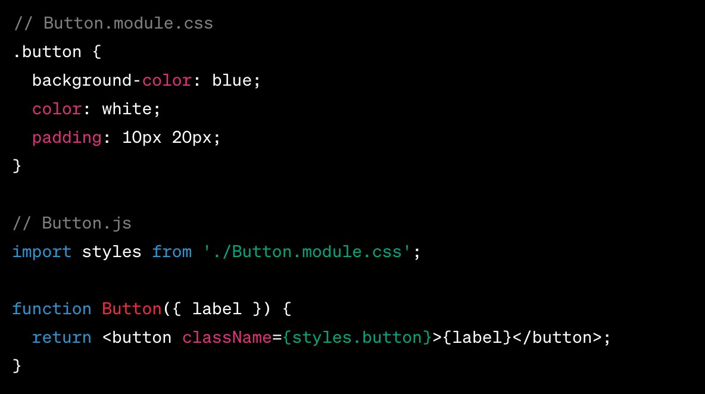
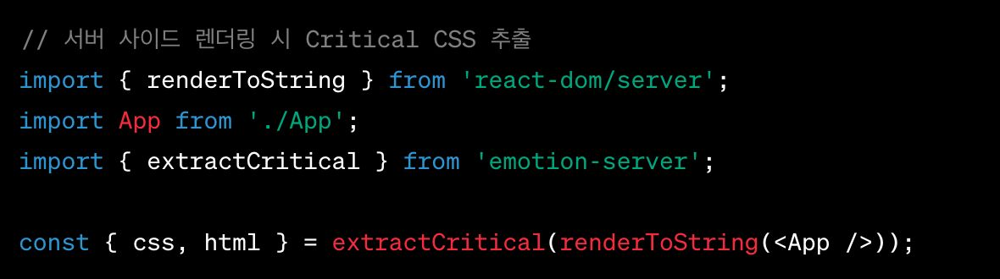
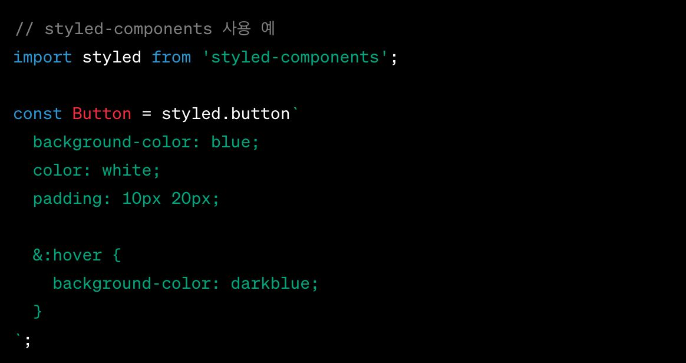

## CSS 최적화

### 분할 및 코드 스플리팅

- React에서 CSS 모듈은 컴포넌트별로 스타일을 캡슐화하고, 전역스타일 충돌을 방지하며, CSS 분할 및 코드 스플리팅이 자연스럽게 이루어집니다.

### Critical CSS 및 SSR

- React에서는 SSR과 결합하여 Critical CSS를 구현할 수 있습니다.

- 초기 페이지 로드에 필요한 핵심 CSS만 로드하여 빠른 렌더링을 가능하게 합니다.

### CSS-in-JS의 압축 및 최소화

- CSS-in-JS 라이브러리는 개발 과정에서 편리함을 제공하며, 프로덕션 빌드 시 자동으로 CSS를 압축하고 최소화합니다.

- 파일 크기를 줄이고 로딩 속도를 개선하는데 도움이 됩니다.

### 참고자료

- [원티드 챌린지]()
