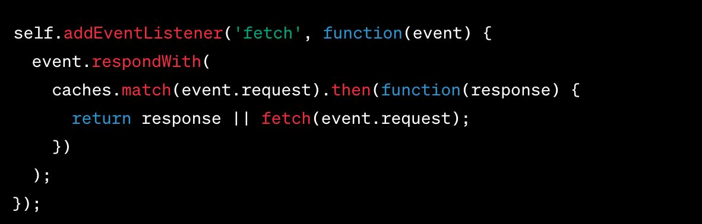

## Caching

### 브라우저 캐싱

- 웹사이트 리소스를 사용자의 로컬 컴퓨터에 저장하여, 재방문 시 빠르게 로드 할 수 있게 하는 기술
- 네트워크 트래픽을 줄이고, 웹사이트 로딩 속도를 향상시키는 중요한 방법
- SPA에서 캐싱은 특히 중요. SPA는 자원을 한 번에 로드한 후 필요한 부분만 갱신하므로, 캐싱을 통해 초기 로딩 시간과 네트워크 사용을 크게 줄일 수 있습니다.
- ”Cache-Control” 헤더는 얼마나 오랫동안 리소스를 캐시할 것인지 브라우저에게 지시 할 수 있습니다.

### 브라우저 캐싱 - ETag

- ETag는 서버가 각 리소스에 대해 고유한 식별자를 제공하는 방법입니다.

- 브라우저는 ETag를 사용하여 리소스의 변경 여부를 확인하고, 변경되지 않았다면 캐시된 버전을 사용합니다.

### 브라우저s 캐싱 – 서비스 워커와 캐싱

- 서비스워커는 웹 애플리케이션의 캐싱 전략을 더욱 세밀하게 제어할 수 있게 해주는 자바스크립트 워커

- 오프라인 경험, 백그라운드 데이터 동기화 등 고급 캐싱 시나리오에 사용됩니다.

### 참고자료

- [원티드 챌린지]()
