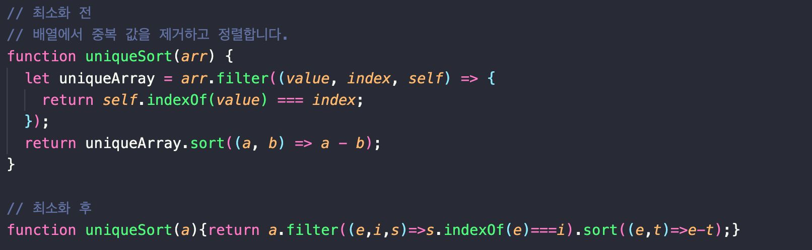
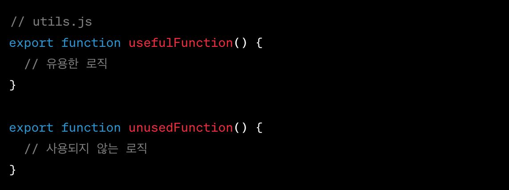
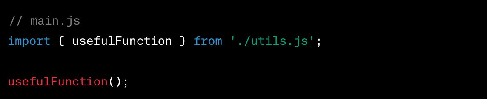
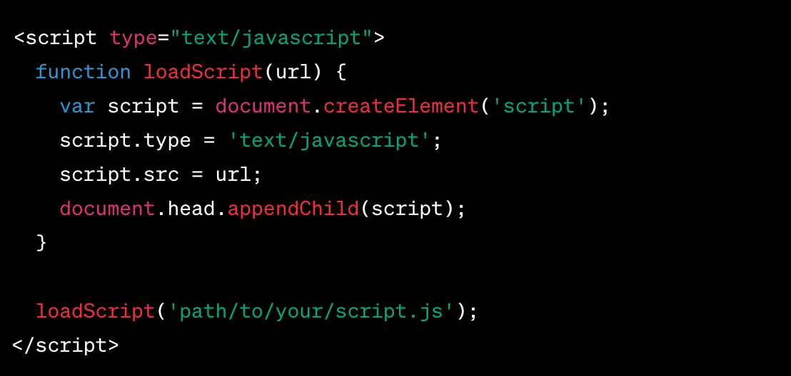

## Javascript 최적화

### 코드 최소화 (Minification)

### 불필요한 코드 제거 (Tree Shaking)

- 실제로 사용되지 않는 코드를 제거하는 기법

- 최종 번들의 크기를 줄이고, 애플리케이션의 로딩 속도와 성능을 향상

|           최적화 전            |                               최적화 후                               |
| :----------------------------: | :-------------------------------------------------------------------: |
|  | 'unusedFunction’은 제거되어 최종 번들에서 더 이상 찾아볼 수 없습니다. |

### 비동기 로딩 (AsynchronousLoading)

- 비동기 로딩은 필요한 시점에 Javascript 파일을 로드하는 방법

- 애플리케이션의 초기 로딩 시간을 단축시키고, 사용자 경험을 개선

- 특히 큰 크기의 스크립트 파일이나 라이브러리를 다룰 때 유용

### 참고자료

- [원티드 챌린지]()
