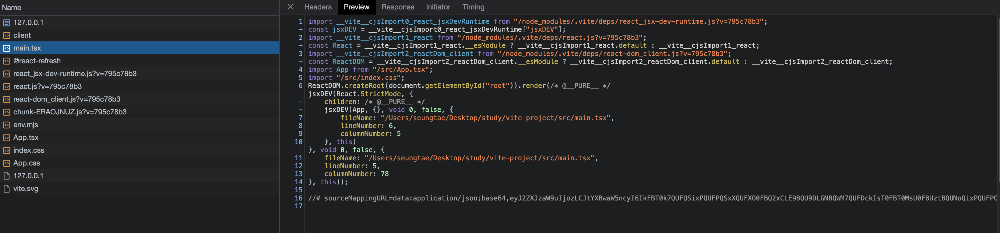
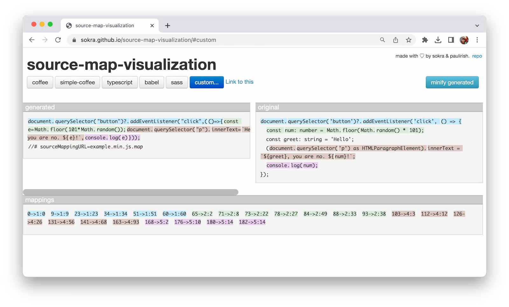
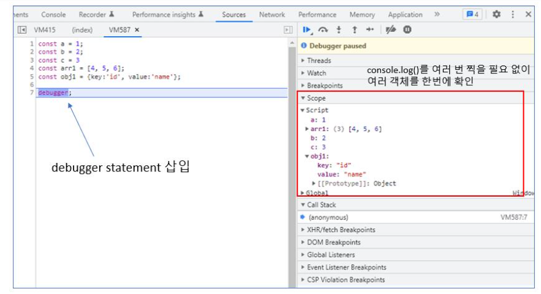
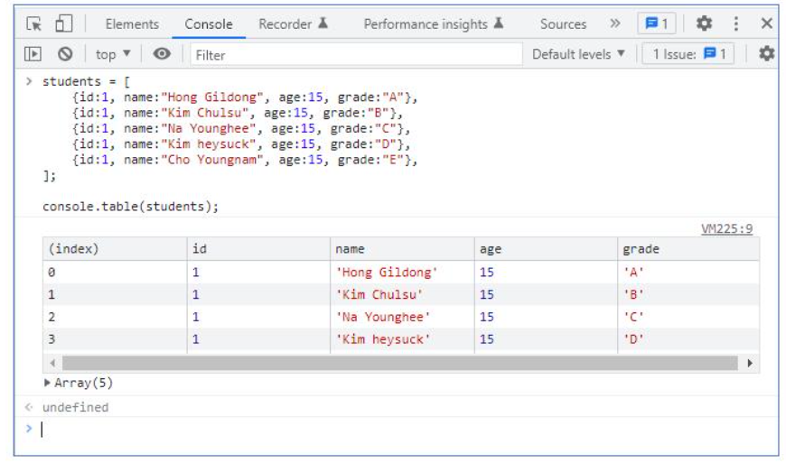

## 디버깅

Source map 덕분에 우리는 브라우저에서 디버깅을 쉽게 할 수 있게 되었습니다. vite를 통해 리액트와 타입스크립트로 구현한 간단한 어플리케이션을 만들어 보고 개발자 도구를 켜보면 변환된 파일이 내려오는 것을 볼 수 있습니다.



이를 개발자 도구 > source에 들어가서 커멘드 + p 를 입력하면 파일명을 입력할 수 있는 명령창이 나옵니다. 여기서 디버깅을 하고자 하는 원본 파일명을 입력해봅시다. 여기서는 위 이미지와 똑같이 main.tsx 파일을 입력해보겠습니다.


코드를 보면 위의 코드와는 다르게 원본 코드가 보이는 것을 확인할 수 있다. 이제 브레이크포인트나 step over와 같은 디버깅 툴이 제공하는 다양한 기능을 활용하여 디버깅을 해보면 console log에 의존하지 않고도 쉽게 디버깅을 할 수 있다. 자세한 기능들은 [공식 문서](https://developer.chrome.com/docs/devtools/javascript/)에 잘 나와있습니다.

### Source Map

프론트엔드 개발을 편리하게 하기 위해 HTML과 CSS의 전처리 부터 자바스크립트 프레임워크, 타입스크립트 등 많은 도구들이 생겨났습니다. 그래서 브라우저가 이해할 수 있는 언어로 변경하는 transpile과 bundle 과정이 많이 필요했습니다. 외부 라이브러리 코드와 병합이 되고 난독화 과정, 자바스크립트 변환 과정 등을 거치면서 그 결과물은 우리가 작성한 코드와 많이 달라집니다. 이는 그 동안 프론트엔드 개발자의 디버깅을 어렵게하는 주범이었습니다.

#### Source Map은 어떻게 만들어 지는가?

Source Map은 .map 으로 끝나는 파일들로, webpack, vite와 같은 빌드툴에 의해 생성됩니다.
아래는 source map의 예시 코드입니다.

```
{
"mappings": "AAAAA,SAASC,cAAc,WAAWC, ...",
"sources": ["src/script.ts"],
"sourcesContent": ["document.querySelector('button')..."],
"names": ["document","querySelector", ...],
"version": 3,
"file": "example.min.js.map"
}
```

source map을 토대로 아래와 같이 변형된 코드와 원본 코드의 mapping 과정을 거치게 됩니다.



### debugger 문구

프론트엔드 단에서 디버깅할 때 크롬 DevTools 같은 브라우저 개발자 도구에서 원하는 객체의 값을 출력하는 용도로 `console.log()`를 쓰곤 합니다. 하지만, 확인해야 하는 객체가 여러 개인 경우 일일이 `console.log()`를 쓰기가 불편한데, 이럴 때는 개발자 도구에서 breakpoint를 잡는 경우도 있지만, debugger라는 명령어를 쓰면 조금 더 빠르고 간편하게 디버깅 작업을 할 수 있습니다.



### Third-party 디버깅 라이브러리

### Browser Console

메서드를 활용하여, 기존의 `console.log()`보다 조금 더 시각적으로 편한 디버깅 작업을 할 수 있습니다.

- console.table()

- console.dir()



#### Console.log()

만약 console 객체를 자주 사용한다면, 아래 코드처럼 console.log를 짧게 줄여서 사용하는 방법도 있습니다. 단순히 코드 몇 글자를 줄일 수 있는 방법이지만, 반복적으로 console.log()를 타이핑하고 있다면 한 번 고려해볼 수 있습니다.

```js
// console log tip
var c = console.log.bind(document);

const a = 1;
const arr1 = [4, 5, 6];
const obj1 = { key: "id", value: "name" };

c(a); // 1
c(arr1); // [4, 5, 6]
c(obj1); // {key: 'id', value: "name"}
```

### 참고자료

- [웹 개발 시간을 줄여주는 팁 4가지](https://yozm.wishket.com/magazine/detail/1585/)
- [디버깅과 Source Map](https://velog.io/@tlatmdxo123/%EB%94%94%EB%B2%84%EA%B9%85%EA%B3%BC-Source-Map)
