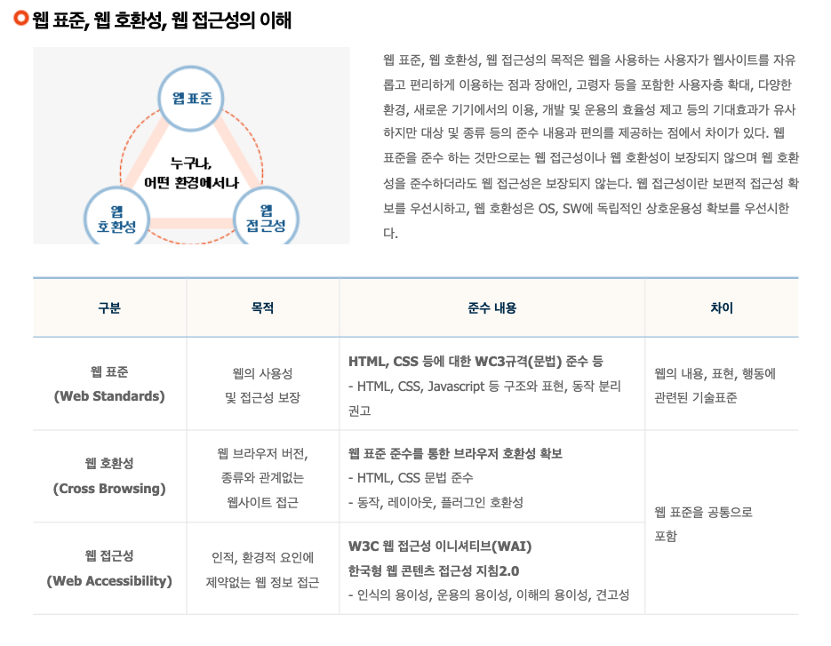

## 웹 접근성

신체적으로 장애를 가진 유저와 장애를 가지지 않은 유저 모두가 동등하게 사용할 수 있도록 함과 동시에, 유저가 브라우저, 디바이스 등을 사용하고 있는 다양한 환경에 영향을 받지 않고, 동일하게 표현해줄 수 있는 방식입니다.

- 법적 의무

웹 접근성 보장은 「국가정보화기본법」과 「장애인차별금지 및 권리구제 등에 관한 법률(이하 "장애인차별금지법")」등 법률에 명시된 의무사항입니다. 특히 장애인차별금지법은 행위자에 대한 단계적 범위를 명확히 하였으며, 불이행시 처벌 등이 구체적으로 성문화된 법입니다. 이에 따라 모든 공공기관은 2009년 4월 11일 부터 웹 접근성을 준수해야 하고, 단계적으로 2015년까지 모든 웹 사이트가 웹 접근성을 준수해야 합니다.

## 웹 표준

웹 표준이란 브라우저 종류 및 버전에 따른 기능 차이에 대하여 호환이 가능하도록 제시된 표준으로, 다른 기종 혹은 플랫폼에 따라 달리 구현되는 기술을 동일하게 구현함과 동시에 어느 한쪽에 최적화되어 치우치지 않도록 공통요소를 사용하여 웹 페이지를 제작하는 기법을 의미한다.

표준은 어떠한 사물을 생산하는 방식이나, 사용하는 방법 및 절차 등에 대한 합리적인 기준이라고 볼 수 있습니다.

그리고 각 사물마다 그것의 표준을 준수한 상품들이 출시되고 있기에 저희는 기종이 다른 핸드폰을 써도, 다른 건물에 있는 엘리베이터를 타도 큰 어색함을 느끼지 않고 사용할 수 있는 것입니다.가끔 독자규격으로 사용자들이 애를 먹게 만드는 경우도 있을 겁니다.

웹 표준의 경우도 동일합니다.

다양한 운영체제, 브라우저, 플러그인이 존재하는 현 시점, 유저들이 웹을 경험하게 되는 경로가 굉장히 다양해졌고, 이에 따라 어떠한 경로에서든 웹을 동일하게 표시해줘야 한다는 점은 웹의 가장 큰 숙제로 남게 되었습니다.

### 웹 표준과 웹 접근성



어느 누구나, 어떤 환경에서든지 사용성을 보장한다는 공통적인 목적을 가지고 있고, 각자 소기의 목적을 이루기 위한 방식이 조금씩 다른 것 같습니다.

웹 표준은 W3C 표준안을 준수하여 HTML, CSS, JavaScript 사용함으로써 웹 사용성과 접근성을 보장합니다.

웹 표준을 준수하여 작성된 웹 페이지는 다양한 브라우저와 디바이스 환경에 대응이 가능해지는데요, 이는 신체적 장애 여부를 떠나서, 웹을 사용하는 다양한 환경도 보장되어야 하는 웹 접근성 측면에서 이점을 누릴 수 있다고 봅니다.

웹 접근성은 WAI-ARIA(웹 접근성 이니셔티브)를 통해 인적, 환경적 요인에 좀 더 디테일하게 집중하는 것을 확인할 수 있습니다.

사람마다, 어디에 더 치중을 두느냐에 따라 목적은 충분히 달라질 수 있을 것 같은데요, 이러한 공통적인 목적과 서로 상호 보완되는 관계이다 보니 웹 표준과 웹 접근성이 같이 언급되는 것 같습니다.

### 웹 접근성 준수

#### 대체 텍스트

모든 컴퓨터에는 스크린 리더라는 것이 존재합니다. 스크린 리더는 개발자들이 삽입한 대체 텍스트들을 TTS를 통해 읽어주는 소프트웨어입니다.

이를 통해 시각 장애가 있는 분들이 볼 수 없는 요소들을 음성으로서 인식할 수 있도록 도와줍니다.

```jsx

```

그렇다면 대체 텍스트를 어떻게 작성해야 인식하기가 편할까요?

- 기본적으로 해당 콘텐츠의 의미나 용도를 파악할 수 있는 대체 텍스트 제공
- ‘더 보기', ‘펼침’, ‘접기’, ‘다음으로’ 등 직관적으로 파악이 가능해 보이는 아이콘들도 대체 텍스트는 필수!
- 배경 이미지와 같은 이미지는 빈 값을 넣어 스크린 리더에서 읽히지 않도록!
- QR 코드, 바코드 같은 이미지는 연결 링크 제공

#### WAI-ARIA(웹 접근성 - Accessible Rich Internet Applications)

기본 HTML 요소만으로는 스크린 리더를 사용하는 사용자들의 컨텐츠들을 잘 이해할 수 있도록 표현해주기가 어려운 상황이 존재합니다.
W3C에서 규정한 WAI-ARIA 혹은 ARIA는 이러한 접근성 문제가 있는 영역을 해결하는 데 매우 적합한 기술입니다.

```jsx
<li tabindex="0" class="checkbox" checked>
  Receive promotional offers
</li>
```

```jsx
<li tabindex="0" class="checkbox" role="checkbox" checked aria-checked="true">
  Receive promotional offers
</li>
```

role 속성과 aria-checked 속성을 사용하여 해당 엘리먼트가 어떤 타입의 엘리먼트인지(체크박스, 라디오 등), 또 해당 체크박스가 체크되어 있는지 안 되어 있는지까지 명시할 수 있습니다.

이렇게 명시된 상세한 정보들은 모두 스크린 리더에 읽혀 시각 장애인들이 웹을 이용하는데 한층 더 수월해질 것입니다.

### Semantic Tag(시멘틱 태그)

One of the best accessibility aids a screenreader user can have is a good content structure of headings, paragraphs, lists, etc. MDN

mdn에서는 스크린 리더 사용자가 가질 수 있는 최고의 접근성 도구는 좋은 컨텐츠 구조라고 주장합니다.
그리고 좋은 컨텐츠 구조를 갖기 위해서는 올바른 작업에 올바른 HTML 요소를 사용해야 한다고 덧붙이고 있습니다.
개발자 본인이 의미 있는 마크업을 사용하고 일관성 있는 구조를 생각해야 결국 좋은 구조를 구축할 수 있다고 생각하고, 이에 따라 시멘틱 마크업을 사용함으로써 누릴 수 있는 장점들이 부차적으로 따라온다고 생각합니다.

### 참고자료

- [웹 접근성이란?](https://boostbrothers.github.io/experience/2022/05/31/web-accessibility/)
