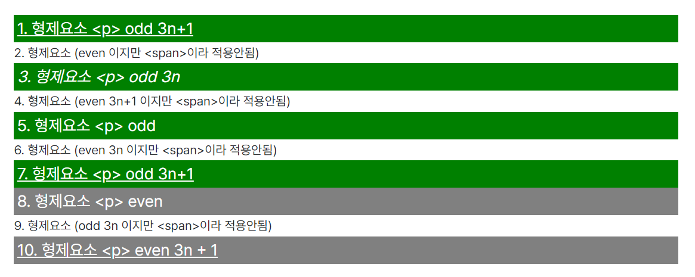
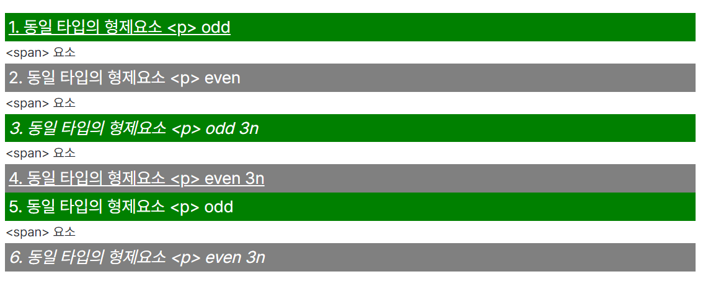

## :nth-child :nth-of-type 가상 클래스

### :nth-child()

형제 요소 중에서 순서에 따라 n번째를 선택하여 스타일을 적용합니다.

- 문법(Syntax)

  :nth-child(n)

  - 키워드(n)

    - odd

      형제 요소중에 홀수번째인 요소 선택(1, 3, 5, 7, …)

    - even

      형제 요소중에 짝수번째인 요소 선택(2, 4, 6, 8, …)

    - An + B

      A와 B는 정수의 입력값(B는 선택), n은 0부터 시작하는 양의 정수가 적용되어 A x n + B로 계산한 값이 대입됩니다.

예시(A에 3, B에 1을 대입한 3n + 1)
|||
|:-:|:-:|
|A| 3|

곱하기

|     |     |     |     |     |     |     |
| :-: | :-: | :-: | :-: | :-: | :-: | :-: |
|  n  |  0  |  1  |  2  |  3  |  4  | ... |

더하기

|     |     |
| :-: | :-: |
|  B  |  1  |

|      |     |     |     |     |     |     |
| :--: | :-: | :-: | :-: | :-: | :-: | :-: |
| 결과 |  1  |  4  |  7  | 10  | 13  | ... |

위 예시 테이블을 풀어보면 아래와 같습니다.

－ 3 x 0 + 1 = 1
－ 3 x 1 + 1 = 4
－ 3 x 2 + 1 = 7
－ 3 x 3 + 1 = 10
－ 3 x 4 + 1 = 13

#### :nth-child 예시

```CSS
.parents p:nth-child(odd) {
  background-color: green;
  color:#fff;
}
.parents p:nth-child(even) {
  background-color: gray;
  color:#fff;
}
.parents p:nth-child(3n) {
  font-style: italic;
}
.parents p:nth-child(3n + 1) {
  text-decoration:underline;
}
```

```HTML
<div class="parents">
  <p>1. 형제요소 p odd 3n+1</p>
  <span>2. 형제요소 (even 이지만 span이라 적용안됨)</span>
  <p>3. 형제요소 p odd 3n</p>
  <span>4. 형제요소 (even 3n+1 이지만 span이라 적용안됨)</span>
  <p>5. 형제요소 p odd</p>
  <span>6. 형제요소 (even 3n 이지만 span이라 적용안됨)</span>
  <p>7. 형제요소 p odd 3n+1</p>
  <p>8. 형제요소 p even</p>
  <span>9. 형제요소 (odd 3n 이지만 span이라 적용안됨)</span>
  <p>10. 형제요소 p even 3n+1</p>
</div>
```

span 태그를 제외한 p태그 중에서,

- odd인 1, 3, 5, 7는 green
- even인 8, 10은 gray
- 3n인 3는 italic
- 3n + 1인 1, 7, 10은 underline 적용



### nth-of-type()

같은 타입의 형제 요소 중에서 순서에 따라 n번째를 선택하여 스타일을 적용합니다.

- 문법(Syntax)

  :nth-of-type(n)

  - 키워드(n)

    - odd

      형제 요소중에 홀수번째인 요소 선택(1, 3, 5, 7, …)

    - even

      형제 요소중에 짝수번째인 요소 선택(2, 4, 6, 8, …)

    - An + B

      A와 B는 정수의 입력값(B는 선택), n은 0부터 시작하는 양의 정수가 적용되어 A x n + B로 계산한 값이 대입된다.

예시 (A에 3, B에 1을 대입한 3n + 1)

|     |     |
| :-: | :-: |
|  A  |  3  |

곱하기

|     |     |     |     |     |     |     |
| :-: | :-: | :-: | :-: | :-: | :-: | :-: |
|  n  |  0  |  1  |  2  |  3  |  4  | ... |

더하기

|     |     |
| :-: | :-: |
|  B  |  1  |

|      |     |     |     |     |     |     |
| :--: | :-: | :-: | :-: | :-: | :-: | :-: |
| 결과 |  1  |  4  |  7  | 10  | 13  | ... |

위 예시 테이블을 풀어보면 아래와 같습니다.

－ 3 x 0 + 1 = 1
－ 3 x 1 + 1 = 4
－ 3 x 2 + 1 = 7
－ 3 x 3 + 1 = 10
－ 3 x 4 + 1 = 13

#### nth-of-type 예시

```CSS
.parents p:nth-of-type(odd) {
  background-color: green;
  color:#fff;
}
.parents p:nth-of-type(even) {
  background-color: gray;
  color:#fff;
}
.parents p:nth-of-type(3n) {
  font-style: italic;
}
.parents p:nth-of-type(3n + 1) {
  text-decoration:unlerline;
}
```

```HTML
<div class="parents">
  <p>1. 동일 타입의 형제요소 p odd</p>
  <span>span 요소</span>
  <p>2. 동일 타입의 형제요소 p even</p>
  <span>span 요소</span>
  <p>3. 동일 타입의 형제요소 p odd 3n</p>
  <span>span 요소</span>
  <p>4. 동일 타입의 형제요소 p even 3n</p>
  <p>5. 동일 타입의 형제요소 p odd</p>
  <span>span 요소</span>
  <p>6. 동일 타입의 형제요소 p even 3n</p>
</div>
```

span 태그는 제외하고 동일 타입인 p태그만 순서를 정하여,

- odd인 1, 3, 5는 green
- even인 2, 4, 6은 gray
- 3n인 3, 6은 italic
- 3n + 1인 1, 4는 underline 적용



### 참고자료

- [[CSS] :nth-child :nth-of-type 가상 클래스(의사 클래스)](https://ak-coding.tistory.com/23)
