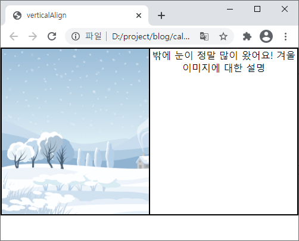
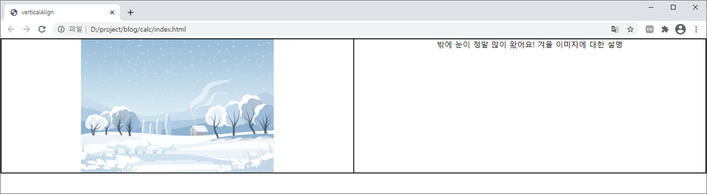
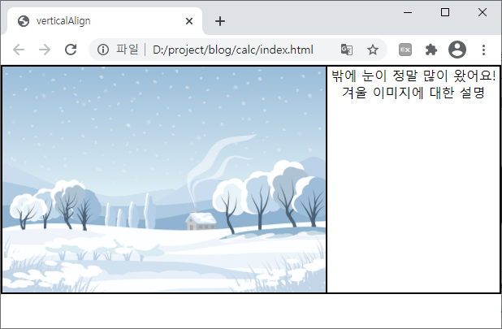
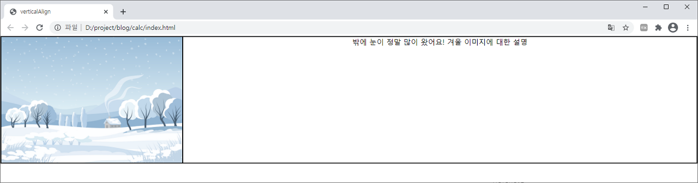
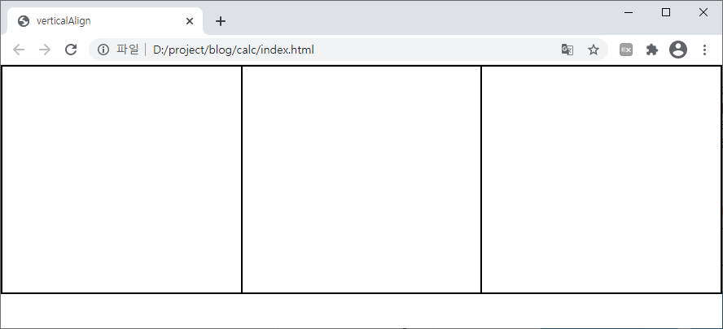

## calc()

calc()는 CSS에서 사용하는 함수이며 내부 매개변수로 하나의 표현식을 받습니다.
표현식으로 다양한 형태의 값들이 들어올 수 있는데 그 값을 계산하여 결과값으로 바꿔주는 함수입니다.

이런 결과값 계산과 같은 일들은 모두 javascript가 수행하는 역할이라고 생각하고 있었는데, CSS에서도 calc() 함수를 활용하면 쉽게 값의 계산이 가능합니다.
알고 있으면 활용도가 높고 의외로 많이 쓰게 되는 함수라서 예제와 함께 활용방법에 대해서 알아 보겠습니다.

### 활용 예제1 - 가변적인 길이와 고정 길이의 계산이 필요할 때

```css
<style>
  .wrapper {
    width: 100%;
    border: 1px solid black;
    box-sizing: border-box;
  }
  .wrapper::after {
    content: '';
    display: block;
    clear: both;
  }
  .img_area {
    float: left;
    width: 50%;
    height: 280px;
    border: 1px solid black;
    box-sizing: border-box;
    text-align: center;
    overflow: hidden;
  }
  .image {
    width: 400px;
    margin:0px auto;
  }
  .text_area {
    float: left;
    width: 50%;
    height: 280px;
    border: 1px solid black;
    box-sizing: border-box;
    text-align: center;
  }
</style>
```

```html
<body>
  <div class="wrapper">
    <div class="img_area">
      
    </div>
    <div class="text_area">
      밖에 눈이 정말 많이 왔어요! 겨울 이미지에 대한 설명
    </div>
  </div>
</body>
```

wrapper영역의 width를 100%로 설정하고 내부에 img_area와 text_area를 만들어 float:left 속성으로 띄워준 후 width: 50%로 절반씩 자리잡았습니다. 각자의 영역 내부에는 width: 400px짜리 이미지 하나와 텍스트를 입력했습니다.


위와 같이 절반의 영역에 이미지와 텍스트가 나뉘어 자리잡고 나타나게 됩니다.
여기서 브라우저 사이즈를 작게 크게 조절해 보겠습니다.
요즘에는 반응형웹 사용빈도가 높아지며 브라우저 사이즈 조절시에도 깨지지 않는 레이아웃 설정이 필요한 경우가 많습니다.

- 브라우저 사이즈를 가로로 줄였을때



- 브라우저 사이즈를 가로로 늘렸을때



위 이미지처럼 브라우저 사이즈를 가로로 줄였을때 레이아웃 img_area영역은 50%로 절반을 차지하지만 이미지의 크기가 400px로 영역보다 커서 첫번재 이미지처럼 이미지가 잘려서 나오게 됩니다.

반대로 브라우저 사이즈를 가로로 늘렸을때는 img_area영역이 이미지 사이즈보다 커지며 이미지 좌우에 여백이 생기게 됩니다.
여기서 생각해 볼 내용은 이미지는 400px의 고정적인 길이를 가지고 있고 영역의 경우 50%인 가변적인 길이를 가지고 있다는 점입니다.

(이미지와 같은) 고정길이와 (영역과 같은) 가변길이의 계산값이 필요할때 calc() 함수를 활용 할 수 있습니다.

```CSS
.img_area {
width: 400px;
}
.text_area {
width: calc(100% - 400px);
}
```

위 코드에서 img_area영역의 width크기를 400px의 고정길이로 바꿔주고 text_area영역의 경우 전체 100%에서 400px 만큼을 빼준 값을 calc() 함수를 사용해 계산해 줍니다.

`width: calc(100% - 400px);`

**덧셈과 뺄셈 연산자를 사용할 때는 반드시 앞뒤에 공백이 있어야 적용됩니다.**

이 코드를 적용하면 이미지 영역은 브라우저 사이즈를 늘이거나 줄여도 400px의 고정영역으로 자리잡고 텍스트 영역의 경우 아래와 같이 유동적인 영역으로 활용이 가능합니다.

- 브라우저 사이즈 축소



- 브라우저 사이즈 확대



### 활용 예제2 - 영역 등분시 값이 명확하게 떨어지지 않을 경우

```CSS
<style>
  .wrapper {
    width: 100%;
    border: 1px solid black;
    box-sizing: border-box;
  }
  .wrapper::after {
    content: '';
    display: block;
    clear: both;
  }
  .area1 {
    float: left;
    width: 33.333%;
    height: 280px;
    border: 1px solid black;
    box-sizing: border-box;
    text-align: center;
  }
  .area2 {
    float: left;
    width: 33.333%;
    height: 280px;
    border: 1px solid black;
    box-sizing: border-box;
    text-align: center;
  }
  .area3 {
    float: left;
    width: 33.333%;
    height: 280px;
    border: 1px solid black;
    box-sizing: border-box;
    text-align: center;
  }
</style>
```

```html
<body>
  <div class="wrapper">
    <div class="area1"></div>
    <div class="area2"></div>
    <div class="area3"></div>
  </div>
</body>
```

위 코드는 wrapper영역 내부 3개의 area1, area2, area3영역을 float:left 속성으로 띄운 후 3등분 한 예제 입니다.


3등분이 잘 되었지만 각 영역의 width속성값을 확인해 보면 33.333%로 명확한 값이 아닙니다.
이렇게 설정한 값이 애매할 경우에도 calc() 함수를 활용해 명확한 계산값으로 바꿔 줄 수 있습니다.

```CSS
.area1 {
width: calc(100% / 3);
}

.area2 {
width: calc(100% / 3);
}

.area3 {
width: calc(100% / 3);
}
```

아래는 정확한 값으로 계산된 수정 화면 입니다.



### 참고자료

- [CSS calc() 활용방법 정리](https://frontendstory.tistory.com/14)
