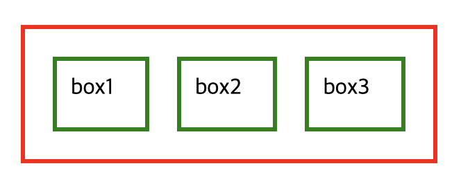

## flex

flex는 css에 display 속성 중 하나로써 박스 레이아웃을 작성할 때 사용되는 아주 유용한 방법입니다.

flexible (유연한) 에서 따온 대로 sizing (엘리먼트의 width나 height를 지정하지 않고도) 유연하고 균형잡힌 배치가 가능한 것이 장점입니다.

### 사용법

```html
//HTML

<body>
  <div id="parent">
    <div class="child">box1</div>
    <div class="child">box2</div>
  </div>
</body>
```

```css
//CSS
* {
  box-sizing: border-box;
  margin: 10px;
  padding: 10px;
}

#parent {
  width: 300px;
  height: 100px;
  display: flex;
  flex-direction: row;
  border: 3px solid red;
}

.child {
  flex: 1 0 auto;
  border: 3px solid green;
}
```


parent의 크기에 맞추어 child 엘리먼트가 일정한 비율을 유지한 채 위치되는 것을 확인할 수 있습니다.
또한 Flex의 장점은 CSS만 맞추어 놓는다면 자식 엘리먼트가 추가되더라도 비율을 유지한 다는 점에 있습니다.

```html
//HTML

<body>
  <div id="parent">
    <div class="child">box1</div>
    <div class="child">box2</div>
    <div class="child">box3</div>
  </div>
</body>
```



#### 필수 지정 속성

- `display: flex;`

  - flex 레이아웃을 적용

- `flex-direction : row; (row || column || row-reverse || column-reverse)`

  - 내부 요소들의 정렬 방향

  - row 는 가로방향 정렬

  - column 은 세로방향 정렬

  - reverse 는 각 방향의 반대에서 부터 정렬


#### 부가 flex 속성 - 부모 요소 편

- flex-wrap: 줄바꿈 설정하기

  자식 요소들의 수가 많아져서 개수가 꽉찼을 때, 부모요소에 flex-wrap: wrap 을 적용하면 자동 줄바꿈을 해줍니다.

`flex-wrap: wrap`


`flex-wrap: nowrap (기본 값)`


- justify-content : 축 수평방향 정렬

  - flex-start : flex 방향 시작점 기준 (기본값)
  - flex-end : flex 방향 끝점 기준
  - center : 중앙 정렬
  - space-between : flex 방향 양 끝점 기준 (양 끝에 붙혀서)
  - space-around : flex 방향 중앙점과 양 끝 기준 (양 끝과도 간격을 둠)

- align-items : 축 수직 방향 정렬

  - stretch : 수직 방향에 최대한 늘려서 (기본값)
  - flex-start : 수직 방향에 위쪽
  - flex-end : 수직 방향에 아래쪽
  - center : 수직 방향 가운데
  - baseline : 컨테이너의 기준선에 배치

### 자식 요소에 설정해야하는 CSS 속성

자식 요소에 크기 또는 비율을 지정하기 위해서 자식요소에 설정해주어야하는 속성이 있습니다.
일반적으로 자식 요소는 수가 많기 때문에 class 선택자를 이용하여 CSS 속성을 부여합니다.

`flex : <grow (팽창 지수)> <shrink (수축 지수)> <basis (기본 크기)>`

```
.child {
flex : 0 1 auto
}
```

- grow 는 자식 요소 간에 비율을 설정합니다.

```css
#box1 {
  flex: 1 0 auto;
}

#box2 {
  flex: 2 0 auto;
}

#box3 {
  flex: 4 0 auto;
}
```


자식 요소가 부모요소 내에서 차지하는 비율을 설정할 수 있습니다.
주로 자식 요소의 비율을 설정 할 때 shrink의 값과 grow의 값을 함께 지정하는 것은 권장되는 방식이 아닙니다.

basis는 부모의 요소나 자식 그외에 비율과 관계 없이 고정되는 넓이에 값을 지정한다. 주로 px 값을 넣는다.

### 실제 예시


```html
<!DOCTYPE html>
<html lang="en">
<head>
    <meta charset="UTF-8">
    <meta http-equiv="X-UA-Compatible" content="IE=edge">
    <meta name="viewport" content="width=device-width, initial-scale=1.0">
    <link rel="stylesheet" href="index.css"></link>
    <title>Document</title>
</head>
<body id="container">
    <div class="col w10">
        <div class="icon">아이콘 1</div>
        <div class="icon">아이콘 2</div>
        <div class="icon">아이콘 3</div>
    </div>
    <div class="col w20">
        <div class="row h40">영역1</div>
        <div class="row h40">영역2</div>
        <div class="row h20">영역3</div>
    </div>
    <div class="col w70">
        <div class="row h80">영역4</div>
        <div class="row h20">영역5</div>
    </div>
</body>
</html>
```

```css
CSS 코드 * {
  box-sizing: border-box;
}
body {
  margin: 0;
  padding: 0;
}
#container {
  display: flex;
  flex-direction: row;
  height: 100vh;
}
.col {
  border: 1px dotted red;
  display: flex;
  flex-direction: column;
}
.w10 {
  width: 10%;
  align-items: center;
}
.w20 {
  width: 20%;
}
.w70 {
  width: 70%;
}
.icon {
  border: 1px dotted green;
  width: 100px;
  height: 100px;
  margin: 20px;
}
.row {
  border: 1px dotted blue;
  margin: 5px 10px;
}
.h40 {
  flex: 2 0 auto;
}
.h20 {
  flex: 1 0 auto;
}
.h80 {
  flex: 4 0 auto;
}
```

### 참고자료

- [[HTML/CSS] Flex 속성에 대해 알아보자](https://velog.io/@rlatp1409/HTMLCSS-Flex-%EC%86%8D%EC%84%B1%EC%97%90-%EB%8C%80%ED%95%B4-%EC%95%8C%EC%95%84%EB%B3%B4%EC%9E%90)
