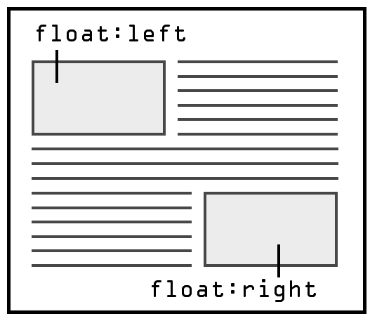
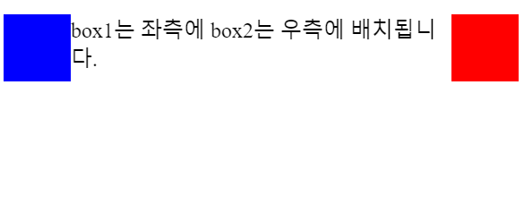
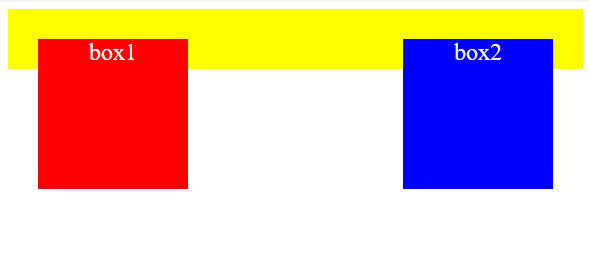
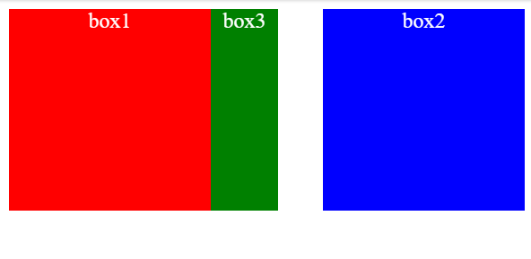

## float

HTML과 CSS를 사용하여 웹 페이지를 디자인할 때, 요소들의 위치와 배치를 제어할 때 float 속성을 사용하고는 합니다.
float은 떠 있다는 의미로 왼쪽 구석이나 오른쪽 구석에 요소를 배치시키는 기능을 가지고 있습니다.

### 요소 왼쪽이나 오른쪽에 배치하기(float 속성)



- none

  해당 요소를 어느쪽으로도 배치하지 않습니다. (기본 값)

- left

  해당 요소를 문서의 왼쪽으로 배치합니다.

- right

  해당 요소를 문서의 오른쪽으로 배치합니다.

```html
<div class="box1"></div>
<div class="box2"></div>
<p>box1는 좌측에 box2는 우측에 배치됩니다.</p>
```

```css
.box1 {
  width: 50px;
  height: 50px;
  background-color: blue;
  float: left;
}

.box2 {
  width: 50px;
  height: 50px;
  background-color: red;
  float: right;
}
```



float 속성을 사용하면 필요한 너비만 콘텐츠를 차지하고 다른 요소가 들어올 만큼의 공간을 비워둡니다. 위의 예제에서 파란색 box1은 `float:left`를, 빨간색 box2는 `float:right`를 적용했습니다. 그러면 위와 같이 공간이 허용하는 선에서 요소들이 가로로 나란히 배치됩니다.

**float 속성을 사용할 때 주의할 점은, 공간에 따라 요소가 띄워진 후에 다음 요소들이 어떻게 배치될지 예측하기 어렵다는 점입니다. 따라서 float 속성을 사용할 때는 다양한 해상도에서 주변 요소들의 배치에 대한 충분한 고려가 필요합니다.**

### float 속성 사용 시 주의 사항

float 속성을 준 부모 요소는 높이 값을 잃어 자식 요소를 포함하지 못합니다.

```html
<div class="container">
  <div class="box box1">box1</div>
  <div class="box box2">box2</div>
</div>
```

```css
.container {
  background-color: yellow;
  padding: 20px;
}

.box {
  width: 100px;
  height: 100px;
  color: white;
  text-align: center;
}

.box1 {
  background-color: red;
  float: left;
}

.box2 {
  background-color: blue;
  float: right;
}
```



float 속성을 가지고 있는 요소의 부모 요소는 높이 값을 잃어버려 원하는 바와 같이 화면이 나오지 않을 수 있습니다. 위의 예제를 보면 float 속성을 가지고 있는 box1 box의 부모 요소인 container가 box1 box2를 포함하지 못하는 것을 보실 수 있습니다.

#### 해결 방법 (overflow: hidden;)

이때는 부모 요소에게 `overflow :hidden` 속성을 줘 높이 값을 되찾게 해 떠있는 요소들을 품도록 합니다.
값은 visible만 아니면 무엇이든 상관없습니다.

### float는 상속이 되기에 다음 요소에 영향을 미친다

```html
<div class="box box1">box1</div>
<div class="box box2">box2</div>
<div class="box box3">box3</div>
```

```css
.container {
  background-color: yellow;
  padding: 20px;
}

.box {
  width: 150px;
  height: 150px;
  color: white;
  text-align: center;
}

.box1 {
  background-color: red;
  float: left;
}

.box2 {
  background-color: blue;
  float: right;
}

.box3 {
  background-color: green;
  width: 200px;
}
```



위의 예제를 보면 box3의 넓이는 200인데도 불구하고 box1의 크기인 150에 가려서 50밖에 노출이 되지 않고 있습니다. 이렇게 float 속성은 상속이 되기 때문에 float 속성을 사용한 요소의 다음 요소에까지 영향을 미칩니다. 따라서 float 속성이 필요하지 않다면 clear 속성을 사용하여 더 이상 float 속성이 유효하지 않다고 알려주어야 합니다.

#### 해결 방법 (float 속성을 해제하는 clear 속성)

- none

  요소가 어느쪽으로든 float 할 수 있습니다.

- left

  왼쪽에 float한 요소 뒤를 초기화

- right

  오른쪽에 float 한 요소 뒤를 초기화

- both

  왼쪽, 오른쪽에 float 한 요소 뒤를 초기화

```html
<div class="box box1">box1</div>
<div class="box box2">box2</div>
<div class="box box3">box3</div>
```

```css
.container {
  background-color: yellow;
  padding: 20px;
}

.box {
  width: 150px;
  height: 150px;
  color: white;
  text-align: center;
}

.box1 {
  background-color: red;
  float: left;
}

.box2 {
  background-color: blue;
  float: right;
}

.box3 {
  background-color: green;
  width: 200px;
  clear: both;
}
```

위의 예제에서 box3에 `clear:both` 속성을 주게 되면 위와 같이 상속된 float 속성이 해제되어 box3이 가려지는 현상을 해결할 수 있습니다.

### 참고자료

- [[HTML/CSS] float 속성 사용법 총정리 (왼쪽 or 오른쪽에 배치하기)](https://coding-factory.tistory.com/926)
