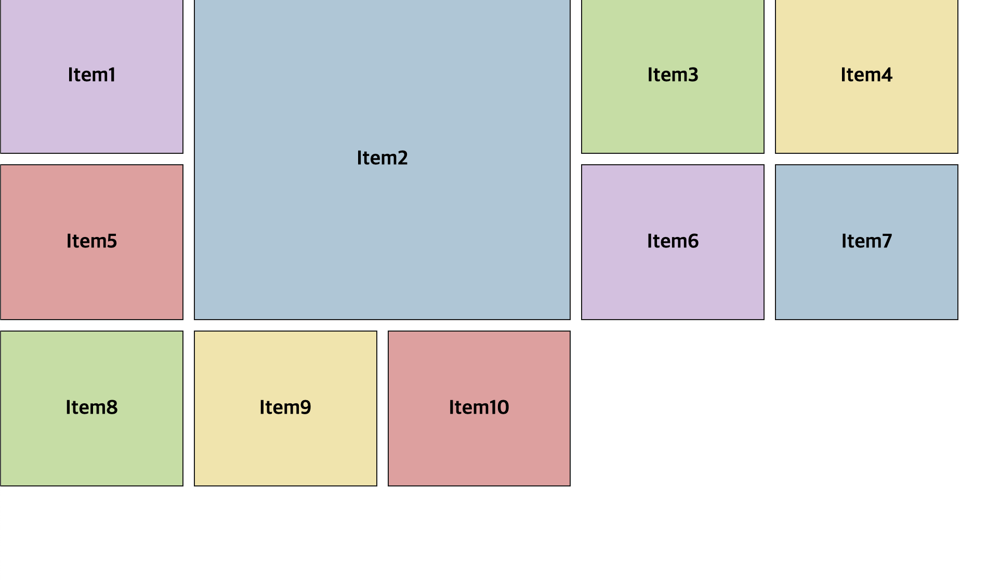

## grid

CSS 의 grid 속성을 이용하면 row 와 column을 이용하여 아이템들을 자유자재로 배치할 수 있습니다.
flex 속성은 1차원으로 수평, 수직 영역중 하나의 방향으로만 레이아웃을 나눌 수 있다면, grid는 2차원으로 수평 수직을 동시에 영역을 나눌 수 있습니다.

```html
<html lang="en">
  <head>
    <meta charset="UTF-8" />
    <meta http-equiv="X-UA-Compatible" content="IE=edge" />
    <meta name="viewport" content="width=device-width, initial-scale=1.0" />
    <title>grid 정리</title>
    <link rel="stylesheet" href="style.css" />

    <style>
      .container {
        display: grid;
        grid-template-columns: 100px 100px 100px;
        grid-template-rows: 200px 200px;
      }
    </style>
  </head>

  <body>
    <div class="container">
      <div class="item color1">Item1</div>
      <div class="item color2">Item2</div>
      <div class="item color3">Item3</div>
      <div class="item color4">Item4</div>
      <div class="item color5">Item5</div>
      <div class="item color1">Item6</div>
      <div class="item color2">Item7</div>
      <div class="item color3">Item8</div>
      <div class="item color4">Item9</div>
      <div class="item color5">Item10</div>
    </div>
  </body>
</html>
```


### grid-template-columns

columns는 grid 아이템들의 가로열 크기를 지정합니다.

### grid-template-rows

rows는 grid 아이템들의 세로열 크기를 지정합니다.

```css
.container {
  display: grid;
  grid-template-columns: repeat(5, 100px);
  grid-template-rows: 200px 200px;
}
```

repeat(반복횟수, 크기)를 설정해서 동일하게 아이템들의 크기와 갯수를 정해줄 수 있습니다.

보통 grid 속성을 사용하는 경우 반응형 웹이기 때문에 사용가능한 화면을 기준으로 몇 %씩 크기를 배치할것인지 정할 수 있습니다. 또는 비율로 결정해주는 fr(fraction) 속성을 사용합니다.

```css
.container {
  display: grid;
  grid-template-columns: repeat(5, 20%);
  grid-template-rows: 200px 200px;
}
```


```css
.container {
  display: grid;
  grid-template-columns: repeat(5, 1fr);
  grid-template-rows: 200px 200px;
}
```


100퍼센트에서 총 5fr 이니 총 사용할수 있는 넓이에서 20%씩 차지하게 된걸 볼 수 있습니다.

### grid-auto-rows

아이템들이 무수히 많다고 가정 했을때, grid-template-columns을 통하여 가로줄 배치를 하면 세로줄이 몇줄이 될지 계산하기 힘든 경우가 있습니다.

grid-auto-rows 속성을 사용하면 세로 줄 갯수에 상관없이 지정한 크기대로 크기를 설정해줍니다.

```css
.container {
  display: grid;
  grid-template-columns: repeat(5, 1fr);
  grid-auto-rows: 200px;
}
```


```html
<div class="container">
  <div class="item color1">Item1</div>
  <div class="item color2">Item2</div>
  <div class="item color3">Item3</div>
  <div class="item color4">
    Item4 Lorem ipsum, dolor sit amet consectetur adipisicing elit. Quaerat eius
    obcaecati unde nulla sint laborum velit consectetur veniam impedit, error
    architecto aperiam quo, ipsam cum, porro neque. Repellat, sunt quis.
  </div>
  <div class="item color5">Item5</div>
  <div class="item color1">Item6</div>
  <div class="item color2">Item7</div>
  <div class="item color3">Item8</div>
  <div class="item color4">Item9</div>
  <div class="item color5">Item10</div>
</div>
```


하지만 이런식으로 각각의 아이템 내용의 크기가 넘칠 경우, 저렇게 특정하게 크기를 지정해주면 아이템 내용이 가려지는 문제가 발생하는데, `minmax` 속성을 사용해서 최소 크기는 지정하되, 아이템 크기가 늘어나면 자동으로 크기를 늘려줄 수 있습니다.

```css
.container {
  display: grid;
  grid-template-columns: repeat(5, 1fr);
  grid-auto-rows: minmax(200, auto);
}
```


### grid-gap

grid-row-gap, grid-column-gap, grid-gap 속성을 사용하면 아이템들 사이사이에 gap 을 줄 수 있습니다.

```css
.container {
  display: grid;
  grid-template-columns: repeat(5, 1fr);
  grid-auto-rows: minmax(200, auto);
  grid-gap: 10px;
}
```


### grid-column, grid-row

grid-column, grid-row를 사용하면 각각 아이템들이 독립적으로 어디까지 크기와 높이를 가질 건지 결정 할 수 있습니다.

```css
.item2 {
  grid-column: 2 / 4;
  grid-row: 1 /3;
}
```

2번째 column 줄부터 4번째 줄까지, 1번째 row 줄부터 3번째 줄까지 차지를 합니다.



### grid-area

grid area 속성을 사용하면 아이템들을 자유자재로 배치시킬 수 있습니다.

```html
<html lang="en">
  <head>
    <meta charset="UTF-8" />
    <meta http-equiv="X-UA-Compatible" content="IE=edge" />
    <meta name="viewport" content="width=device-width, initial-scale=1.0" />
    <title>flex 정리</title>
    <link rel="stylesheet" href="style.css" />

    <style></style>
  </head>

  <body>
    <section class="container">
      
      
      
      
      
      
      
    </section>
  </body>
</html>
```

이미지가 쭉 나와져있는 html이 있습니다.

```css
.container {
  display: grid;
  grid-template-columns: repeat(3, 1fr);
  grid-auto-rows: 150px;
  gap: 40px;
}
```

먼저 grid 속성을 이용해서 아이템들이 column과 row에 맞춰 일정하게 배치 되도록 합니다.


그 후 grid-template-areas 를 사용하여 섹션을 나눠줍니다.

```css
.container {
  display: grid;
  grid-template-columns: repeat(3, 1fr);
  grid-auto-rows: 150px;
  gap: 40px;
  grid-template-areas:
    "a a a"
    "b c c"
    "b d g"
    "e f g";
}
```

이렇게 아이템 갯수에 맞게 레이블명을 지정해주고 아이템 배치를 해준후에 해당 이미지들에 레이블명을 지정해줍니다.

```css
.image1 {
  grid-area: a;
}

.image2 {
  grid-area: b;
}

.image3 {
  grid-area: c;
}

.image4 {
  grid-area: d;
}

.image5 {
  grid-area: e;
}

.image6 {
  grid-area: f;
}

.image7 {
  grid-area: g;
}
```


grid-template-areas를 통해 나눴던 섹션대로 이미지들이 잘 배치 되었습니다.

### 참고자료

- [CSS grid 속성 정리](https://velog.io/@brgndy/CSS-grid-%EC%86%8D%EC%84%B1-%EC%A0%95%EB%A6%AC)
