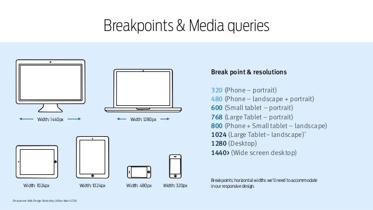
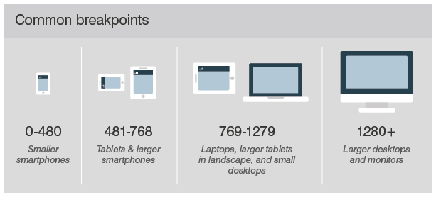

## media-query

### 기본적인 사용방법

`@media (조건문) { 실행코드 }`

```js
<link rel="stylesheet" media="all and (조건)" href="desktop.css" >
```

※ `<link>`를 사용하는 방법은 권장하지 않습니다. (브라우져는 일단 모든 css를 내려받기때문에 size가 커집니다.)

※ 구문에는 논리연산자 및 각각의 특성들이 존재하지만, 사용빈도가 적습니다.

```js
<link rel="stylesheet" href="/board/css/mediaquery.css">
```

※ 미디어 쿼리 구분을 따로 빼놓은 CSS 파일을 작성하는 것도 좋습니다.

### 모바일우선 데스크탑우선

- 모바일우선 - min-width 사용 (최소 ~ 부터 적용)

작은 가로폭부터 큰 가로폭 순서로 만드는 것

- 모바일 = 작다 = min, 모바일기기는 해상도가 작기 때문에 작은게 먼저 조건에 부합합니다.

```css
/* 기본으로 작성되는 CSS는 576px보다 작은 화면에서 작동 됩니다. */
/* 가로모드 모바일 디바이스 (가로 해상도가 576px 보다 큰 화면에 적용) */
@media (min-width: 576px) {
  ...;
}

/* 태블릿 디바이스 (가로 해상도가 768px 보다 큰 화면에 적용) */
@media (min-width: 768px) {
  ...;
}

/* 테스크탑 (가로 해상도가 992px 보다 큰 화면에 적용) */
@media (min-width: 992px) {
  ...;
}

/* 큰화면 데스크탑 (가로 해상도가 1200px 보다 큰 화면에 적용) */
@media (min-width: 1200px) {
  ...;
}
```

- 데스트탑우선 - max-width 사용 (최대 ~ 까지 적용)

큰 가로폭부터 작은 가로폭 순서로 만드는 것

- desktop = 크다 = max, 데스크탑은 해상도가 크기 때문에 큰게 먼저 조건에 부합합니다.

```css
/* 기본 CSS를 작성합니다. */
/* 기본으로 작성되는 CSS는 1199px보다 큰 화면에서 작동 됩니다. */
/* 세로모드 모바일 디바이스 (가로 해상도가 576px 보다 작은 화면에 적용) */
@media (max-width: 575px) {
  ...;
}

/* 가로모드 모바일 디바이스 (가로 해상도가 768px 보다 작은 화면에 적용) */
@media (max-width: 767px) {
  ...;
}

/* 태블릿 디바이스 (가로 해상도가 992px 보다 작은 화면에 적용) */
@media (max-width: 991px) {
  ...;
}

/* 테스크탑 (가로 해상도가 1200px 보다 작은 화면에 적용) */
@media (max-width: 1199px) {
  ...;
}
```

- CSS Override

### Break Point

```css
/* 가로 해상도가 576px 보다 작은 화면에 적용) */
@media only screen and (max-width: 576px) {
  ...;
}

/* 가로 해상도가 576px 보다 작은 큰화면 적용) */
@media only screen and (min-width: 576px) {
  ...;
}

/* 가로 해상도가 768px 보다 작은 큰화면에 적용) */
@media only screen and (min-width: 768px) {
  ...;
}

/* 가로 해상도가 992px 보다 작은 큰화면에 적용) */
@media only screen and (min-width: 992px) {
  ...;
}

/* 가로 해상도가 1200px 보다 작은 큰화면에 적용) */
@media only screen and (min-width: 1200px) {
  ...;
}
```

- 브레이크 포인트는 미세하게 차이가 나지만, 크게 의미있진 않습니다.

```css
/* 세로모드 모바일 디바이스 (가로 해상도가 576px 보다 작은 화면에 적용) */
@media (max-width: 575px) {
  ...;
}

/* 가로모드 모바일 디바이스 (가로 해상도가 576px보다 크고 768px 보다 작은 화면에 적용)  */
@media (min-width: 576px) and (max-width: 767px) {
  ...;
}

/*태블릿 디바이스 (가로 해상도가 768px보다 크고 991px 보다 작은 화면에 적용)  */
@media (min-width: 768px) and (max-width: 991px) {
  ...;
}

/* 데스크탑 (가로 해상도가 992px보다 크고 1199px 보다 작은 화면에 적용)  */
@media (min-width: 992px) and (max-width: 1199px) {
  ...;
}

/* 큰화면 데스크탑 (가로 해상도가 1200px 보다 큰 화면에 적용)  */
@media (min-width: 1200px) {
  ...;
}
```

예전 해상도(320)까지 고려한다면

```css
@media all and (max-width: 320px) {
  ...;
}
@media all and (min-width: 321px) and (max-width: 768px) {
  ...;
}
@media all and (min-width: 769px) and (max-width: 1024px) {
  ...;
}
@media all and (min-width: 1025px) {
  ...;
}
```

※ 브레이크 포인트의 분기는 사이트 구축 상황에 맞게 선택하면 됩니다.
아래의 방법은 조금 무식하지만, 직관적인 작업플로우를 제공해줍니다.

```css
#media-320, #media-768, #media-1024, #media-1025 {
    display: none;
    height: 0px;
    overflow: hidden;
}

@media all and (max-width: 320px) {
    #media-320 { display: block; }
}
@media all and (min-width: 321px) and (max-width: 768px) {
    #media-768 { display: block; }
}
@media all and (min-width: 769px) and (max-width: 1024px) {
    #media-1024 { display: block; }
}
@media all and (min-width: 1025px) {
    #media-1025 { display: block; }
}
<div id="media-320"></div>
<div id="media-768"></div>
<div id="media-1024"></div>
<div id="media-1025"></div>
```





### 예제코드

```css
/* 화면사이즈가 600px 보다 크면 해당요소를 감춘다 */
@media only screen and (max-width: 600px) {
  div.example {
    display: none;
  }
}
```

#### 실제 활용예

반응형 게시판을 만들때 넓이가 줄어들면 게시판 리스트 항목을 모두 보여주기 힘듭니다.
이때 등록일이나 히트수 같은 항목을 감춤으로써 넓이를 확보할 수 있습니다.
또한 모바일 화면에서는 특정 블럭을 생략하는 경우도 있는데, 이럴때도 유용하게 사용할 수 있습니다.
실제로 반응형 웹페이지를 만들때 미디어쿼리를 이용하지 않으면 사실상 구현이 힘듭니다.

#### 가장 기본적으로 사용되는 활용예

사이트의 width 값이 해상도에 맞게 적응되게 하는 코드는 사이트 구축의 가장 기본적인 활용입니다.
보통 wrap 코드에 적용을 많이 합니다.
위의 무식하지만 직관적인 플로우 예제가 그 좋은 예입니다.
%로 하면 되지 않냐 라는 의견도 있을 수 있지만, 가장 외곽틀의 width는 정확한 수치로 지정하는것이 좋습니다.
틀안의 요소들은 틀안에서 %로 얼마든지 지정을 해도 됩니다.
혹은 틀안에서 보이고 보이지 않게 하는 방향으로 진행하는것이 가장 효율적입니다.

### 참고 자료

- [[CSS] 미디어쿼리(Media Query)의 기본사용법](https://log.designichthus.com/11)
