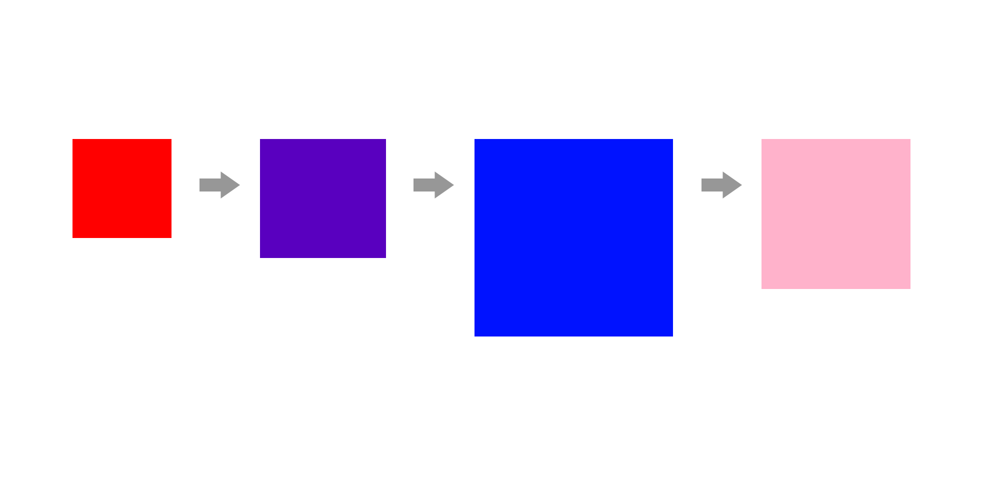
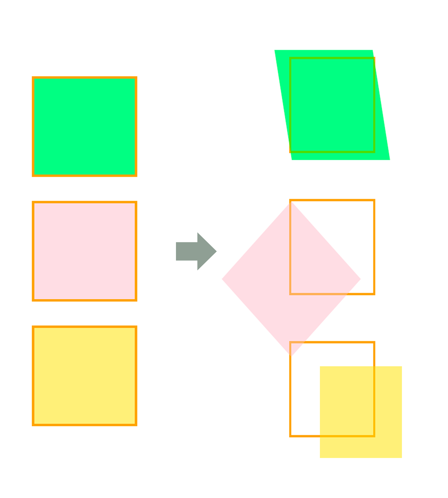

## transition, transform

### transition

변화하는 단계의 중간 움직임을 생성하도록 도와줍니다.
select메뉴에 커서를 올려놓았을 때 뚝뚝 끊기듯 서브메뉴가 펼쳐지는 것이 아니라 자연스럽게 시간차를 두고 펼쳐지도록 해줍니다.
속성 적용은 최초 상태의 태그에 합니다.

### 사용법

`transition: property duration timing-function delay;`

- property : 변화를 일으킬 css 속성명
- duration : 변화가 얼마동안 일어나게 할지 명시하는 지속시간 (1s=1000ms)
- timing-function : 변화의 속도를 지정하는 가속도 (생략가능)
- ease-in : 천천히 움직이다가 나중에 빠르게
- ease-out : 빠르게 움직이다가 나중에 천천히
- ease-in-out : 천천히 빠르게 천천히
- delay : 몇초 후에 동작할지 지정하는 지연시간

```jsx
<p class="box"><p>

<style>
    p.box{
    	width:200px;
        height:200px;
        background-color:red;
        transition: all 1s ease-in;	//모든 속성을 1초동안 ease-in
    }

    p.box:hover{
    	width:400px;
        height:200px;
        background-color: blue;
    }

    p.box:active{ 		//actvie - 클릭한 상태
    	width:300px;
        height:200px;
        background-color: pink;
    }
</style>
```

빨간색 박스에서 hover시, 1초 동안 파란 박스로 색상이 자연스럽게 변화되어 갑니다.
그리고 박스를 active(클릭) 하고있는 동안, 핑크박스의 색깔과 크기로 변화됩니다.



#### transition을 각 요소마다 적용하고 싶은 경우

`transition: font-size 1s ease-out, background-color 2s ease-in 1s;`

### transform

초기값에 영향을 미치지 않는 요소의 변형

#### 사용법

`transform : scale(x,y) translate(x,y) rotate(deg) skew(xdeg,ydeg);`

- translate(x,y) : 원래 위치를 기준으로 내가 원하는 방향으로 위치시킵니다.
- scale(x,y) : (숫자)의 배율만큼 사이즈를 조정합니다. (1=기본값, 1.2=120%, 2=2배)
  - x,y축의 배율이 같으면 한번만 적어줍니다.
- rotate(deg) : 각도를 나타내는 deg(degree)를 넣어 시계방향으로 회전
- skew(deg) : 비틀기 효과, 마름모꼴

- transform-origin : rotate(), skew() 등의 회전, 변형 속성을 사용하기 전에 기준점을 지정해 주는 속성. 초기 값은 50% 50%으로 요소의 중심점이 됩니다. 백분율과 키워드로 작성 가능 (0% 0% = left top)

```jsx
<div id="wrap">
    <article>
        <p class="one"></p>
    </article>
    <article>
        <p class="two"></p>
    </article>
    <article>
        <p class="three"></p>
    </article>
</div>

<style>
	#wrap{
            width: 800px;
            margin: 30px auto;
        }

        article{
            width: 200px;
            height: 200px;
            margin: 0 0 80px 200px;
            border: 5px solid orange;
        }

        article>p{
            width: 200px;
            height: 200px;
            opacity: 0.5;
        }

        p.one{
      	    background-color: #0f0;
            transform: scale(1.2,1.2) skew(10deg);  //1.2(120%) 확대, skew(마름모꼴) 변형
        }

        p.two{
            background-color: pink;
            transform-origin: right top;  //오른쪽 위를 기준으로 설정
            transform:scale(1.2) rotate(45deg);  //1.2배 확대, 45도 시계방향회전
        }

        p.three{
            background-color: gold;
            transform: translate(70px,50px);  //원래 위치에서 가로70, 세로50 이동
        }
</style>
```



### transition과 transform을 이용한 hover 효과

프레임안에 있는 이미지에 hover했을 때, 이미지가 1.2(120%)배 확대되며 0.7(70%) 불투명도가 적용됩니다.
이미지는 0.3초동안 ease-in-out으로 확대됩니다. 이 때 frame에 overflow:hidden을 적용하지 않으면 이미지 크기가 1.2배 그대로 커지게 됩니다.

```jsx
<style>
	.frame{
            overflow: hidden;  //확대된 부분 숨기기
            width: 300px;
            height: 150px;
            margin: 0 auto;
            border-radius: 10px;
        }

        .frame>img{
            display: block;
            width: 100%;
            transition:all 0.3s ease-in-out;  //0.3초동안 변화
        }

        .frame>img:hover{
            transform:scale(1.2);  //1.2배 확대
            opacity: 0.7;  //불투명도 70% 적용
        }
</style>

<body>
      <p class="frame">
          
      </p>
</body>
```

### 참고자료

- [CSS - transition, transform을 이용한 효과](https://velog.io/@roong-ra/CSS-%EC%95%A0%EB%8B%88%EB%A9%94%EC%9D%B4%EC%85%98-%ED%9A%A8%EA%B3%BC-transition-transform-animation)
